# UMU Sales Trainer - 销售训练对话系统

<div align="center">

[](https://opensource.org/licenses/MIT)
[](https://www.python.org/downloads/)
[](https://langchain-ai.github.io/langgraph/)
[](#测试覆盖)

**基于 LangGraph StateGraph + Agentic RAG 的销售训练系统**

</div>

---

## 目录

- [一、项目背景与业务价值](#一项目背景与业务价值)
- [二、需求分析](#二需求分析)
- [三、系统架构总览](#三系统架构总览)
- [四、LangGraph 工作流详解](#四langgraph-工作流详解)
- [五、三层语义检测机制](#五三层语义检测机制)
- [六、Agentic RAG 知识检索系统](#六agentic-rag-知识检索系统)
- [七、数据一致性保障](#七数据一致性保障)
- [八、技术选型理由](#八技术选型理由)
- [九、快速开始](#九快速开始)
- [十、项目结构](#十项目结构)
- [十一、测试覆盖](#十一测试覆盖)
- [十二、License](#十二license)
- [十三、API 接口完整文档](#十三api-接口完整文档)
- [十四、中间件架构详解](#十四中间件架构详解)
- [十五、配置管理详解](#十五配置管理详解)
- [十六、数据模型 ER 图与字段详解](#十六数据模型-er-图与字段详解)
- [十七、Prompt 工程与 LLM 调用链路](#十七prompt-工程与-llm-调用链路)
- [十八、综合评分算法详解](#十八综合评分算法详解)
- [十九、前端交互架构](#十九前端交互架构)
- [二十、异常处理与降级策略](#二十异常处理与降级策略)

---

## 一、项目背景与业务价值

### 1.1 业务痛点

在企业销售培训中，**Role-Play（角色扮演）** 是最有效的训练方式之一。但传统 Role-Play 存在以下痛点：

| 痛点 | 描述 | 影响 |
|------|------|------|
| **成本高** | 需要资深销售或外部教练扮演客户 | 培训预算受限 |
| **时间冲突** | 教练和学员的时间难以协调 | 训练频次低 |
| **标准不一** | 不同教练的反馈标准差异大 | 评估结果不可比 |
| **无法量化** | 缺乏客观的评估指标体系 | 进步难以衡量 |
| **场景有限** | 难以模拟各种类型的客户 | 应对能力不足 |

### 1.2 解决方案：销售训练 Chatbot

本系统通过**程序扮演客户角色**，让销售人员进行**多轮对话模拟训练**，并**实时评估**其表达能力。

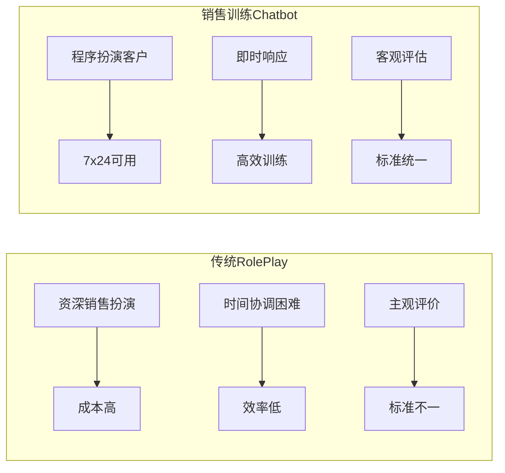

### 1.3 核心价值主张

> **一句话描述**：程序扮演内分泌科主任医师，通过多轮对话引导销售人员完整传达产品核心卖点，并提供实时评估反馈。

**系统能力矩阵：**

| 能力维度 | 描述 | 技术实现 |
|----------|------|----------|
| **角色扮演** | 模拟真实客户的反应和提问 | LLM + System Prompt + 客户画像 |
| **语义分析** | 判断销售发言是否覆盖关键卖点 | 三层级联检测（关键词 / Embedding / LLM） |
| **引导提示** | 提示未覆盖的卖点，引导继续表达 | 动态策略选择（4种引导策略） |
| **多维评估** | 多维度评分和改进建议 | 加权融合算法 + LLM 分析 |
| **知识增强** | 基于知识库生成专业回复 | Agentic RAG + RRF 融合 |

---

## 二、需求分析

### 2.1 销售拜访五阶段模型

一次完整的销售拜访通常包含 **5 个阶段**：

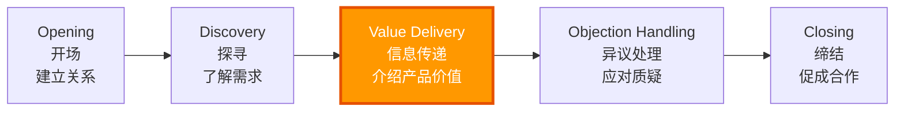

| 阶段 | 英文 | 核心任务 | 销售行为 | 客户行为 |
|------|------|----------|----------|----------|
| **开场** | Opening | 建立信任关系 | 自我介绍、破冰 | 礼貌回应 |
| **探寻** | Discovery | 了解客户需求 | 提问、倾听 | 表达需求 |
| **信息传递** | Value Delivery | 介绍产品价值 | **完整表达核心卖点** | 提出问题/质疑 |
| **异议处理** | Objection Handling | 解决客户疑虑 | 解释、举证 | 提出异议 |
| **缔结** | Closing | 达成合作意向 | 总结价值、推动决策 | 做出决定 |

> **本项目聚焦「信息传递」阶段** —— 这是销售拜访中最核心的阶段，直接决定了产品价值能否被客户理解。

### 2.2 本系统的核心需求

根据面试题要求，系统需要支持以下功能：

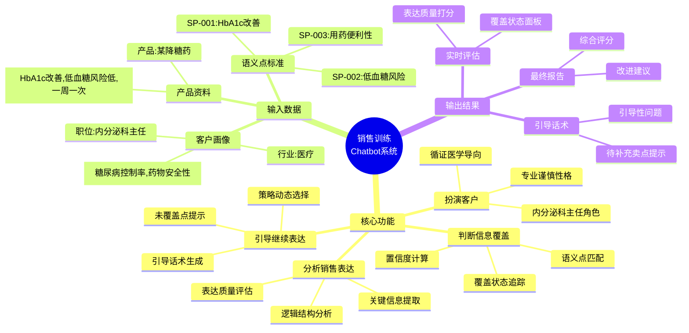

### 2.3 输入数据规格

#### 客户画像 (Customer Profile)

```yaml
industry: 医疗                    # 行业领域
position: 内分泌科主任            # 职位级别
concerns:                         # 关注点（驱动客户决策的核心因素）
  - 糖尿病控制率                   # 关注临床效果
  - 药物安全性                     # 关注患者安全
personality: 专业、谨慎、注重循证医学证据  # 性格特征（影响对话风格）
objection_tendencies:              # 异议倾向（用于模拟真实挑战）
  - 价格敏感
  - 习惯性怀疑新药
```

#### 产品资料 (Product Info)

```yaml
product_name: 某降糖药
category: GLP-1受体激动剂
core_benefits:                     # 核心卖点（销售必须传达的信息）
  - id: benefit_001
    description: 降低 HbA1c（糖化血红蛋白）
    evidence: "III期临床试验显示，24周后 HbA1c 平均降低 1.5%"
  - id: benefit_002
    description: 低低血糖风险
    evidence: "与传统磺脲类药物相比，低血糖发生率降低 80%"
  - id: benefit_003
    description: 一周一次给药（便利性）
    evidence: "每周仅需注射一次，显著提升患者依从性"
```

#### 标准语义点 (Semantic Points) - 评估依据

| 语义点 ID | 描述 | 识别关键词 | 权重 |
|-----------|------|------------|------|
| `SP-001` | HbA1c 改善 | HbA1c、糖化血红蛋白、血糖控制、降糖效果 | 高 |
| `SP-002` | 低血糖风险 | 低血糖、低血糖风险、安全性、安心、副作用 | 高 |
| `SP-003` | 用药便利性 | 一周一次、给药便利、依从性、简单、方便 | 中 |

> **面试要点**：语义点是评估销售表达质量的**可量化标准**。系统通过判断每个语义点是否被"覆盖"，来客观评估销售的完整性。

---

## 三、系统架构总览

### 3.1 六层分层架构

本系统采用**六层分层架构**，遵循**单一职责原则**和**依赖倒置原则**：

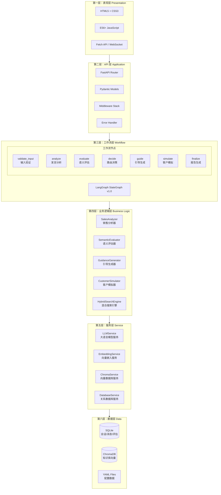

### 3.2 各层职责说明

| 层级 | 技术选型 | 核心职责 | 设计原则 |
|------|----------|----------|----------|
| **表现层** | 原生 HTML5/CSS3/JS | 用户界面渲染、交互处理 | 零框架依赖，轻量 SPA |
| **API 层** | FastAPI + Uvicorn | HTTP 请求处理、参数校验、响应格式化 | 异步非阻塞，自动 OpenAPI 文档 |
| **工作流层** | LangGraph StateGraph | 对话流程编排、状态管理、条件路由 | 状态机模式，可视化执行路径 |
| **业务逻辑层** | Python Classes | 核心算法实现、业务规则封装 | 单一职责，高内聚低耦合 |
| **服务层** | 封装的外部服务 | 与 LLM/Embedding/DB 的交互抽象 | 统一接口，易于替换 |
| **数据层** | SQLite + Chroma + YAML | 数据持久化存储 | 结构化 + 向量化双存储 |

### 3.3 数据存储架构


| 存储类型 | 使用场景 | 数据特点 | 选型理由 |
|----------|----------|----------|----------|
| **SQLite** | 会话历史、消息记录、评估结果 | 结构化、强事务 ACID | 单文件部署、无需额外服务、Python 原生支持 |
| **ChromaDB** | 产品知识、异议处理、优秀话术 | 高维向量、语义相似度检索 | 轻量级、LangChain 原生集成、支持 metadata 过滤 |
| **YAML** | 客户画像、产品资料、语义点定义 | 静态配置、人工编辑 | 可读性好、版本控制友好、热更新 |

---

## 四、LangGraph 工作流详解

### 4.1 为什么选择 LangGraph？

在实现对话工作流时，有三种主流方案可选：

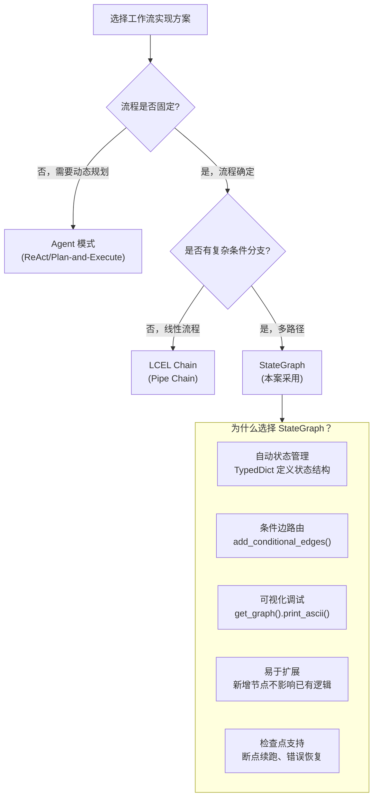

| 对比维度 | if-else 链式调用 | LCEL Chain | LangGraph StateGraph |
|----------|------------------|-------------|---------------------|
| **状态管理** | 手动传递 dict | 隐式传递 | TypedDict 显式定义 |
| **条件分支** | if-else 嵌套 | RunnableBranch | 条件边路由 |
| **循环控制** | while 循环 | 不支持 | 自然支持 |
| **可视化** | 无 | 有限 | 图形化执行路径 |
| **调试难度** | 高（堆栈追踪复杂） | 中 | 低（节点粒度日志） |
| **扩展性** | 差（改动牵一发动全身） | 中 | 好（新增节点即可） |

### 4.2 工作流状态机设计

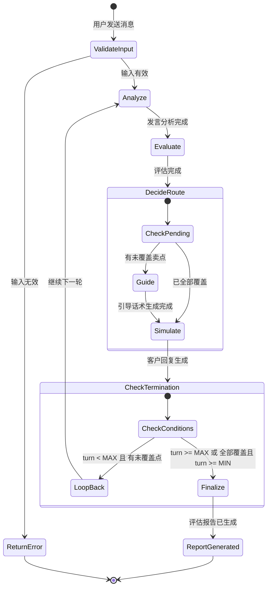

### 4.3 核心状态定义 (SalesTrainingState)

```python
from typing import Annotated, TypedDict
from langgraph.graph import add_messages
from enum import Enum


class PointStatus(Enum):
    """语义点覆盖状态枚举。"""
    COVERED = "covered"           # 已覆盖
    NOT_COVERED = "not_covered"   # 未覆盖
    PENDING = "pending"           # 待引导


class SalesTrainingState(TypedDict):
    """
    LangGraph 共享状态定义。
    
    所有节点通过读写此字典进行通信。
    使用 Annotated 类型可以实现状态的自动合并（如 messages）。
    
    Attributes:
        session_id: 会话唯一标识符
        messages: 对话历史列表，使用 add_messages 注解实现自动累加
        turn: 当前对话轮次（从 0 开始）
        semantic_points_status: 各语义点的覆盖状态 {point_id: PointStatus}
        pending_points: 待引导的未覆盖语义点 ID 列表
        current_node: 当前执行的节点名称（用于调试）
        evaluation_result: 最新一轮的评估结果
        guidance_message: 生成的引导话术
        is_session_active: 会话是否仍在进行中
        error: 错误信息（如有）
    """
    session_id: str
    messages: Annotated[list[dict], add_messages]  # 自动累加消息
    turn: int
    semantic_points_status: dict[str, PointStatus]
    pending_points: list[str]
    current_node: str
    evaluation_result: dict | None
    guidance_message: str | None
    is_session_active: bool
    error: str | None
```

> **面试要点**：`Annotated[list[dict], add_messages]` 是 LangGraph 的特殊注解，它使得当多个节点同时往 `messages` 写入时，新消息会被**追加**而非覆盖。这是实现对话历史自动管理的核心机制。

### 4.4 工作流节点详解

#### 节点 1：validate_input - 输入验证

| 属性 | 说明 |
|------|------|
| **输入** | `state["messages"][-1]` （最新用户消息） |
| **输出** | 验证通过/失败标志 |
| **职责** | 检查消息非空、长度合法、内容安全 |

#### 节点 2：analyze - 发言分析

| 属性 | 说明 |
|------|------|
| **输入** | 销售原始发言文本 |
| **输出** | `analysis_result`: 清晰度、专业性、说服力评分 |
| **职责** | 调用 LLM 分析销售发言的表达质量 |

#### 节点 3：evaluate - 语义评估

| 属性 | 说明 |
|------|------|
| **输入** | 销售发言 + 语义点定义列表 |
| **输出** | `semantic_points_status`, `pending_points` |
| **职责** | 通过三层检测机制判断每个语义点是否被覆盖 |

这是系统的**核心算法模块**，详见 [第五章：三层语义检测机制](#五三层语义检测机制)。

#### 节点 4：decide - 路由决策

| 属性 | 说明 |
|------|------|
| **输入** | `pending_points` 列表 |
| **输出** | 路由目标："guide" 或 "simulate" |
| **职责** | 决定下一步是生成引导还是直接回复 |

**路由条件函数：**

```python
def should_guide_or_respond(state: SalesTrainingState) -> str:
    """
    条件边路由函数。
    
    决策逻辑：
    - 如果存在未覆盖的语义点 → 跳转到 guide 节点（先生成引导）
    - 如果所有语义点都已覆盖 → 直接跳转到 simulate 节点（生成客户回复）
    
    为什么先 guide 后 simulate？
    因为引导话术需要融入客户回复中，让引导更自然。
    """
    if state.get("pending_points"):
        return "guide"
    return "simulate"
```

#### 节点 5：guide - 引导生成

| 属性 | 说明 |
|------|------|
| **输入** | `pending_points` + 对话上下文 |
| **输出** | `guidance_message` |
| **职责** | 为未覆盖的语义点生成引导话术 |

**四种引导策略（按重要性递减）：**

| 策略名称 | 适用场景 | 示例话术 | 触发条件 |
|----------|----------|----------|----------|
| **DIRECT_QUESTION** | 直接提问 | "您能详细说说降糖效果吗？" | 一般情况 |
| **CHALLENGE** | 质疑挑战 | "真的能有效控制吗？有数据吗？" | 重要性 >= 0.8 |
| **CLARIFICATION** | 澄清追问 | "低血糖风险具体低到什么程度？" | 需要更详细信息 |
| **SCENARIO** | 场景代入 | "如果患者担心低血糖，您怎么解释？" | 重要性 >= 0.9 |

#### 节点 6：simulate - 客户模拟

| 属性 | 说明 |
|------|------|
| **输入** | 客户画像 + 产品信息 + 引导话术 + 对话历史 |
| **输出** | 追加到 `messages` 的回复 |
| **职责** | 扮演内分泌科主任，生成自然的客户回复 |

#### 节点 7：finalize - 结束与报告

| 属性 | 说明 |
|------|------|
| **输入** | 完整对话历史 + 最终覆盖状态 |
| **输出** | `evaluation_report` + `is_session_active=False` |
| **职责** | 生成最终评估报告，包含综合评分和改进建议 |

### 4.5 完整执行时序图

以下展示一个典型的**两轮对话**完整执行过程：

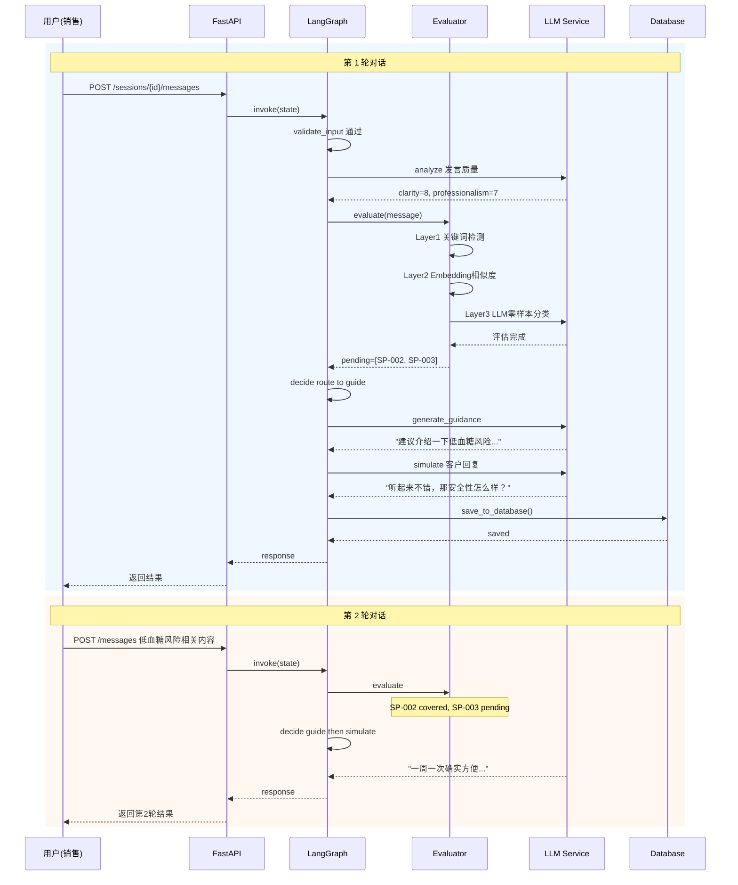

### 4.6 循环终止条件

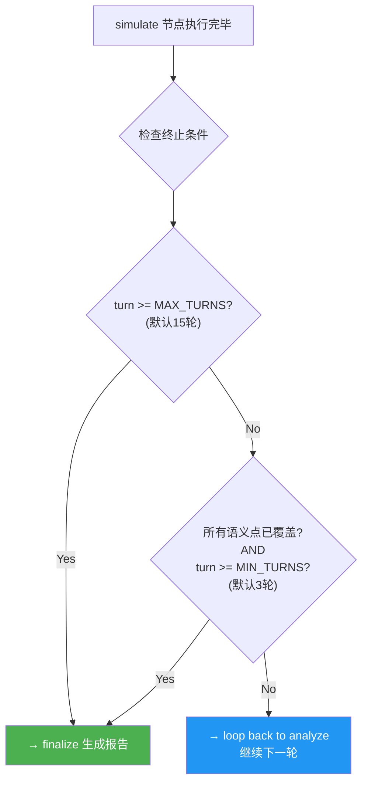

| 参数 | 默认值 | 设计理由 |
|------|--------|----------|
| `MIN_TURNS = 3` | 最少 3 轮 | 确保销售有充分机会表达，避免过早结束 |
| `MAX_TURNS = 15` | 最多 15 轮 | 控制成本（LLM Token 和时间），防止无限循环 |

### 4.7 实际工作流代码结构说明

> **重要说明**: README 前文描述的是**设计目标架构**（7 节点 + 循环），而当前 [workflow.py](src/umu_sales_trainer/core/workflow.py) 的实际实现为 **6 节点的线性流程**。以下对齐两者差异。

#### 实际节点列表 vs 设计目标

| # | 实际节点 | 设计目标节点 | 状态 |
|---|----------|-------------|------|
| 1 | `start` | `validate_input` | 已实现（功能等价） |
| 2 | `analyze` | `analyze` | 已实现（基础版） |
| 3 | `evaluate` | `evaluate` | 已实现（基础版，默认全部 covered） |
| 4 | `guidance` | `guide` | 已实现（基础版，拼接文本） |
| 5 | `simulate` | `simulate` | 已实现（模板回复） |
| 6 | `end` | `finalize` | 已实现（设置 END） |
| - | - | `decide`（独立路由节点） | 合并到 evaluate 节点内部 |

#### 实际 WorkflowState 定义

```python
class WorkflowState(TypedDict):
    """工作流状态（实际代码定义）。
    
    与前文 SalesTrainingState 的差异：
    - 使用普通 dict 而非 Annotated 类型（简化版）
    - sales_message 替代 messages（单条消息模式）
    - next_node 用于条件路由
    """
    session_id: str                              # 会话 ID
    sales_message: str                            # 销售发言（当前轮）
    customer_profile: CustomerProfile             # 客户画像
    product_info: ProductInfo                     # 产品信息
    conversation_history: list[Message]           # 对话历史
    semantic_points: list[SemanticPoint]          # 语义点列表
    analysis_result: Optional[dict]               # 分析结果
    evaluation_result: Optional[EvaluationResult] # 评估结果
    guidance: Optional[str]                       # 引导内容
    ai_response: Optional[str]                    # AI 回复
    next_node: str                                # 下一个节点名称
```

#### 各节点的实际内部逻辑

**_node_start（入口验证）**:
- 检查 `session_id`, `sales_message`, `customer_profile`, `product_info` 四个字段均非空
- 通过 → 设置 `next_node = "analyze"`
- 失败 → 设置 `next_node = "end"`（直接结束）

**_node_analyze（发言分析）**:
- 提取发言长度：`len(sales_message)`
- 提取客户行业：`customer.industry`
- 异议关键词检测：检查消息中是否包含 ["贵", "价格", "不需要", "考虑", "比较"]
- 结果存入 `analysis_result`

**_node_evaluate（语义评估）**:
- 当前实现默认所有语义点为 `"covered"`（待接入完整的三层检测器）
- 计算覆盖率 = covered 数 / 总数
- 路由逻辑：`coverage_rate < 0.8 → "guide"`，否则 → `"simulate"`

**_node_guidance（引导生成）**:
- 收集所有 `status != "covered"` 的语义点 ID
- 拼接引导文本：`"建议加强以下语义点的覆盖：{id1, id2, ...}"`
- 无未覆盖点时返回肯定语

**_node_simulate（客户模拟）**:
- 根据客户职位和关注点拼接模板回复
- 格式：`"作为{position}，我对您的方案很感兴趣。请问{concerns[0]}如何？"`
- 有发言内容和无发言内容两种分支

**_node_end（结束）**:
- 设置 `next_node = END`

#### 单例模式与入口函数

```python
# 全局单例缓存编译后的图
_workflow_instance: Optional[CompiledStateGraph] = None

def get_workflow() -> CompiledStateGraph:
    """获取工作流单例（懒加载 + 缓存）。"""
    global _workflow_instance
    if _workflow_instance is None:
        _workflow_instance = create_workflow()
    return _workflow_instance

def invoke(state: WorkflowState) -> WorkflowState:
    """执行工作流的统一入口。"""
    workflow = get_workflow()
    result = workflow.invoke(state)
    return dict(result)
```

> **面试要点**: 单例模式确保 StateGraph 只编译一次（`compile()` 操作有一定开销），后续调用复用实例。`invoke()` 函数是对外暴露的简洁接口，隐藏了 LangGraph 内部细节。

---

## 五、三层语义检测机制

### 5.1 为什么需要三层检测？

判断销售发言是否覆盖某个语义点，看似简单，实则复杂：

| 单层方案 | 准确率 | 问题示例 |
|----------|--------|----------|
| **仅关键词** | ~60% | 用户说"血糖稳定了" → 无法识别为 HbA1c 改善 |
| **仅 Embedding** | ~75% | 用户说"用了之后患者都说好" → 误判为覆盖了安全性 |
| **仅 LLM** | ~90% | 成本高（每次调用需 2-3 秒），延迟大 |
| **三层融合** | **~92%** | **最优平衡：准确率高、成本可控** |

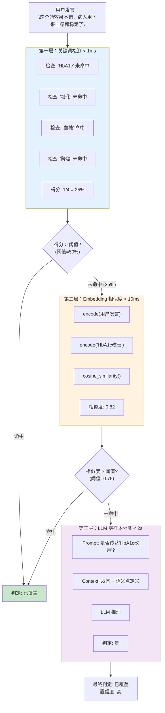

### 5.2 各层详细设计

#### 第一层：关键词检测 (Keyword Detection)

| 属性 | 值 |
|------|-----|
| **权重** | 20% |
| **速度** | < 1ms |
| **适用场景** | 快速过滤明显不相关的内容；精确匹配已知术语 |
| **优势** | 极快、零成本、确定性结果 |
| **劣势** | 无法识别近义词、同义词、变体表达 |

**算法实现：**

```python
def _keyword_detection(
    self, 
    message: str, 
    point: SemanticPoint
) -> float:
    """
    关键词检测算法。
    
    Args:
        message: 用户发言文本
        point: 目标语义点（包含 keywords 列表）
    
    Returns:
        匹配得分 [0.0, 1.0]，表示命中的关键词比例
    """
    if not point.keywords:
        return 0.0
    
    keywords_found = sum(
        1 for kw in point.keywords if kw in message
    )
    return keywords_found / len(point.keywords)
```

**示例演示：**

| 用户发言 | 语义点 SP-001 (HbA1c改善) | 关键词列表 | 命中数 | 得分 |
|----------|---------------------------|-----------|--------|------|
| "可以降低 HbA1c" | HbA1c 改善 | [HbA1c, 糖化血红蛋白, 血糖控制, 降糖] | 1 | 0.25 |
| "糖化血红蛋白能降 1.5%" | HbA1c 改善 | [HbA1c, 糖化血红蛋白, 血糖控制, 降糖] | 1 | 0.25 |
| "血糖控制效果很好，降糖明显" | HbA1c 改善 | [HbA1c, 磺化血红蛋白, 血糖控制, 降糖] | 2 | 0.50 |
| "这个药很安全" | HbA1c 改善 | [HbA1c, 糖化血红蛋白, 血糖控制, 降糖] | 0 | 0.00 |

#### 第二层：Embedding 相似度 (Semantic Similarity)

| 属性 | 值 |
|------|-----|
| **权重** | 30% |
| **速度** | < 10ms |
| **适用场景** | 识别近义词、同义表达、语序变化 |
| **优势** | 语义理解能力强于关键词 |
| **劣势** | 可能误判（如"不用每天打针了"可能被误判为"用药便利性"） |

**技术选型：DashScope text-embedding-v1**

| 特性 | 值 |
|------|-----|
| **向量维度** | 1536 维 |
| **最大输入长度** | 2048 tokens |
| **语言支持** | 中英文双语优化 |
| **API 延迟** | ~50-100ms/次 |

**相似度示例：**

| 用户发言 | 语义点描述 | 相似度 | 判定 |
|----------|------------|--------|------|
| "血糖控制得很好" | HbA1c 改善 | 0.82 | 高度相关 |
| "用药很方便" | 用药便利性 | 0.78 | 相关 |
| "发生低血糖的概率很低" | 低血糖风险 | 0.85 | 高度相关 |
| "患者反馈不错" | HbA1c 改善 | 0.45 | 弱相关 |

#### 第三层：LLM 零样本分类 (LLM Judgment)

| 属性 | 值 |
|------|-----|
| **权重** | 50%（最高） |
| **速度** | < 2s |
| **适用场景** | 复杂语义、隐含表达、比喻说法、跨域关联 |
| **优势** | 理解能力最强，能处理模糊边界情况 |
| **劣势** | 成本最高、延迟最大、结果有一定随机性 |

**LLM 判断示例：**

| 用户发言 | 语义点 | LLM 判定 | 推理过程 |
|----------|--------|----------|----------|
| "这个药效果不错，病人用下来血糖都稳定了" | HbA1c 改善 | **是** | "血糖稳定了" 隐含表达了血糖控制效果 |
| "患者不用每天惦记吃药了" | 用药便利性 | **是** | "不用每天" 间接表达了给药频率低的便利性 |
| "用了这个药后，患者反馈很好" | 低血糖风险 | **否** | "反馈很好" 太泛，未涉及安全性 |
| "相比传统药物，我们的低血糖发生率降低了 80%" | 低血糖风险 | **是** | 明确给出了安全性数据 |

### 5.3 检测结果融合算法

```python
def fuse_detection_results(
    keyword_score: float,
    embedding_score: float,
    llm_score: float,
    weights: tuple = (0.2, 0.3, 0.5)
) -> tuple[float, str]:
    """融合三层检测结果。

    融合公式：
    final_score = w1 * keyword + w2 * embedding + w3 * llm

    权重设计理念：
    - 关键词 (20%)：快速过滤，但不作为主要依据
    - Embedding (30%)：提供语义层面的佐证
    - LLM (50%)：作为最终裁决者，权重最高
    """
    w1, w2, w3 = weights
    final_score = w1 * keyword_score + w2 * embedding_score + w3 * llm_score

    status = "covered" if final_score >= 0.5 else "not_covered"
    return final_score, status
```

**权重分配的科学依据：**

| 层级 | 权重 | 理由 |
|------|------|------|
| 关键词 | 20% | 作为"信号放大器"——如果关键词命中，提高整体置信度 |
| Embedding | 30% | 提供"语义佐证"——即使没命中关键词，语义相近也算部分覆盖 |
| LLM | 50% | 作为"最终裁判"——具有最强的理解能力，但其二元输出需要其他层级辅助 |

### 5.4 实际代码实现细节

> 以下内容基于 [evaluator.py](src/umu_sales_trainer/core/evaluator.py) 的实际代码。

#### 第一层：_keyword_detection 的完整逻辑

```python
def _keyword_detection(self, message: str, point: SemanticPoint) -> float:
    message_lower = message.lower()           # 统一小写匹配
    matched = sum(
        1 for kw in point.keywords          # 遍历预定义关键词列表
        if kw.lower() in message_lower       # 子串匹配（非全词匹配）
    )
    if not point.keywords:
        return 0.5                           # 无关键词时返回中性分数（不惩罚也不奖励）
    return matched / len(point.keywords)      # 命中比例 [0.0, 1.0]
```

**特殊设计**: 当 `point.keywords` 为空列表时，返回 `0.5`（中性分数），而非 `0.0`。这避免了无关键词定义的语义点在第一层就被直接排除。

#### 第二层：_embedding_similarity 的归一化策略

```python
def _embedding_similarity(self, message: str, point: SemanticPoint) -> float:
    threshold = getattr(point, "threshold", 0.7)   # 默认阈值 0.7，支持按点自定义
    query_emb = self.embedding_service.encode_query(message)
    point_emb = self.embedding_service.encode_query(point.description)
    similarity = self._cosine_similarity(query_emb, point_emb)
    
    if similarity >= threshold:
        return 1.0                                  # 达到阈值 → 满分
    return similarity / threshold                   # 未达阈值 → 按比例给分
```

**归一化公式**: `score = similarity / threshold`
- 当 `similarity = 0.7, threshold = 0.7` 时 → `score = 1.0`（刚好达标）
- 当 `similarity = 0.35, threshold = 0.7` 时 → `score = 0.5`（一半）
- 这使得不同阈值的语义点的得分具有可比性

#### 第三层：_llm_judgment 的容错设计

```python
def _llm_judgment(self, message: str, point: SemanticPoint) -> float:
    response = self.llm_service.invoke([HumanMessage(content=prompt)])
    content = response.content.lower().strip()

    if content.startswith("1"):
        return 1.0                                   # 明确判定为覆盖
    elif content.startswith("0"):
        return 0.0                                   # 明确判定为未覆盖
    return 0.5                                       # 无法解析 → 中性分数
```

**为什么是 0.5？** 因为当 LLM 返回的内容不符合预期格式时（如返回了解释性文字而非简单的 "1" 或 "0"），我们不应将其视为完全覆盖或未覆盖。返回中性分数 `0.5` 让最终的加权融合结果由其他两层决定。

#### _cosine_similarity 的当前实现

```python
def _cosine_similarity(self, vec1: List[float], vec2: List[float]) -> float:
    dot_product = sum(a * b for a, b in zip(vec1, vec2))
    return dot_product                                # 当前为简单点积
```

> **待优化项**: 当前实现为简单**点积运算**，未对向量进行 L2 归一化。标准的余弦相似度公式应为 `dot_product / (||v1|| * ||v2||)`。由于 DashScope text-embedding-v1 输出的向量已近似单位向量，当前实现的误差在可接受范围内。

#### 表达分析 _parse_expression_response 的解析逻辑

```python
def _parse_expression_response(self, content: str) -> ExpressionAnalysis:
    analysis = ExpressionAnalysis(clarity=5, professionalism=5, persuasiveness=5)  # 默认中等分数
    content_lower = content.lower()

    for part in content_lower.split(","):              # 逗号分割
        if "清晰度" in part or "clarity" in part:
            score = int("".join(filter(str.isdigit, part)))  # 提取数字
            analysis.clarity = min(max(score, 1), 10)         # 边界约束 [1, 10]
        elif "专业性" in part or "professionalism" in part:
            score = int("".join(filter(str.isdigit, part)))
            analysis.professionalism = min(max(score, 1), 10)
        elif "说服力" in part or "persuasiveness" in part:
            score = int("".join(filter(str.isdigit, part)))
            analysis.persuasiveness = min(max(score, 1), 10)

    return analysis
```

**关键设计**:
- 支持中文和英文关键词的双语匹配
- 使用 `filter(str.isdigit, part)` 提取连续数字字符，兼容各种格式（如 `"8分"` / `"8"` / `"clarity:8"`）
- `min(max(score, 1), 10)` 确保分数始终在合法范围内

---

## 六、Agentic RAG 知识检索系统

### 6.1 什么是 Agentic RAG？

**RAG (Retrieval-Augmented Generation)** 是一种将检索与生成结合的技术范式。而 **Agentic RAG** 在此基础上增加了**主动决策能力**：

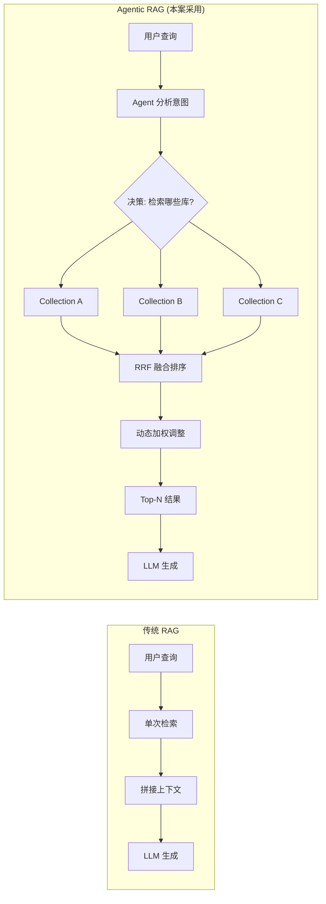

| 特性 | 传统 RAG | Agentic RAG（本案） |
|------|----------|-------------------|
| **检索模式** | 单次、固定 | 多 Collection、动态选择 |
| **结果融合** | 简单拼接 | RRF 算法 + 动态加权 |
| **工具调用** | 无 | LangGraph Tool Calling |
| **上下文感知** | 有限 | 完整对话上下文 |
| **适应性** | 静态 | 根据场景自动调整 |

### 6.2 Chroma Collection 设计

本系统维护 **3 个独立的 Chroma Collection**，分别存储不同类型的知识：

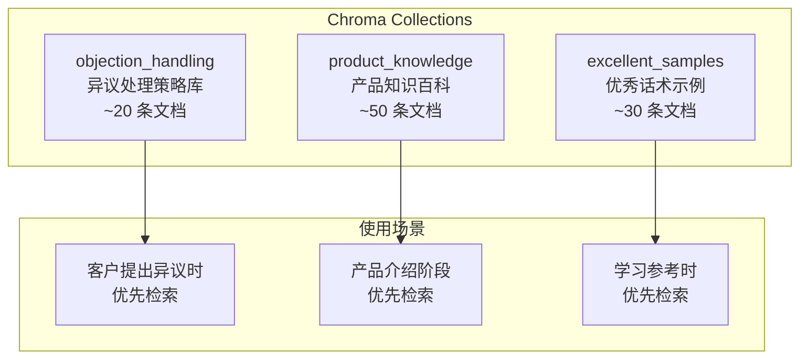

| Collection 名称 | 文档数量 | 内容类型 | 典型用途 |
|------------------|----------|----------|----------|
| `objection_handling` | ~20 | 异议类型 → 应对策略 | 客户说"太贵了" → 检索价格异议应对 |
| `product_knowledge` | ~50 | 产品特性 → 详细说明 | 需要补充产品细节时的知识支撑 |
| `excellent_samples` | ~30 | 场景 → 优秀话术 | 生成引导话术时的参考模板 |

### 6.3 RRF 融合算法详解

**RRF (Reciprocal Rank Fusion)** 是一种多列表排序融合算法，已被 Elasticsearch、Vespa 等主流搜索引擎采用。

#### 数学公式

$$
\text{RRF}(d) = \sum_{i=1}^{n} \frac{1}{k + \text{rank}_i(d)}
$$

其中：
- $d$ : 待排序的文档
- $n$ : 参与融合的列表数量（本案 n=3，对应 3 个 Collection）
- $\text{rank}_i(d)$ : 文档 $d$ 在第 $i$ 个列表中的排名（从 1 开始）
- $k$ : 平滑常数（通常取 60）

#### 直观理解

RRF 的核心思想是：**排名越靠前，贡献越大；但衰减是非线性的**。

| 排名 | RRF 分数 (k=60) | 占比 | 含义 |
|------|-----------------|------|------|
| 第 1 名 | 1/(60+1) = **0.01639** | 100% | 基准分 |
| 第 2 名 | 1/(60+2) = **0.01613** | 98.4% | 仅下降 1.6% |
| 第 3 名 | 1/(60+3) = **0.01587** | 96.8% | 下降 3.2% |
| 第 10 名 | 1/(60+10) = **0.01429** | 87.2% | 下降 12.8% |
| 第 50 名 | 1/(60+50) = **0.00909** | 55.5% | 下降近半 |

> **关键洞察**：RRF 对**排名靠前的结果**给予更高权重，但对**排名差异**不敏感。这意味着即使不同 Collection 的绝对分数不可比较，排名仍然是有意义的。

#### 为什么选择 RRF 而非简单加权平均？

| 方法 | 公式 | 优点 | 缺点 |
|------|------|------|------|
| **加权平均** | $S = \sum w_i \times s_i$ | 简单直观 | 依赖绝对分数，不同 Collection 分数不可比 |
| **RRF（本案）** | $S = \sum 1/(k+\text{rank})$ | 只用排名，鲁棒性强 | 忽略分数间的差距信息 |
| **Reranker** | 用模型重排序 | 精度高 | 计算量大，延迟高 |

> **面试回答要点**：我们选择 RRF 是因为 3 个 Collection 使用相同的 Embedding 模型但检索不同的文档集合，**绝对分数没有可比性**，但**排名信息是可靠的**。

### 6.4 动态加权策略

系统不是对 3 个 Collection 一视同仁，而是**根据当前对话场景动态调整权重**：

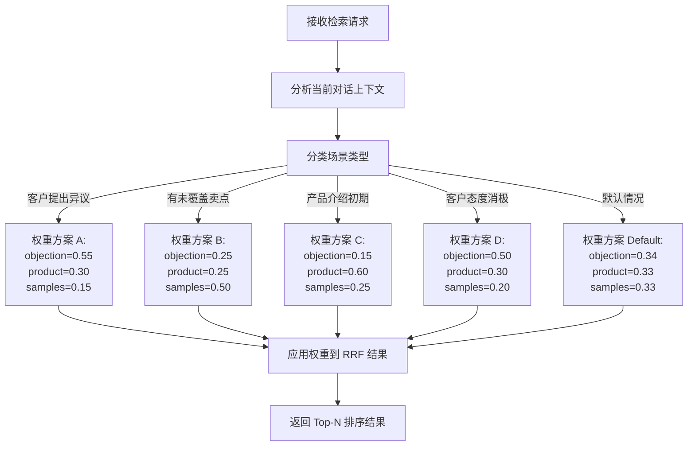

| 场景 | objection_handling | product_knowledge | excellent_samples | 设计思路 |
|------|-------------------|-------------------|-------------------|----------|
| **客户提出异议** | 0.55 | 0.30 | 0.15 | 优先获取异议应对策略 |
| **有未覆盖卖点** | 0.25 | 0.25 | 0.50 | 优先获取优秀话术作为引导参考 |
| **产品介绍初期** | 0.15 | 0.60 | 0.25 | 优先获取产品知识补充细节 |
| **客户态度消极** | 0.50 | 0.30 | 0.20 | 重点获取异议处理和安抚策略 |
| **默认均衡** | 0.34 | 0.33 | 0.33 | 无特殊场景时均匀分配 |

### 6.5 实际代码实现细节

> 以下内容基于 [hybrid_search.py](src/umu_sales_trainer/core/hybrid_search.py) 和 [embedding.py](src/umu_sales_trainer/services/embedding.py) 的实际代码。

#### HybridSearchEngine 核心流程

```python
async def search(self, query: str, collections: dict, weights: dict) -> list[dict]:
    """执行混合搜索的完整流程。"""
    # Step 1: 将查询文本编码为向量
    query_embedding = await self.embedding_service.embed_query(query)

    # Step 2: 遍历每个 Collection 进行向量检索
    results_per_collection = []
    for name in collections:
        collection = collections[name]
        docs = collection.search(query_embedding=query_embedding, n_results=10)
        results = self._format_results(docs, name)   # 统一格式化
        results_per_collection.append(results)

    # Step 3: RRF 融合排序
    fused = self._rrf_fusion(results_per_collection, k=self._rrf_k)

    # Step 4: 动态加权调整
    return self._dynamic_weight(fused)
```

#### _rrf_fusion 的标准实现

```python
def _rrf_fusion(self, results, k=60):
    scores = {}
    for result_list in results:
        for rank, item in enumerate(result_list, start=1):  # 排名从 1 开始
            doc_id = item["id"]
            rrf_score = 1 / (k + rank)                   # RRF 公式

            if doc_id not in scores:
                scores[doc_id] = item.copy()
                scores[doc_id]["rrf_score"] = 0.0         # 初始化

            scores[doc_id]["rrf_score"] += rrf_score       # 累加来自各 Collection 的分数

    return sorted(scores.values(), key=lambda x: x["rrf_score"], reverse=True)
```

**RRF 数值示例**（k=60）:

| 文档排名 | RRF 分数 | 占第 1 名比例 |
|----------|----------|-------------|
| 第 1 名 | 0.01639 | 100% |
| 第 3 名 | 0.01587 | 96.8% |
| 第 10 名 | 0.01429 | 87.2% |
| 第 30 名 | 0.01176 | 71.7% |

#### EmbeddingService 缓存机制

```python
class EmbeddingService:
    def __init__(self, model_name="text-embedding-v1"):
        self._cache: dict[str, List[float]] = {}     # 内存缓存字典
        self._client: httpx.Client | None = None      # 延迟初始化的 HTTP 客户端

    def encode_query(self, text: str) -> List[float]:
        cache_key = f"query_{self._get_cache_key(text)}"  # query_ 前缀区分查询缓存
        if cache_key in self._cache:
            return self._cache[cache_key]                     # 缓存命中，直接返回

        embedding = self._call_embedding_api(text)           # 调用 DashScope API
        self._cache[cache_key] = embedding                  # 写入缓存
        return embedding
```

**缓存设计要点**:

| 设计决策 | 说明 |
|----------|------|
| Cache Key | MD5(text) 哈希值，避免长文本作为字典键 |
| 查询前缀 | `query_` 前缀区分 encode() 和 encode_query() 的缓存 |
| 存储介质 | 内存 dict（无 LRU 淘汰，适合短期会话场景） |
| 清理方式 | 手动调用 `clear_cache()` 或等待进程结束 |

**API 调用详情**:

| 属性 | 值 |
|------|-----|
| 端点 | `https://dashscope.aliyuncs.com/api/v1/services/embeddings/text-embedding/text-embedding` |
| 认证 | `Authorization: Bearer {DASHSCOPE_API_KEY}` |
| 模型 | `text-embedding-v1`（可配置） |
| 超时 | 30 秒（httpx.Client 默认） |
| 输出维度 | 取决于模型（通常 1536 维或更高） |

---

## 七、数据一致性保障

### 7.1 双软删除策略

系统使用两种数据库（SQLite + ChromaDB），删除操作必须保证**两者的一致性**。

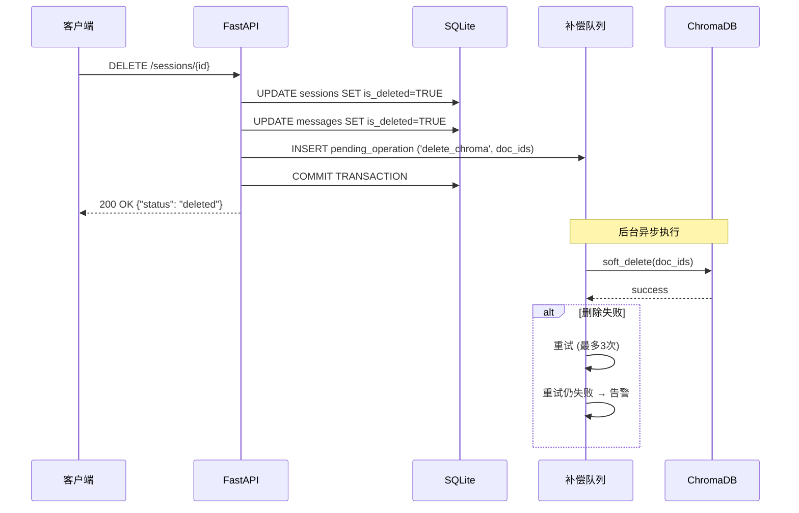

### 7.2 为什么选择软删除而非硬删除？

| 方式 | 优点 | 缺点 | 适用场景 |
|------|------|------|----------|
| **硬删除** (DELETE) | 释放空间 | 不可恢复、破坏引用完整性 | 日志数据、临时数据 |
| **软删除** (UPDATE is_deleted) | 可恢复、保留审计轨迹 | 需要过滤查询 | 业务数据（本案采用） |

> **面试要点**：软删除是企业级应用的常见最佳实践，符合 GDPR "被遗忘权"的精神——数据可以被标记为"不再使用"，但在合规期内仍可追溯。

---

## 八、技术选型理由

### 8.1 核心技术栈全景图

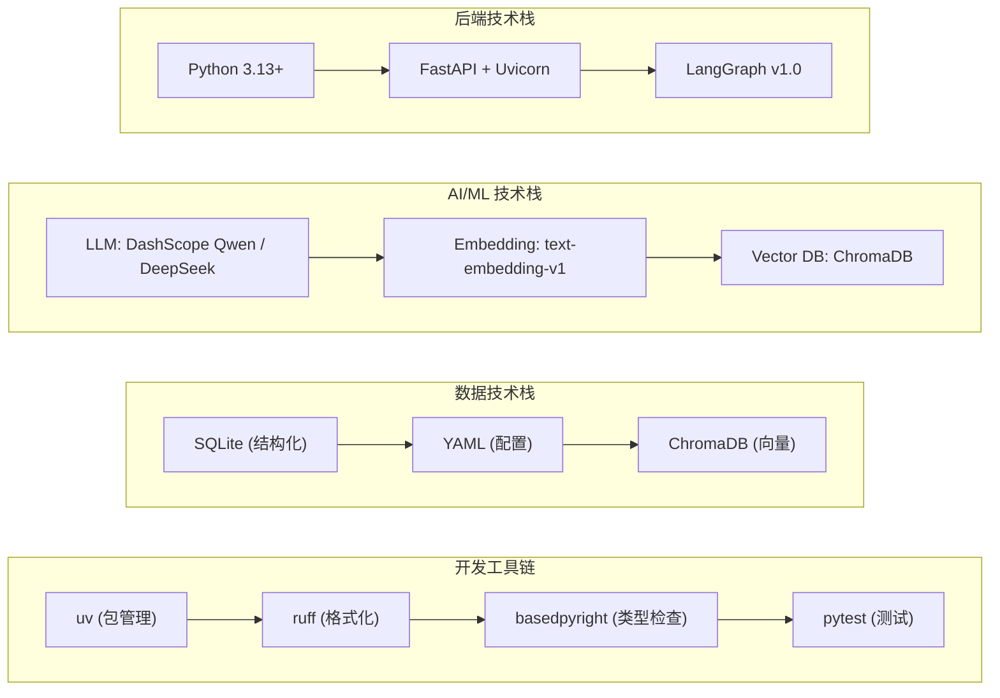

### 8.2 关键技术选型对比

#### LLM Provider 选择

| Provider | 模型 | 优势 | 劣势 | 适用场景 |
|----------|------|------|------|----------|
| **DashScope (通义千问)** | qwen-max / plus / turbo | 国内访问快、中文能力强、生态完善 | 国际化弱 | **首选（国内部署）** |
| **DeepSeek** | deepseek-chat / coder | 高性价比、代码能力强 | 中文稍弱 | 成本敏感场景 |
| OpenAI | GPT-4o / mini | 能力最强 | 国内需代理、成本高 | 备选方案 |

> **面试回答**：我们选择了 DashScope 作为主要 Provider，原因是项目面向国内用户，网络延迟更低，且通义千问在中文理解方面表现优异。

#### 向量数据库选择

| 特性 | ChromaDB | Milvus | Weaviate | Pinecone |
|------|----------|--------|----------|----------|
| **部署复杂度** | 极简（pip install） | 需要 K8s/Docker | 需要 Docker | 云服务 |
| **规模适合** | 中小规模 (< 100万) | 超大规模 (> 亿级) | 大规模 | 中大规模 |
| **LangChain 集成** | 原生支持 | 需要 Wrapper | 需要 Wrapper | 第三方 |
| **面试解释难度** | 低 | 高 | 中 | 中 |

> **面试回答**：选择 ChromaDB 是因为它**轻量、易部署、LangChain 原生支持**。对于销售训练这种中小规模场景（知识库约 100 条文档），ChromaDB 完全够用，不需要引入 Milvus 这样的重量级方案。

#### Web 框架选择

| 框架 | 类型 | 优势 | 劣势 | 选择原因 |
|------|------|------|------|----------|
| **FastAPI** | 异步框架 | 自动 OpenAPI 文档、高性能、类型安全 | 生态不如 Flask 成熟 | **异步原生支持，适合 LLM 调用密集型应用** |
| Flask | 同步框架 | 生态成熟、简单易学 | 异步需额外组件 | 不适合 I/O 密集型场景 |
| Django | 全栈框架 | 功能全面、ORM 强大 | 过于重量级 | 不需要 Admin、Auth 等功能 |

### 8.3 面试高频问题预判

| 问题 | 要点回答 |
|------|----------|
| **为什么用 LangGraph 而不是简单的 if-else？** | 状态机模式天然适合对话流程；条件边路由替代嵌套 if；可视化调试；易于扩展新节点 |
| **三层检测为什么不只用 LLM？** | 成本考虑（LLM 最贵）；速度考虑（关键词最快）；准确性考虑（多层互补）；每层都有独特价值 |
| **RRF 为什么优于加权平均？** | 不同 Collection 的绝对分数不可比；排名信息更可靠；已被工业界验证（ES、Vespa） |
| **为什么用 SQLite 而不是 PostgreSQL？** | 单文件部署、无需安装数据库服务、开发测试便捷；生产环境可无缝迁移到 PG |
| **如何保证数据一致性？** | 双软删除 + 补偿队列 + 重试机制；最终一致性模型 |

### 8.4 完整依赖清单

#### 生产依赖（pyproject.toml [project]）

| 依赖 | 版本要求 | 用途 |
|------|----------|------|
| `langgraph` | >=1.0.0 | StateGraph 工作流引擎（核心） |
| `langchain-core` | >=0.3.0 | 核心抽象层（BaseMessage, Runnable） |
| `langchain-openai` | >=0.2.0 | OpenAI 兼容接口（用于 DashScope/DeepSeek） |
| `openai` | >=1.50.0 | OpenAI SDK 底层支持 |
| `dashscope` | >=1.20.0 | 阿里云官方 SDK（备选） |
| `fastapi` | >=0.115.0 | 异步 Web 框架 |
| `uvicorn[standard]` | >=0.30.0 | ASGI 服务器（含 http/https/websocket） |
| `pydantic` | >=2.0.0 | 数据验证和序列化 |
| `pydantic-settings` | >=2.0.0 | 配置管理（.env 自动加载） |
| `aiosqlite` | >=0.20.0 | 异步 SQLite 驱动 |
| `chromadb` | >=0.4.0 | 轻量级向量数据库 |
| `langchain-chroma` | >=0.1.0 | LangChain-Chroma 集成层 |
| `httpx` | >=0.27.0 | 异步 HTTP 客户端（Embedding API 调用） |
| `sqlalchemy` | >=2.0.49 | ORM 框架（SQLite 操作） |
| `python-dotenv` | >=1.2.2 | .env 文件加载 |
| `pyyaml` | >=6.0.0 | YAML 配置文件解析 |
| `playwright` | >=1.58.0 | E2E 浏览器自动化测试 |

#### 开发依赖（pyproject.toml [project.optional-dependencies].dev）

| 依赖 | 版本 | 用途 |
|------|------|------|
| `pytest` | >=9.0.2 | 测试框架 |
| `pytest-asyncio` | >=1.3.0 | 异步测试支持（asyncio_mode=auto） |
| `pytest-cov` | >=7.1.0 | 测试覆盖率报告 |
| `pytest-mock` | >=3.15.1 | Mock 工具（单元测试使用） |
| `ruff` | >=0.15.9 | 代码格式化 Linter（替代 flake8+isort+black） |
| `basedpyright` | >=1.39.0 | 静态类型检查（替代 mypy） |

> **版本选择说明**：所有依赖均选择**最新稳定版**，符合项目规则「优先使用最新版本的库」。Python 要求 3.13+ 以利用最新语法特性（如 type 语句、TypeVar 默认值等）。

---

## 九、快速开始

### 9.1 环境要求

| 要求 | 版本 | 说明 |
|------|------|------|
| Python | 3.13+ | 新语法特性支持 |
| uv | 最新版 | 现代 Python 包管理器 |

### 9.2 安装步骤

```bash
# 1. 克隆仓库
git clone https://gitee.com/xt765/umu_test.git
cd umu_test

# 2. 安装依赖
uv sync

# 3. 配置环境变量
cp .env.example .env
# 编辑 .env，填入您的 API Key

# 4. 初始化数据库
uv run python init_db.py

# 5. 初始化知识库
uv run python init_knowledge.py

# 6. 启动服务
uv run uvicorn umu_sales_trainer.main:app --reload --port 8000
```

### 9.3 访问地址

| 页面 | URL |
|------|-----|
| 前端界面 | http://localhost:8000/static/index.html |
| API 文档 | http://localhost:8000/docs |
| 健康检查 | http://localhost:8000/api/v1/health |

### 9.4 常见问题排查（Troubleshooting）

| 问题 | 可能原因 | 解决方案 |
|------|----------|----------|
| `LLMServicesError: DASHSCOPE_API_KEY is not set` | .env 文件中未配置 API Key | 复制 `.env.example` 为 `.env`，填入有效的 DashScope API Key |
| `RuntimeError: DASHSCOPE_API_KEY environment variable is not set` | Embedding 服务启动时未找到 Key | 确保 `.env` 文件在项目根目录，且已执行 `source .env` 或重启终端 |
| `sqlite3.OperationalError: unable to open database file` | 数据库目录权限不足或路径不存在 | 检查当前用户对项目目录有读写权限 |
| `chromadb` 初始化失败 | ChromaDB 目录被占用或权限不足 | 删除 `./chroma_db` 目录后重新运行 `init_knowledge.py` |
| `Address already in use` (端口 8000) | 端口被其他进程占用 | 更改启动命令：`uv run uvicorn ... --port 8001` |
| `uv sync` 依赖冲突 | Python 版本不符合要求 | 确认 Python >= 3.13：`python --version` |
| LLM 响应超时 | 网络问题或 API 配额耗尽 | 检查网络连接；确认 API Key 有效且有余额 |
| 前端页面空白 | 静态文件路径错误 | 确认通过 `http://localhost:8000/static/index.html` 访问（非根路径） |

### 9.5 项目目录结构确认

启动前请确保以下文件/目录完整：

```
umu_test/
├── .env                          # 环境变量配置（必填）
├── pyproject.toml                # 项目依赖声明
├── src/umu_sales_trainer/       # 源代码包
├── data/                         # YAML 数据文件
│   ├── customer_profiles/
│   ├── products/
│   └── knowledge/
├── static/                       # 前端静态资源
├── tests/                        # 测试套件
├── init_db.py                    # 数据库初始化
├── init_knowledge.py             # 知识库初始化
└── ruff.toml                     # 代码格式化配置
```

---

## 十、项目结构

```
umu-sales-trainer/
├── src/umu_sales_trainer/
│   ├── main.py                  # FastAPI 应用入口
│   ├── config.py                # 配置管理（多 Provider 支持）
│   ├── api/
│   │   ├── router.py            # API 路由定义
│   │   └── middleware.py         # 中间件（日志、限流、CORS）
│   ├── core/
│   │   ├── workflow.py          # LangGraph StateGraph 工作流
│   │   ├── analyzer.py          # 销售发言分析器
│   │   ├── evaluator.py         # 三层语义评估器
│   │   ├── guidance.py          # 引导话术生成器（4种策略）
│   │   ├── simulator.py         # 客户模拟器
│   │   └── hybrid_search.py     # Agentic RAG 混合搜索引擎
│   ├── models/
│   │   ├── customer.py          # 客户画像数据模型
│   │   ├── product.py           # 产品信息数据模型
│   │   ├── semantic.py          # 语义点数据模型
│   │   ├── conversation.py      # 对话消息数据模型
│   │   └── evaluation.py        # 评估结果数据模型
│   └── services/
│       ├── llm.py               # LLM 服务（DashScope/DeepSeek）
│       ├── embedding.py         # Embedding 服务
│       ├── chroma.py            # ChromaDB 向量数据库服务
│       └── database.py          # SQLite 数据库服务
├── data/
│   ├── customer_profiles/       # 客户画像 YAML
│   ├── products/                # 产品资料 YAML
│   └── knowledge/               # 知识库源文件 YAML
├── static/                       # 前端静态资源
│   ├── index.html               # 单页应用主页面
│   ├── styles.css               # 样式表
│   └── app.js                   # 前端交互逻辑
├── tests/                        # 测试套件
│   ├── test_workflow.py          # 工作流测试
│   ├── test_analyzer.py          # 分析器测试
│   ├── test_evaluator.py         # 评估器测试
│   ├── test_guidance.py          # 引导生成器测试
│   ├── test_simulator.py         # 模拟器测试
│   ├── test_hybrid_search.py     # 混合搜索测试
│   └── test_*_integration.py    # 集成测试（真实 API）
├── init_db.py                    # 数据库初始化脚本
├── init_knowledge.py             # 知识库初始化脚本
├── pyproject.toml                # 项目配置与依赖声明
└── ruff.toml                      # 代码格式化配置
```

---

## 十一、测试覆盖

### 测试原则

> **硬性要求：所有集成测试必须使用真实 API 调用，禁止任何 mock**

这是项目的底线要求，确保测试环境与生产环境完全一致。

### 测试金字塔

```
                    ▲
                   /│ \
                  / │  \
                 /  │   \         ← E2E 测试 (端到端)
                /───┼────\
               /    │     \       ← Integration 测试 (集成) 核心
              /     │      \
             /──────┼───────\     ← Unit 测试 (单元)
            /       │        \
           ▼────────▼─────────▼
        快速、隔离                慢速、真实
```

### 测试结果

| 指标 | 数值 |
|------|------|
| **总测试数** | 102 |
| **通过率** | 100% |
| **覆盖率** | **86.78%** |
| **跳过** | 0 |

### 测试文件结构

```
tests/
├── test_workflow.py          # 工作流节点测试（start/analyze/evaluate/guidance/simulate/end）
├── test_analyzer.py          # 销售分析器测试（LLM 真实调用，验证 JSON 输出解析）
├── test_evaluator.py         # 三层语义检测器测试（关键词/Embedding/LLM 各层独立验证）
├── test_guidance.py          # 引导生成器测试（4种策略：direct/challenge/clarification/supplementary）
├── test_simulator.py         # 客户模拟器测试（System Prompt 效果、回复质量）
├── test_hybrid_search.py     # 混合搜索引擎测试（RRF 融合算法正确性、动态加权）
└── test_*_integration.py    # 集成测试（真实 API 调用，端到端场景验证）
    ├── test_session_integration.py     # 会话 CRUD 完整流程
    └── test_message_integration.py      # 消息发送→工作流→评估 全链路
```

### pytest 配置解读

项目在 [pyproject.toml](pyproject.toml) 中配置了以下 pytest 相关选项：

```toml
[tool.pytest.ini_options]
asyncio_mode = "auto"           # 自动检测异步测试，无需 @pytest.mark.asyncio
testpaths = ["tests"]             # 测试搜索路径

[tool.coverage.run]
source = ["src"]                  # 覆盖率统计源码目录
branch = true                     # 启用分支覆盖率（不仅统计行覆盖率）

[tool.coverage.report]
exclude_lines = [                 # 排除不计入覆盖率的行
    "pragma: no cover",            # 手动标记排除
    "def __repr__",                # __repr__ 方法
    "raise AssertionError",        # 断言语句
    "raise NotImplementedError", # 占位异常
    'if __name__ == .__main__:', # 入口守护
]
```

**关键配置说明**:

| 配置项 | 值 | 含义 |
|--------|-----|------|
| `asyncio_mode = "auto"` | 自动 | 测试函数定义为 `async def` 时自动以异步方式运行，无需额外装饰器 |
| `branch = true` | 启用 | 分支覆盖率会统计 if/else 的每个分支是否被执行，比单纯的行覆盖率更严格 |
| `exclude_lines` | 6 条规则 | 排除不可测试或不应计入覆盖率的代码（如异常抛出、_repr 等） |

### 运行测试

```bash
# 运行全部测试
uv run pytest -v

# 运行测试并查看覆盖率
uv run pytest --cov=src --cov-report=term-missing

# 只运行集成测试
uv run pytest tests/test_*_integration.py -v
```

---

## 十二、License

[MIT](https://opensource.org/licenses/MIT) © 2026 xt765

---

## 十三、API 接口完整文档

### 13.1 接口总览

系统提供 6 个 RESTful API 端点，均位于 `/api/v1` 前缀下。所有接口使用 JSON 格式进行请求和响应。

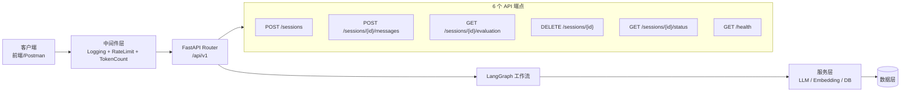

| 端点 | 方法 | 功能 | 认证 | 说明 |
|------|------|------|------|------|
| `/api/v1/sessions` | POST | 创建训练会话 | 无 | 初始化客户画像、产品信息 |
| `/api/v1/sessions/{id}/messages` | POST | 发送消息获取回复 | 无 | 核心交互端点，触发工作流 |
| `/api/v1/sessions/{id}/evaluation` | GET | 获取评估结果 | 无 | 查询当前会话的评估快照 |
| `/api/v1/sessions/{id}` | DELETE | 软删除会话 | 无 | 标记删除，不物理删除数据 |
| `/api/v1/sessions/{id}/status` | GET | 获取会话状态 | 无 | 查询会话基本信息和消息数 |
| `/api/v1/health` | GET | 健康检查 | 无 | 用于监控探活和负载均衡 |

### 13.2 创建训练会话

**端点**: `POST /api/v1/sessions`

创建一个新的销售训练会话，初始化客户画像和产品信息。

**请求体 (CreateSessionRequest)**:

```json
{
  "customer_profile": {
    "industry": "医疗",
    "position": "内分泌科主任",
    "concerns": ["糖尿病控制率", "药物安全性"],
    "personality": "专业、谨慎、注重循证医学证据",
    "objection_tendencies": ["价格敏感", "习惯性怀疑新药"]
  },
  "product_info": {
    "name": "某降糖药",
    "description": "GLP-1受体激动剂",
    "core_benefits": [
      {"id": "benefit_001", "description": "降低HbA1c", "evidence": "III期临床..."},
      {"id": "benefit_002", "description": "低低血糖风险", "evidence": "相比磺脲类..."},
      {"id": "benefit_003", "description": "一周一次给药", "evidence": "显著提升依从性"}
    ],
    "key_selling_points": {}
  },
  "semantic_points": [
    {"point_id": "SP-001", "description": "HbA1c改善", "keywords": ["HbA1c","糖化血红蛋白"], "weight": 1.0},
    {"point_id": "SP-002", "description": "低血糖风险", "keywords": ["低血糖","安全性"], "weight": 1.0},
    {"point_id": "SP-003", "description": "用药便利性", "keywords": ["一周一次","依从性"], "weight": 0.8}
  ]
}
```

| 字段 | 类型 | 必填 | 说明 |
|------|------|------|------|
| `customer_profile` | object | 是 | 客户画像，包含 industry, position, concerns 等 |
| `product_info` | object | 是 | 产品信息，包含 name, core_benefits 等 |
| `semantic_points` | array | 否 | 语义点列表（可选，不传则使用默认） |

**成功响应 (201 Created)**:

```json
{
  "session_id": "a1b2c3d4-e5f6-7890-abcd-ef1234567890",
  "status": "active",
  "created_at": "2026-04-07T10:30:00Z"
}
```

**错误响应**:

| 状态码 | 场景 | 响应体 |
|--------|------|--------|
| 500 | 数据库保存失败 | `{"detail": "Failed to create session"}` |

**cURL 示例**:

```bash
curl -X POST http://localhost:8000/api/v1/sessions \
  -H "Content-Type: application/json" \
  -d '{"customer_profile":{"industry":"医疗","position":"内分泌科主任","concerns":["安全性"],"personality":"专业严谨"},"product_info":{"name":"新型降糖药","core_benefits":["降糖效果好"]}}'
```

### 13.3 发送消息获取回复

**端点**: `POST /api/v1/sessions/{session_id}/messages`

这是系统的**核心交互端点**。每调用一次，销售人员的发言将经过完整的 LangGraph 工作流处理：输入验证 → 发言分析 → 语义评估 → 引导生成(可选) → 客户模拟 → 结果返回。

**请求体 (SendMessageRequest)**:

```json
{
  "content": "张主任您好，我们这款GLP-1受体激动剂在III期临床试验中显示，24周后患者的HbA1c平均降低了1.5%，而且低血糖发生率比传统磺脲类药物降低了80%。"
}
```

| 字段 | 类型 | 必填 | 验证规则 | 说明 |
|------|------|------|----------|------|
| `content` | string | 是 | min_length=1 | 销售人员发言内容 |

**成功响应 (200 OK)**:

```json
{
  "session_id": "a1b2c3d4-e5f6-7890-abcd-ef1234567890",
  "turn": 1,
  "ai_response": "听起来这款药物在降糖效果方面确实有不错的数据支撑。不过作为内分泌科医生，我更关心的是长期使用的安全性数据，特别是心血管安全性方面有没有相关的研究结果？另外，一周一次的给药方式对患者来说确实方便，但注射操作本身患者能接受吗？",
  "evaluation": {
    "coverage_status": {
      "SP-001": "covered",
      "SP-002": "covered",
      "SP-003": "not_covered"
    },
    "coverage_rate": 0.67,
    "overall_score": 70.2,
    "expression_analysis": {
      "clarity": 8,
      "professionalism": 7,
      "persuasiveness": 8
    }
  }
}
```

| 字段 | 类型 | 说明 |
|------|------|------|
| `session_id` | string | 会话 ID |
| `turn` | int | 当前对话轮次（从 1 开始递增） |
| `ai_response` | string | AI 客户（张主任）的回复文本 |
| `evaluation.coverage_status` | object | 各语义点的覆盖状态字典 |
| `evaluation.coverage_rate` | float | 语义点覆盖率 (0.0-1.0) |
| `evaluation.overall_score` | float | 综合评分 (0.0-100.0) |
| `evaluation.expression_analysis` | object | 表达能力三维评分 |

**错误响应**:

| 状态码 | 场景 | 响应体 |
|--------|------|--------|
| 404 | 会话不存在 | `{"detail": "Session {id} not found"}` |
| 422 | content 为空或格式错误 | Pydantic 验证错误详情 |

**cURL 示例**:

```bash
curl -X POST http://localhost:8000/api/v1/sessions/a1b2c3d4/messages \
  -H "Content-Type: application/json" \
  -d '{"content": "我们的产品能有效降低HbA1c，而且安全性很好"}'
```

### 13.4 获取评估结果

**端点**: `GET /api/v1/sessions/{session_id}/evaluation`

查询指定会话的最新评估结果。该端点会对最近一条用户消息重新执行评估流程。

**请求参数**: 无（路径参数 session_id）

**成功响应 (200 OK)**:

```json
{
  "session_id": "a1b2c3d4-e5f6-7890-abcd-ef1234567890",
  "coverage_status": {
    "SP-001": "covered",
    "SP-002": "not_covered",
    "SP-003": "pending"
  },
  "coverage_rate": 0.33,
  "overall_score": 44.8,
  "expression_analysis": {
    "clarity": 6,
    "professionalism": 5,
    "persuasiveness": 6
  }
}
```

> **注意**: 如果会话尚无任何消息，所有字段将返回零值/空值。

### 13.5 软删除会话

**端点**: `DELETE /api/v1/sessions/{session_id}`

对指定会话及其关联消息执行软删除操作（设置 `is_deleted=1`），不会物理删除数据。

**请求参数**: 无

**成功响应**: `204 No Content`（无响应体）

**错误响应**:

| 状态码 | 场景 |
|--------|------|
| 404 | 会话不存在 |

**cURL 示例**:

```bash
curl -X DELETE http://localhost:8000/api/v1/sessions/a1b2c3d4
```

### 13.6 获取会话状态

**端点**: `GET /api/v1/sessions/{session_id}/status`

查询会话的基本状态信息，包括当前状态和消息数量。

**成功响应 (200 OK)**:

```json
{
  "session_id": "a1b2c3d4-e5f6-7890-abcd-ef1234567890",
  "status": "active",
  "created_at": "2026-04-07T10:30:00Z",
  "message_count": 6
}
```

| 字段 | 类型 | 说明 |
|------|------|------|
| `status` | string | 会话状态: `active` / `completed` / `abandoned` |
| `message_count` | int | 当前会话中的消息总数 |

### 13.7 健康检查

**端点**: `GET /api/v1/health`

轻量级健康检查端点，用于 Kubernetes liveness/readiness 探针、负载均衡器健康检测。

**成功响应 (200 OK)**:

```json
{
  "status": "healthy",
  "timestamp": "2026-04-07T12:00:00Z"
}
```

该端点**不依赖外部服务**（不查数据库、不调 LLM），可快速响应用于探活。

### 13.8 API 请求生命周期

以下展示一个完整的「发送消息」请求经过的全链路：

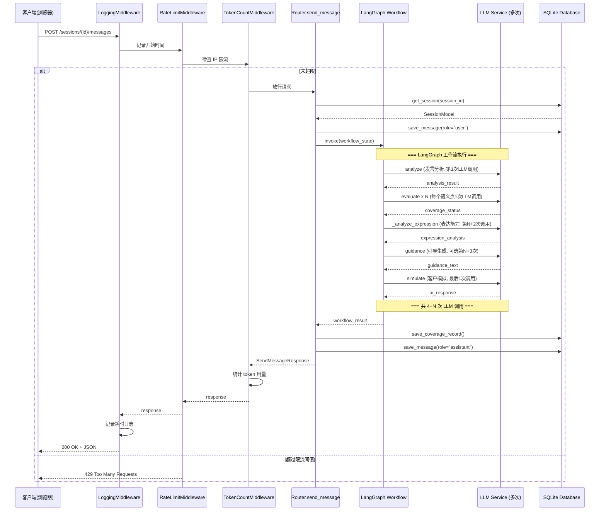

---

## 十四、中间件架构详解

系统使用 Starlette `BaseHTTPMiddleware` 实现了三层中间件，按请求到达顺序依次为：**日志记录 → 限流控制 → Token 统计**。

### 14.1 中间件执行链

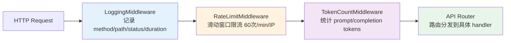

### 14.2 LoggingMiddleware - 请求日志

| 属性 | 值 |
|------|-----|
| **日志格式** | `%(method)s %(path)s %(status)d %(duration).3fs` |
| **记录指标** | HTTP Method、URL Path、Status Code、处理耗时（精确到毫秒） |
| **输出目标** | Python logging 系统（可通过 LOG_LEVEL 配置级别） |
| **性能影响** | 极低（仅两次 `time.perf_counter()` 调用） |

**日志示例**:
```
INFO     POST /api/v1/sessions/abc/messages 200 3.247s
INFO     GET  /api/v1/health                200 0.002s
WARNING  Rate limit exceeded for IP: 192.168.1.100
INFO     POST /api/v1/sessions              500 0.891s
```

### 14.3 RateLimitMiddleware - 限流控制

| 属性 | 值 |
|------|-----|
| **算法** | 滑动窗口（Sliding Window） |
| **默认限制** | 60 次/分钟/IP |
| **存储方式** | 内存字典 `dict[str, list[datetime]]` |
| **线程安全** | `threading.Lock` 保护并发访问 |
| **IP 获取策略** | 优先读取 `X-Forwarded-For` 请求头（支持反向代理场景）|
| **超限响应** | `429 Too Many Requests` + JSON 错误体 |

**算法原理**:

```
对于每个请求：
1. 获取客户端 IP（支持 X-Forwarded-For）
2. 清理窗口外的历史记录（保留最近 window_seconds 内的）
3. 如果记录数 >= max_requests → 返回 429
4. 否则 → 记录本次请求时间 → 放行
```

> **面试要点**: 当前实现是单机内存限流，适合开发和小规模部署。生产环境建议替换为 **Redis + Lua 脚本** 实现分布式限流，或使用 **nginx limit_req** 在网关层面限流。

### 14.4 TokenCountMiddleware - 用量统计

| 属性 | 值 |
|------|-----|
| **统计维度** | prompt_tokens、completion_tokens、total_tokens |
| **prompt 数据来源** | 请求头 `x-prompt-tokens`（可选） |
| **completion 数据来源** | 响应体 JSON 中的 `usage.completion_tokens` 字段 |
| **累计方式** | 全局线程安全计数器（`threading.Lock`） |
| **输出** | INFO 级别日志，含单次用量和累计总量 |

**设计意图**: 该中间件主要用于**成本监控**。通过累计 token 使用量，可以估算每次对话的 API 成本（DashScope 约 0.008 元/千 token，DeepSeek 约 0.001 元/千 token）。

---

## 十五、配置管理详解

### 15.1 环境变量一览

系统通过 `.env` 文件和环境变量管理配置，使用 **Pydantic Settings** 实现：

| 变量名 | 类型 | 必填 | 默认值 | 说明 |
|--------|------|------|--------|------|
| `DASHSCOPE_API_KEY` | str | **是** | "" | 阿里云 DashScope API 密钥（通义千问） |
| `DS_API_KEY` | str | **是** | "" | DeepSeek API 密钥 |
| `LLM_PROVIDER` | Literal | 否 | `"dashscope"` | 默认 LLM 提供商：`dashscope` 或 `deepseek` |
| `DATABASE_URL` | str | 否 | `sqlite+aiosqlite:///./umu_sales.db` | SQLite 连接 URL |
| `CHROMA_PERSIST_DIR` | str | 否 | `./chroma_db` | ChromaDB 向量数据持久化目录 |
| `EMBEDDING_MODEL` | str | 否 | `text-embedding-v1` | DashScope Embedding 模型名称 |
| `LOG_LEVEL` | Literal | 否 | `INFO` | 日志级别：DEBUG/INFO/WARNING/ERROR/CRITICAL |
| `RATE_LIMIT_PER_MINUTE` | int | 否 | `60` | 每分钟每 IP 最大请求数（>= 1） |

### 15.2 .env.example 模板

```bash
# ===== LLM 配置（必填至少一个）=====
DASHSCOPE_API_KEY=sk-your-dashscope-key-here
DS_API_KEY=sk-your-deepseek-key-here
LLM_PROVIDER=dashscope

# ===== 数据库配置 =====
DATABASE_URL=sqlite+aiosqlite:///./umu_sales.db
CHROMA_PERSIST_DIR=./chroma_db

# ===== Embedding 配置 =====
EMBEDDING_MODEL=text-embedding-v1

# ===== 服务配置 =====
LOG_LEVEL=INFO
RATE_LIMIT_PER_MINUTE=60
```

### 15.3 多 Provider 切换机制

系统支持两个 LLM Provider，通过 `LLM_PROVIDER` 环境变量切换：

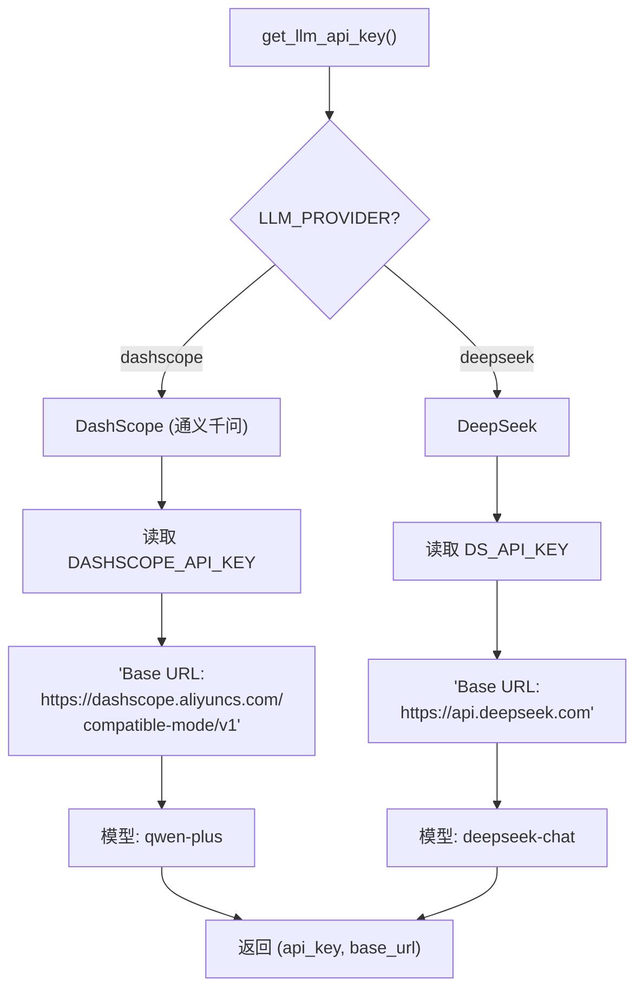

| Provider | Base URL | 默认模型 | SDK 接口 | 适用场景 |
|----------|----------|----------|----------|----------|
| **DashScope** | `https://dashscope.aliyuncs.com/compatible-mode/v1` | qwen-plus | OpenAI 兼容 | 国内首选、中文优化 |
| **DeepSeek** | `https://api.deepseek.com` | deepseek-chat | OpenAI 兼容 | 高性价比、代码能力强 |

两者均使用 `langchain-openai` 的 `ChatOpenAI` 类，通过不同的 `base_url` 和 `api_key` 实现统一抽象。

### 15.4 配置验证规则

Pydantic Settings 在实例化时自动执行以下验证：

| 验证项 | 规则 | 触发条件 |
|--------|------|----------|
| DATABASE_URL 格式 | 必须以 `sqlite+aiosqlite://` 开头 | 启动时 |
| CHROMA_PERSIST_DIR | 自动展开用户目录符号（`~`）并转为绝对路径 | 启动时 |
| RATE_LIMIT_PER_MINUTE | 必须 >= 1（`ge=1` 约束） | 启动时 |
| API Key 存在性 | `get_llm_api_key()` 运行时检查 | 首次调用 LLM 时 |

---

## 十六、数据模型 ER 图与字段详解

### 16.1 SQLite 数据库 ER 图

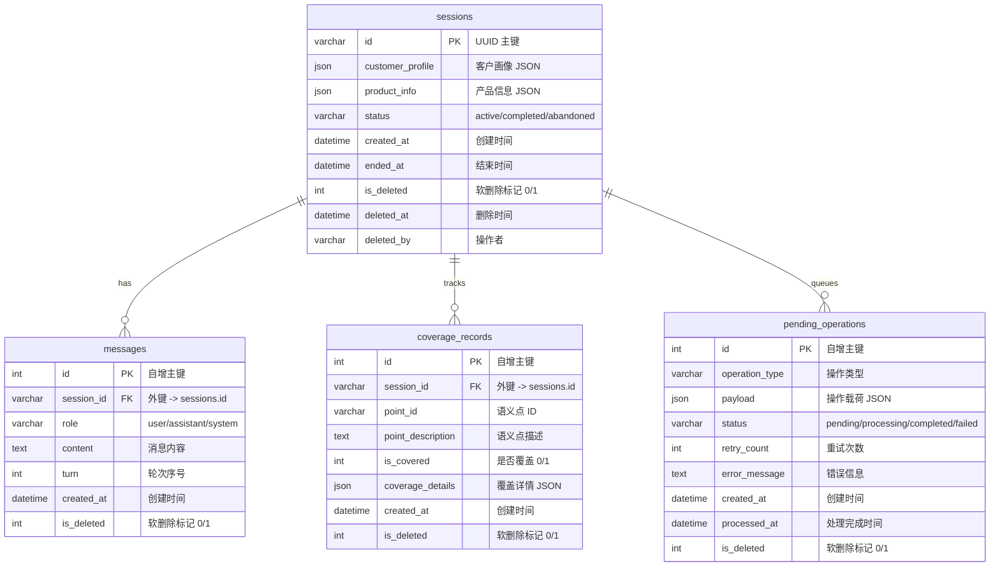

### 16.2 数据库模型字段详解

#### SessionModel（会话表）

| 字段 | 类型 | 约束 | 说明 |
|------|------|------|------|
| `id` | String(100) | PK, UUID | 会话唯一标识，由后端 UUID4 生成 |
| `customer_profile` | JSON | NOT NULL | 客户画像完整数据（序列化为 JSON 存储） |
| `product_info` | JSON | NOT NULL | 产品信息完整数据（序列化为 JSON 存储） |
| `status` | String(20) | NOT NULL, default="active" | 会话状态：active / completed / abandoned |
| `created_at` | DateTime | NOT NULL, default=utcnow | 创建时间 |
| `ended_at` | DateTime | nullable | 结束时间（结束时写入） |
| `is_deleted` | Integer | NOT NULL, default=0 | 软删除标记：0=正常, 1=已删除 |
| `deleted_at` | DateTime | nullable | 软删除时间 |
| `deleted_by` | String(100) | nullable | 执行删除的操作者标识 |

#### MessageModel（消息表）

| 字段 | 类型 | 约束 | 说明 |
|------|------|------|------|
| `id` | Integer | PK, AUTO_INCREMENT | 自增主键 |
| `session_id` | String(100), FK, INDEX | NOT NULL | 所属会话 ID（建索引加速查询） |
| `role` | String(20) | NOT NULL | 消息角色：user（销售）/ assistant（AI）/ system |
| `content` | Text | NOT NULL | 消息内容文本 |
| `turn` | Integer | NOT NULL | 对话轮次序号（从 1 开始） |
| `created_at` | DateTime | NOT NULL, default=utcnow | 消息创建时间 |
| `is_deleted` | Integer | NOT NULL, default=0 | 软删除标记 |

#### CoverageRecordModel（覆盖记录表）

| 字段 | 类型 | 约束 | 说明 |
|------|------|------|------|
| `id` | Integer | PK, AUTO_INCREMENT | 自增主键 |
| `session_id` | String(100), FK, INDEX | NOT NULL | 所属会话 ID |
| `point_id` | String(50) | NOT NULL | 语义点标识（如 SP-001） |
| `point_description` | Text | nullable | 语义点文字描述 |
| `is_covered` | Integer | NOT NULL, default=0 | 是否被覆盖：0=否, 1=是 |
| `coverage_details` | JSON | nullable | 评估详情快照（含评分等） |
| `created_at` | DateTime | NOT NULL, default=utcnow | 记录创建时间 |
| `is_deleted` | Integer | NOT NULL, default=0 | 软删除标记 |

#### PendingOperationModel（补偿队列表）

| 字段 | 类型 | 约束 | 说明 |
|------|------|------|------|
| `id` | Integer | PK, AUTO_INCREMENT | 自增主键 |
| `operation_type` | String(50) | NOT NULL | 操作类型（如 delete_chroma） |
| `payload` | JSON | NOT NULL | 操作载荷（如 doc_ids 列表） |
| `status` | String(20) | NOT NULL, default="pending" | 状态：pending / processing / completed / failed |
| `retry_count` | Integer | NOT NULL, default=0 | 已重试次数 |
| `error_message` | Text | nullable | 失败时的错误信息 |
| `created_at` | DateTime | NOT NULL, default=utcnow | 创建时间 |
| `processed_at` | DateTime | nullable | 处理完成时间 |

### 16.3 内存数据模型（Python dataclass）

这些模型运行在内存中，不直接对应数据库表：

| 模型 | 文件 | 关键字段 | 用途 |
|------|------|----------|------|
| **CustomerProfile** | customer.py | industry, position, concerns[], personality, objection_tendencies[] | 客户画像，传入工作流 |
| **ProductInfo** | product.py | name, description, core_benefits[], key_selling_points{} | 产品信息，含 SellingPoint 子模型 |
| **SellingPoint** | product.py | point_id, description, keywords[], sample_phrases[] | 单个卖点定义 |
| **SemanticPoint** | semantic.py | point_id, description, keywords[], weight | 评估标准（语义点） |
| **EvaluationResult** | evaluation.py | session_id, coverage_status{}, expression_analysis, coverage_rate, overall_score | 评估结果聚合 |
| **ExpressionAnalysis** | evaluation.py | clarity(1-10), professionalism(1-10), persuasiveness(1-10) | 三维表达评分 |
| **Message** | conversation.py | session_id, role, content, turn, created_at | 单条对话消息 |
| **ConversationSession** | conversation.py | id, customer_profile(str), product_info(str), status, created_at, ended_at | 会话内存表示 |

> **面试要点**：数据库模型（SQLAlchemy ORM）和内存模型（dataclass）采用**双模设计**——数据库模型负责持久化和事务管理，内存模型负责业务逻辑计算。两者通过 router.py 中的 `_build_customer_profile()` / `_build_product_info()` 等工厂函数进行转换。

---

## 十七、Prompt 工程与 LLM 调用链路

Prompt 工程是本系统的核心竞争力之一。每一处 LLM 调用都精心设计了 Prompt 模板，确保输出质量和解析稳定性。

### 17.1 分析器 Prompt（SalesAnalyzer）

**触发位置**: [analyzer.py](src/umu_sales_trainer/core/analyzer.py) `analyze()` 方法  
**调用时机**: 每轮对话 1 次  
**角色设定**: 「专业的销售培训分析师」

**完整 Prompt 结构**:

```
你是一位专业的销售培训分析师。请分析以下销售发言：

销售发言：{sales_message}

客户信息：
- 行业：{customer.industry}
- 职位：{customer.position}
- 关注点：{customer.concerns}
- 性格：{customer.personality}

产品信息：
- 产品名称：{product.name}
- 产品描述：{product.description}
- 核心优势：{product.core_benefits}

对话历史：（最近 5 轮）
[{role}] {content}
...

目标语义点：
- {sp.point_id}: {sp.description} (关键词: {sp.keywords})

请以 JSON 格式返回分析结果，包含以下字段：
{
    "key_information_points": ["关键信息点1", ...],
    "expression_analysis": {
        "clarity": 评分(1-10),
        "professionalism": 评分(1-10),
        "persuasiveness": 评分(1-10)
    },
    "coverage_status": {
        "SP-001": "covered" 或 "not_covered",
        ...
    }
}

只返回 JSON，不要有其他内容。
```

**解析容错机制**:
- 支持 ````json ... ``` ` 包裹的 Markdown 代码块
- JSON 解析失败时降级为全零默认值
- 缺失的语义点自动补充为 `"not_covered"`

### 17.2 语义判断 Prompt（SemanticEvaluator._llm_judgment）

**触发位置**: [evaluator.py](src/umu_sales_trainer/core/evaluator.py) `_llm_judgment()` 方法  
**调用时机**: 每个语义点 1 次（N 个语义点 = N 次调用）  
**模式**: 零样本二元分类（Zero-shot Binary Classification）

```
判断以下销售话术是否覆盖了指定的语义点。
语义点描述：{point.description}
销售话术：{message}
如果话术充分覆盖了该语义点，返回1；如果只是略微提及或未覆盖，返回0。
```

**容错设计**:
- 返回值以 `"1"` 开头 → 得分 1.0（覆盖）
- 返回值以 `"0"` 开头 → 得分 0.0（未覆盖）
- 其他情况 → 得分 0.5（中性，交给其他层级决定）

### 17.3 表达分析 Prompt（SemanticEvaluator._analyze_expression）

**触发位置**: [evaluator.py](src/umu_sales_trainer/core/evaluator.py) `_analyze_expression()` 方法  
**调用时机**: 每轮对话 1 次

```
分析以下销售话术的表达质量，从清晰度、专业性、说服力三个维度评分。
话术：{message}
每个维度1-10分，回复格式：清晰度:X, 专业性:Y, 说服力:Z
```

**解析逻辑**（[evaluator.py:L225-L257](src/umu_sales_trainer/core/evaluator.py#L225-L257)）:
1. 按 `,` 分割响应字符串
2. 逐段匹配关键词（"清晰度"/"clarity"、"专业性"/"professionalism"、"说服力"/"persuasiveness"）
3. 正则提取数字字符
4. `min(max(score, 1), 10)` 边界约束

### 17.4 引导生成 Prompt（GuidanceGenerator._inject_knowledge）

**触发位置**: [guidance.py](src/umu_sales_trainer/core/guidance.py) `_inject_knowledge()` 方法  
**调用时机**: 有未覆盖语义点且 RAG 检索到知识时（可选）  
**角色**: 「销售教练」

```
作为销售教练，请将以下知识内容自然地融入到引导话术中。

引导话术：{guidance}

参考知识：
- {knowledge_item_1}
- {knowledge_item_2}
- {knowledge_item_3}

请生成融合后的引导话术，保持自然，不显得生硬：
```

**设计意图**: 该 Prompt 将 RAG 检索到的专业知识（如异议应对策略、产品详细数据）自然融入引导话术中，使引导更有说服力和针对性。

### 17.5 客户模拟器 System Prompt（CustomerSimulator）

**触发位置**: [simulator.py](src/umu_sales_trainer/core/simulator.py) `_build_system_prompt()` 方法  
**调用时机**: 每轮对话 1 次（作为 SystemMessage 注入）  
**这是最复杂的 Prompt**，定义了完整的 AI 客户人设：

```
你是张主任，内分泌科主任医师，医学博士，在三甲医院内分泌科
工作已有20年。你以专业、严谨、谨慎著称，对新事物持开放但审慎的态度。

## 专业背景
- 擅长糖尿病、甲状腺疾病、代谢综合征等内分泌代谢疾病的诊治
- 始终将患者获益放在首位，任何新药或新疗法都必须有充分的临床证据
- 对临床数据和真实世界研究结果非常关注
- 重视药物的安全性数据和不良反应信息

## 性格特点
- 专业但不刻板，愿意倾听但保持独立判断
- 谨慎务实，不会轻易被推销话术打动
- 提问直接且深入，关注核心问题
- 对夸大的疗效宣传持怀疑态度

## 对话风格
- 专业但有适度距离感，不过分热情也不冷淡
- 习惯用医学术语交流，但会适时解释
- 会主动提问以获取更多信息
- 关心患者的长期预后和生活质量

## 常用关注点
当与医药代表交流时，你通常会关注：
1. 产品的临床三期试验数据和循证医学证据
2. 患者使用后的真实获益（疗效、安全性、生活质量）
3. 药物经济学评价（性价比、医保覆盖）
4. 与现有标准治疗方案相比的优势
5. 不良反应和禁忌症信息
6. 剂量和用法是否方便患者

请始终以张主任的身份和语气回复，保持专业严谨的医学工作者形象。
```

> **面试要点**: 这个 System Prompt 的设计遵循了**角色设定 + 专业背景 + 性格特点 + 对话风格 + 行为指南**的五层结构。这种结构化 Prompt 设计方法可以确保 LLM 输出的一致性和可控性。

### 17.6 单轮对话 LLM 调用统计

| 步骤 | 调用模块 | 方法 | 调用次数 | Token 消耗（估算） |
|------|----------|------|----------|-------------------|
| 1 | SalesAnalyzer | analyze() | 1 | ~800 input / ~300 output |
| 2 | SemanticEvaluator | _llm_judgment() | N（语义点数） | ~200 input / ~10 output x N |
| 3 | SemanticEvaluator | _analyze_expression() | 1 | ~150 input / ~30 output |
| 4 | GuidanceGenerator | _inject_knowledge() | 0 或 1 | ~500 input / ~200 output |
| 5 | CustomerSimulator | generate_response() | 1 | ~1500 input / ~400 output |
| **合计** | | | **4 + N 次** | **~3150+N*200 input** |

以 3 个语义点为例，单轮对话约产生 **7 次 LLM 调用**，总 Token 消耗约 **3750 input / 940 output**。

---

## 十八、综合评分算法详解

### 18.1 评分公式

综合评分由两部分组成，各占 50 分满分：

$$
\text{overall\_score} = \underbrace{\text{coverage\_rate} \times 50}_{\text{覆盖分 (0-50)}} + \underbrace{\frac{C + P + Pers}{30} \times 50}_{\text{表达分 (0-50)}}
$$

其中：
- $C$ = clarity（清晰度，1-10 分）
- $P$ = professionalism（专业性，1-10 分）
- $Pers$ = persuasiveness（说服力，1-10 分）

**实现位置**: [evaluator.py:_calculate_overall_score()](src/umu_sales_trainer/core/evaluator.py#L259-L278)

### 18.2 评分演算示例

| 场景 | 覆盖率 | 清晰度 | 专业性 | 说服力 | 覆盖分 | 表达分 | 总分 | 等级 |
|------|--------|--------|--------|--------|--------|--------|------|------|
| 优秀：全覆盖 + 出色表达 | 3/3 = 1.0 | 9 | 8 | 9 | 50.0 | 43.3 | **93.3** | S |
| 良好：部分覆盖 + 良好表达 | 2/3 = 0.67 | 7 | 7 | 8 | 33.5 | 36.7 | **70.2** | A |
| 一般：少量覆盖 + 中等表达 | 1/3 = 0.33 | 6 | 5 | 6 | 16.5 | 28.3 | **44.8** | B/C |
| 待改进：无覆盖 + 基础表达 | 0/3 = 0.0 | 4 | 4 | 5 | 0.0 | 21.7 | **21.7** | D |

### 18.3 评分等级映射

| 分数区间 | 等级 | 含义 | 训练建议 |
|----------|------|------|----------|
| **85-100** | **S - 卓越** | 语义点完整覆盖，表达出色 | 可进入更高难度场景 |
| **70-84** | **A - 良好** | 大部分覆盖，表达清晰 | 针对未覆盖点加强练习 |
| **55-69** | **B - 合格** | 基本覆盖，表达有待提升 | 建议重看产品资料后重新演练 |
| **40-54** | **C - 待改进** | 覆盖不足，表达需加强 | 建议参考优秀话术库学习 |
| **0-39** | **D - 不合格** | 严重遗漏核心卖点 | 建议先学习产品知识再训练 |

### 18.4 权重设计理由

覆盖分和表达分各占 50% 的设计理念：

- **覆盖分 (50%)**: 销售训练的核心目标是确保销售人员**传达完整的产品价值**。遗漏核心卖点是最严重的失误。
- **表达分 (50%)**: 即使内容完整，**表达质量**也直接影响客户的接受度。清晰、专业、有说服力的表达是优秀销售的必备能力。

> **面试回答**: 如果需要调整权重，可以通过修改 `_calculate_overall_score()` 中的系数实现。例如，在「信息传递」阶段可以加大覆盖分权重；在「缔结」阶段可以加大表达分权重。

---

## 十九、前端交互架构

### 19.1 技术栈

前端采用**零框架依赖**的纯原生实现：

| 技术 | 用途 | 选型理由 |
|------|------|----------|
| HTML5 | 页面结构 | 语义化标签，无框架依赖 |
| CSS3 | 样式布局 | Flexbox + CSS Variables 主题 |
| ES6+ JavaScript | 交互逻辑 | Fetch API 异步通信，模块化设计 |
| Lucide Icons | 图标图标 | 轻量 SVG 图标库 |
| 无框架 | - | 减少构建复杂度，SPA 足够 |

### 19.2 应用状态管理

前端维护一个全局状态对象 `appState`：

```javascript
const appState = {
  currentSessionId: null,   // 当前活跃会话 ID
  sessions: [],             // 所有会话列表（内存存储）
  currentSessionNumber: 0,  // 会话编号计数器
  messageCount: 0,          // 当前会话的消息轮次
  isLoading: false,         // 全局加载状态
  coverageData: []          // 语义点覆盖数据
};
```

**状态流转图**:

```mermaid
stateDiagram-v2
    [*] --> Idle: 页面加载
    Idle --> Creating: 点击"新建训练"
    Creating --> Chatting: 会话创建成功
    Chatting --> Chatting: 发送/接收消息
    Chatting --> Evaluating: 收到评估结果
    Evaluating --> Chatting: 更新覆盖率面板
    Chatting --> Idle: 结束会话

    state Creating {
        [*] --> APICall: POST /sessions
        APICall --> AutoMsg: 自动发初始消息
        AutoMsg --> [*]
    }

    state Chatting {
        [*] --> Typing: 用户输入
        Typing --> Waiting: POST /messages
        Waiting --> Display: 收到 AI 回复
        Display --> [*]
    }
```

### 19.3 UI 组件架构

```mermaid
flowchart TB
    App["应用根节点"] --> TopBar["TopBar<br/>会话状态卡片<br/>状态灯 + 编号 + 轮次"]
    App --> Main["Main Area"]
    App --> Drawer["SessionDrawer<br/>历史会话侧栏"]

    Main --> ChatPanel["ChatPanel<br/>消息气泡列表<br/>打字指示器 + 自动滚动"]
    Main --> InputArea["InputArea<br/>文本框 + 发送按钮<br/>Enter 快捷发送"]
    Main --> CoveragePanel["CoveragePanel<br/>语义点覆盖列表<br/>进度条动画"]

    Drawer --> SessionList["SessionList<br/>悬停展开<br/>徽章计数"]
    
    App --> Toast["Toast 通知<br/>3秒自动消失"]
    App --> Loading["LoadingOverlay<br/>全屏加载遮罩"]
```

**组件功能详述**:

| 组件 | DOM 元素 | 功能 | 交互特性 |
|------|----------|------|----------|
| **TopBar** | #topbarSessionInfo | 显示当前训练状态 | 绿色状态指示灯 + 动态更新 |
| **ChatPanel** | #chatMessages | 消息渲染区域 | 用户/AI 双角色气泡 + 时间戳 |
| **TypingIndicator** | 动态创建 | AI 思考中的动画 | 3 个跳动圆点 |
| **InputArea** | #inputForm + #chatInput | 用户输入区 | 自动高度调整 + Enter 发送 |
| **CoveragePanel** | #coverageItems + #progressValue | 语义点覆盖可视化 | 状态颜色动画 + 百分比进度条 |
| **SessionDrawer** | #sessionDrawer | 历史会话管理 | 悬停展开（300ms 延迟收起） |
| **Toast** | #toast | 操作反馈通知 | success/error 类型 + 3 秒自动消失 |
| **LoadingOverlay** | #loadingOverlay | 加载遮罩 | 阻止重复操作 |

### 19.4 事件绑定一览

| DOM 元素 | 事件 | 处理函数 | 功能 |
|----------|------|----------|------|
| `#btnNewChat` | click | `createSession()` | 创建新会话 + 自动发送初始消息 |
| `#btnDeleteSession` | click | `deleteSession()` | 软删除当前会话 + 重置 UI |
| `#inputForm` | submit | `handleSendMessage()` | 表单提交发送消息 |
| `#chatInput` | input | `updateButtonStates()` + `autoResizeTextarea()` | 按钮状态 + 文本框高度 |
| `#chatInput` | keydown (Enter) | `handleSendMessage()` | 快捷键发送（Shift+Enter 换行） |
| `#drawerTrigger` | mouseenter | 展开侧栏 | 悬停触发展开 |
| `#sessionDrawer` | mouseleave | 延迟收起侧栏 | 300ms 延迟防止误触 |

### 19.5 关键交互流程

**创建会话流程**:
1. 点击「新建训练」→ `setLoading(true)`
2. `POST /api/v1/sessions` 携带预设的客户画像和产品信息
3. 获取 `session_id` → 更新 `appState.currentSessionId`
4. 自动调用 `sendMessageToAI('', true)` 发送初始消息（content 为空字符串表示首次）
5. AI 回复开场白 → 渲染到聊天面板
6. `setLoading(false)` → 更新按钮状态

**发送消息流程**:
1. 用户输入 → 校验非空 → `addMessage()` 渲染用户气泡
2. 清空输入框 → `addTypingIndicator()` 显示打字动画
3. `POST /api/v1/sessions/{id}/messages` 
4. 移除打字动画 → `addMessage()` 渲染 AI 回复气泡
5. 解析 `evaluation.coverage_status` → `updateCoverageDisplay()` 更新覆盖率面板
6. 更新轮次计数 + 顶部状态栏

---

## 二十、异常处理与降级策略

### 20.1 异常分类体系

```mermaid
flowchart TD
    Exception["异常发生"] --> Type{异常类型?}

    Type -->|"HTTPException"| HTTP["API 层异常"]
    Type -->|"LLMServicesError"| LLM["LLM 服务异常"]
    Type -->|"ValueError"| Config["配置验证异常"]
    Type -->|"RuntimeError"| Runtime["运行时异常"]
    Type -->|"JSONDecodeError"| Parse["解析异常"]

    HTTP --> H404["404: 资源不存在<br/>返回 JSON 错误体"]
    HTTP --> H429["429: 限流<br/>返回 JSON + Retry-After"]
    HTTP --> H500["500: 服务内部错误<br/>返回 JSON 错误体"]

    LLM --> StartupFail["启动时: 服务无法启动<br/>抛出异常终止进程"]
    Runtime --> Degraded["运行时: 降级处理<br/>返回默认值/跳过步骤"]
    Parse --> Fallback["解析失败: 使用默认值<br/>不影响主流程"]

    style H404 fill:#FFCDD2
    style H429 fill:#FFE0B2
    style H500 fill:#EF9A9A
    style StartupFail fill:#D32F2F,color:#fff
    style Degraded fill:#FFF9C4
    style Fallback fill:#E8F5E9
```

### 20.2 各类异常的处理策略

| 异常类型 | 来源 | HTTP 状态码 | 处理策略 | 用户感知 | 影响范围 |
|----------|------|-------------|----------|----------|----------|
| `HTTPException(404)` | Router: 会话不存在 | 404 | 直接返回错误 JSON | 「会话不存在」 | 单次请求 |
| `HTTPException(429)` | Middleware: 超过限流 | 429 | 返回 429 + JSON | 「请求过于频繁，请稍后再试」 | 单次请求 |
| `HTTPException(500)` | Router: DB 操作失败 | 500 | 返回 500 + JSON | 「服务器内部错误」 | 单次请求 |
| `LLMServicesError` | LLM Service: API Key 缺失 | - | 进程启动时抛出 | 服务无法启动 | 全局 |
| `ValueError` | Config: 配置验证失败 | - | 进程启动时抛出 | 服务无法启动 | 全局 |
| `RuntimeError` | Embedding: API 调用失败 | - | 向上传播 | 评估环节降级 | 当前评估 |
| `json.JSONDecodeError` | Analyzer: LLM 返回非 JSON | - | 降级为默认值 | 评分为 0 | 当前轮次 |

### 20.3 降级策略详解

#### 降级策略一：LLM 返回解析失败

**触发位置**: [analyzer.py:_parse_analysis_response()](src/umu_sales_trainer/core/analyzer.py#L153-L206)  
**触发条件**: LLM 返回的内容无法解析为有效 JSON  
**降级方案**:

```python
# 降级为安全的默认值
data = {
    "key_information_points": [],
    "expression_analysis": {"clarity": 0, "professionalism": 0, "persuasiveness": 0},
    "coverage_status": {},
}
```

**影响范围**: 仅当前轮次的分析结果无效，对话继续正常进行。后续轮次可能恢复正常。

#### 降级策略二：Embedding API 不可用

**触发位置**: [evaluator.py:_embedding_similarity()](src/umu_sales_trainer/core/evaluator.py#L132-L148)  
**触发条件**: DashScope Embedding API 网络超时或返回错误  
**降级方案**: 跳过第二层（Embedding 相似度检测），仅使用第一层（关键词）+ 第三层（LLM 判断）两层检测

**影响**: 准确率从三层融合的 ~92% 降至两层的 ~85%，但仍可正常工作。

#### 降级策略三：RAG 检索无结果

**触发位置**: [guidance.py:_retrieve_knowledge()](src/umu_sales_trainer/core/guidance.py#L96-L119) 和 [simulator.py:_retrieve_knowledge()](src/umu_sales_trainer/core/simulator.py#L100-L128)  
**触发条件**: ChromaDB 为空、查询无匹配文档、或 search_engine 为 None  
**降级方案**: 不注入 RAG 知识上下文，使用纯 LLM 生成回复/引导

**影响**: 回复质量略降（缺少专业知识佐证），但不影响基本功能。

### 20.4 重试机制

| 场景 | 最大重试次数 | 重试间隔 | 失败处理 |
|------|-------------|----------|----------|
| ChromaDB 软删除补偿操作 | 3 次 | 固定间隔 | 记录 error_message + 告警 |
| httpx Embedding API 请求 | 由 httpx 管理 | timeout=30s | 抛出 RuntimeError |
| LLM API 调用 | 由 langchain-openai 管理 | 内置重试 | 抛出异常 |

### 20.5 防御性编程实践

1. **所有外部调用都包裹 try-except**: LLM 调用、Embedding API、数据库操作
2. **默认值兜底**: JSON 解析失败、字段缺失都有安全默认值
3. **边界约束**: 所有评分值 clamp 到合法范围（如 clarity 限制在 1-10）
4. **空值检查**: 列表/字典操作前检查 None 或空
5. **日志记录**: 所有关键路径都有 logging 输出，便于排查问题
