# UMU Sales Trainer - AI 销售训练 Chatbot 系统

<div align="center">

[](https://opensource.org/licenses/MIT)
[](https://www.python.org/downloads/)
[](https://langchain-ai.github.io/langgraph/)
[](#测试覆盖)

**基于 LangGraph StateGraph + Agentic RAG 的智能销售训练系统**

</div>

---

## 目录

- [一、项目背景与业务价值](#一项目背景与业务价值)
- [二、需求分析](#二需求分析)
- [三、系统架构总览](#三系统架构总览)
- [四、LangGraph 工作流详解](#四langgraph-工作流详解)
- [五、三层语义检测机制](#五三层语义检测机制)
- [六、Agentic RAG 知识检索系统](#六agentic-rag-知识检索系统)
- [七、数据一致性保障](#七数据一致性保障)
- [八、技术选型理由](#八技术选型理由)
- [九、快速开始](#九快速开始)
- [十、项目结构](#十项目结构)
- [十一、测试覆盖](#十一测试覆盖)
- [十二、License](#十二license)

---

## 一、项目背景与业务价值

### 1.1 业务痛点

在企业销售培训中，**Role-Play（角色扮演）** 是最有效的训练方式之一。但传统 Role-Play 存在以下痛点：

| 痛点 | 描述 | 影响 |
|------|------|------|
| **成本高** | 需要资深销售或外部教练扮演客户 | 培训预算受限 |
| **时间冲突** | 教练和学员的时间难以协调 | 训练频次低 |
| **标准不一** | 不同教练的反馈标准差异大 | 评估结果不可比 |
| **无法量化** | 缺乏客观的评估指标体系 | 进步难以衡量 |
| **场景有限** | 难以模拟各种类型的客户 | 应对能力不足 |

### 1.2 解决方案：AI 销售训练 Chatbot

本系统通过 **AI 扮演客户**，让销售人员进行**多轮对话模拟训练**，并**实时评估**其表达能力。

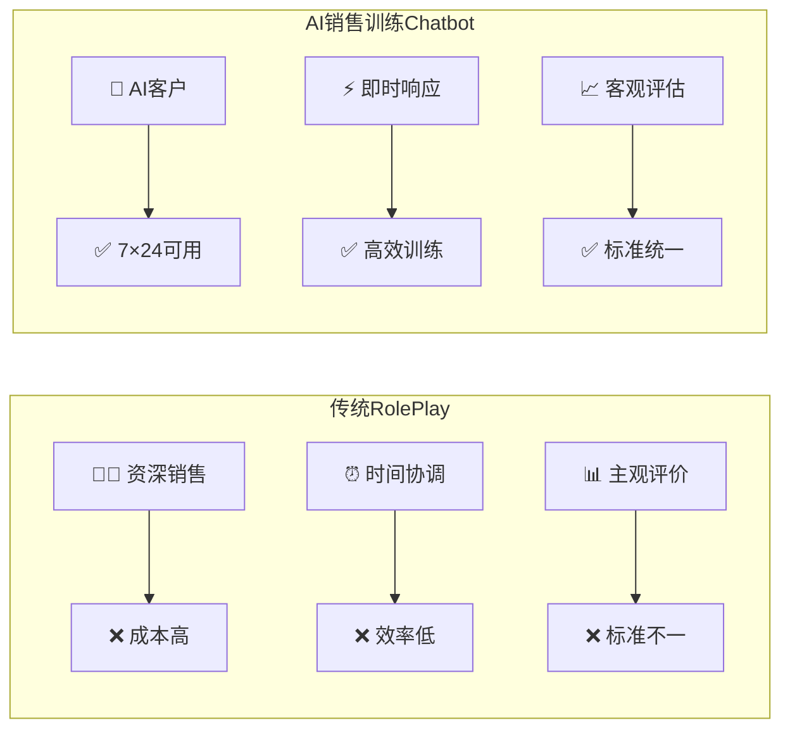

### 1.3 核心价值主张

> **一句话描述**：AI 扮演内分泌科主任医师，通过多轮对话引导销售人员完整传达产品核心卖点，并提供实时评估反馈。

**系统能力矩阵：**

| 能力维度 | 描述 | 技术实现 |
|----------|------|----------|
| 🎭 **角色扮演** | AI 模拟真实客户的反应和提问 | LLM + System Prompt + 客户画像 |
| 🔍 **语义分析** | 判断销售发言是否覆盖关键卖点 | 三层级联检测（关键词→Embedding→LLM） |
| 💡 **智能引导** | 提示未覆盖的卖点，引导继续表达 | 动态策略选择（4种引导策略） |
| 📊 **实时评估** | 多维度评分和改进建议 | 加权融合算法 + LLM 分析 |
| 📚 **知识增强** | 基于知识库生成专业回复 | Agentic RAG + RRF 融合 |

---

## 二、需求分析

### 2.1 销售拜访五阶段模型

一次完整的销售拜访通常包含 **5 个阶段**：

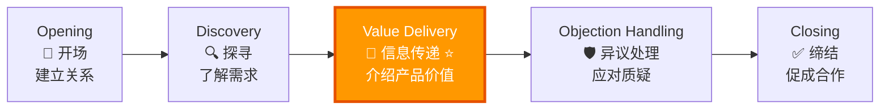

| 阶段 | 英文 | 核心任务 | 销售行为 | 客户行为 |
|------|------|----------|----------|----------|
| **开场** | Opening | 建立信任关系 | 自我介绍、破冰 | 礼貌回应 |
| **探寻** | Discovery | 了解客户需求 | 提问、倾听 | 表达需求 |
| **信息传递** | Value Delivery | 介绍产品价值 | **完整表达核心卖点** | 提出问题/质疑 |
| **异议处理** | Objection Handling | 解决客户疑虑 | 解释、举证 | 提出异议 |
| **缔结** | Closing | 达成合作意向 | 总结价值、推动决策 | 做出决定 |

> **本项目聚焦「信息传递」阶段** —— 这是销售拜访中最核心的阶段，直接决定了产品价值能否被客户理解。

### 2.2 本系统的核心需求

根据面试题要求，系统需要支持以下功能：

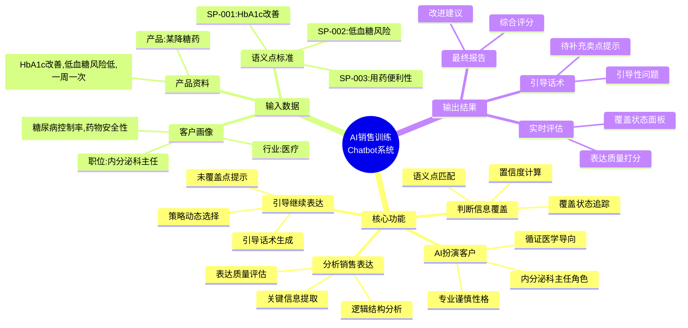

### 2.3 输入数据规格

#### 客户画像 (Customer Profile)

```yaml
industry: 医疗                    # 行业领域
position: 内分泌科主任            # 职位级别
concerns:                         # 关注点（驱动客户决策的核心因素）
  - 糖尿病控制率                   # 关注临床效果
  - 药物安全性                     # 关注患者安全
personality: 专业、谨慎、注重循证医学证据  # 性格特征（影响对话风格）
objection_tendencies:              # 异议倾向（用于模拟真实挑战）
  - 价格敏感
  - 习惯性怀疑新药
```

#### 产品资料 (Product Info)

```yaml
product_name: 某降糖药
category: GLP-1受体激动剂
core_benefits:                     # 核心卖点（销售必须传达的信息）
  - id: benefit_001
    description: 降低 HbA1c（糖化血红蛋白）
    evidence: "III期临床试验显示，24周后 HbA1c 平均降低 1.5%"
  - id: benefit_002
    description: 低低血糖风险
    evidence: "与传统磺脲类药物相比，低血糖发生率降低 80%"
  - id: benefit_003
    description: 一周一次给药（便利性）
    evidence: "每周仅需注射一次，显著提升患者依从性"
```

#### 标准语义点 (Semantic Points) - 评估依据

| 语义点 ID | 描述 | 识别关键词 | 权重 |
|-----------|------|------------|------|
| `SP-001` | HbA1c 改善 | HbA1c、糖化血红蛋白、血糖控制、降糖效果 | ⭐⭐⭐ 高 |
| `SP-002` | 低血糖风险 | 低血糖、低血糖风险、安全性、安心、副作用 | ⭐⭐⭐ 高 |
| `SP-003` | 用药便利性 | 一周一次、给药便利、依从性、简单、方便 | ⭐⭐ 中 |

> **面试要点**：语义点是评估销售表达质量的**可量化标准**。系统通过判断每个语义点是否被"覆盖"，来客观评估销售的完整性。

---

## 三、系统架构总览

### 3.1 六层分层架构

本系统采用**六层分层架构**，遵循**单一职责原则**和**依赖倒置原则**：

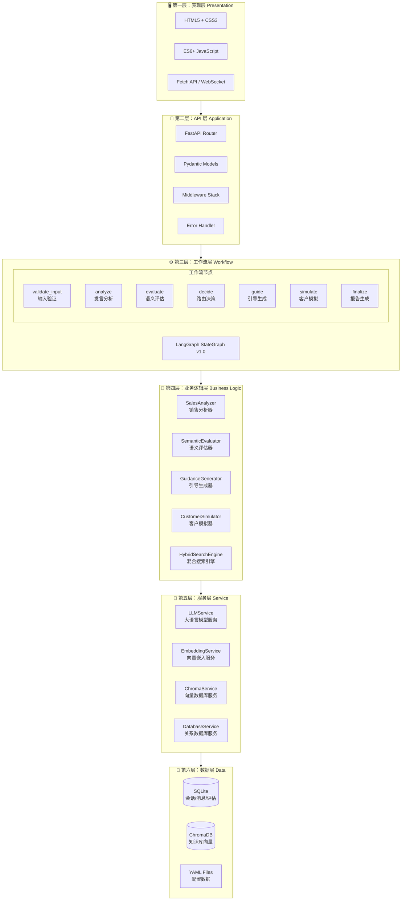

### 3.2 各层职责说明

| 层级 | 技术选型 | 核心职责 | 设计原则 |
|------|----------|----------|----------|
| **表现层** | 原生 HTML5/CSS3/JS | 用户界面渲染、交互处理 | 零框架依赖，轻量 SPA |
| **API 层** | FastAPI + Uvicorn | HTTP 请求处理、参数校验、响应格式化 | 异步非阻塞，自动 OpenAPI 文档 |
| **工作流层** | LangGraph StateGraph | 对话流程编排、状态管理、条件路由 | 状态机模式，可视化执行路径 |
| **业务逻辑层** | Python Classes | 核心算法实现、业务规则封装 | 单一职责，高内聚低耦合 |
| **服务层** | 封装的外部服务 | 与 LLM/Embedding/DB 的交互抽象 | 统一接口，易于替换 |
| **数据层** | SQLite + Chroma + YAML | 数据持久化存储 | 结构化 + 向量化双存储 |

### 3.3 数据存储架构

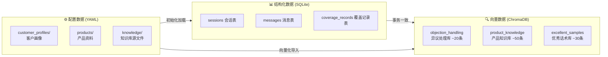

| 存储类型 | 使用场景 | 数据特点 | 选型理由 |
|----------|----------|----------|----------|
| **SQLite** | 会话历史、消息记录、评估结果 | 结构化、强事务 ACID | 单文件部署、无需额外服务、Python 原生支持 |
| **ChromaDB** | 产品知识、异议处理、优秀话术 | 高维向量、语义相似度检索 | 轻量级、LangChain 原生集成、支持 metadata 过滤 |
| **YAML** | 客户画像、产品资料、语义点定义 | 静态配置、人工编辑 | 可读性好、版本控制友好、热更新 |

---

## 四、LangGraph 工作流详解

### 4.1 为什么选择 LangGraph？

在实现对话工作流时，有三种主流方案可选：

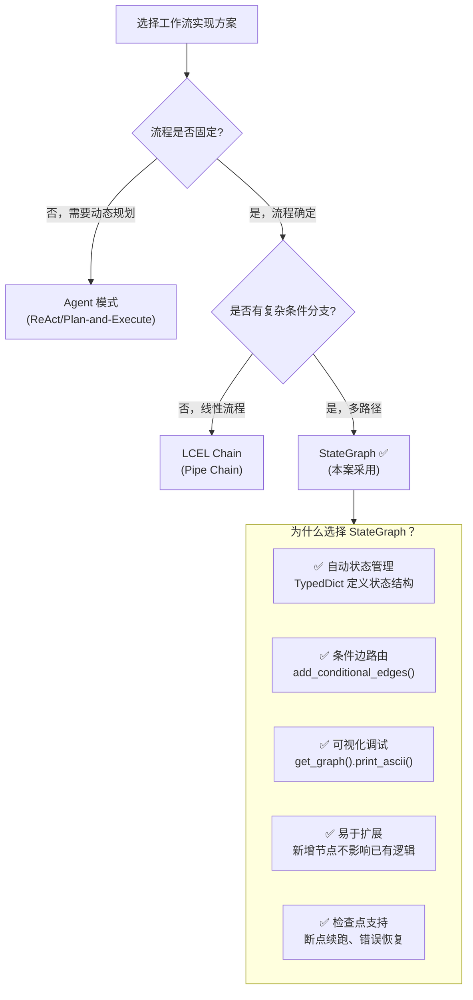

| 对比维度 | if-else 链式调用 | LCEL Chain | LangGraph StateGraph |
|----------|------------------|-------------|---------------------|
| **状态管理** | 手动传递 dict | 隐式传递 | ✅ TypedDict 显式定义 |
| **条件分支** | if-else 嵌套 | RunnableBranch | ✅ 条件边路由 |
| **循环控制** | while 循环 | 不支持 | ✅ 自然支持 |
| **可视化** | 无 | 有限 | ✅ 图形化执行路径 |
| **调试难度** | 高（堆栈追踪复杂） | 中 | ✅ 低（节点粒度日志） |
| **扩展性** | 差（改动牵一发动全身） | 中 | ✅ 好（新增节点即可） |

### 4.2 工作流状态机设计

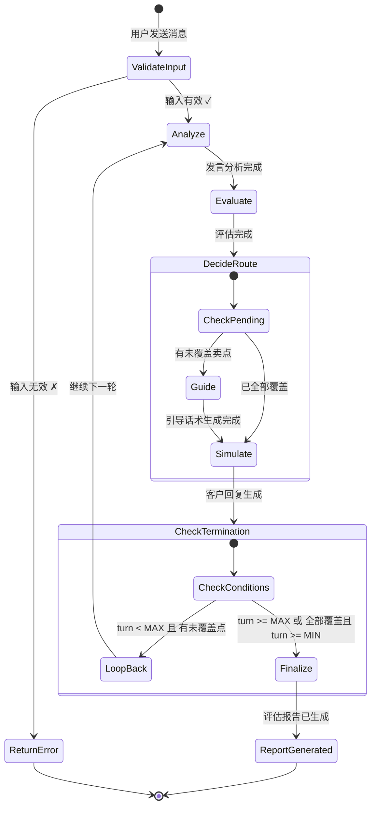

### 4.3 核心状态定义 (SalesTrainingState)

```python
from typing import Annotated, TypedDict
from langgraph.graph import add_messages
from enum import Enum


class PointStatus(Enum):
    """语义点覆盖状态枚举。"""
    COVERED = "covered"           # 已覆盖
    NOT_COVERED = "not_covered"   # 未覆盖
    PENDING = "pending"           # 待引导


class SalesTrainingState(TypedDict):
    """
    LangGraph 共享状态定义。
    
    所有节点通过读写此字典进行通信。
    使用 Annotated 类型可以实现状态的自动合并（如 messages）。
    
    Attributes:
        session_id: 会话唯一标识符
        messages: 对话历史列表，使用 add_messages 注解实现自动累加
        turn: 当前对话轮次（从 0 开始）
        semantic_points_status: 各语义点的覆盖状态 {point_id: PointStatus}
        pending_points: 待引导的未覆盖语义点 ID 列表
        current_node: 当前执行的节点名称（用于调试）
        evaluation_result: 最新一轮的评估结果
        guidance_message: 生成的引导话术
        is_session_active: 会话是否仍在进行中
        error: 错误信息（如有）
    """
    session_id: str
    messages: Annotated[list[dict], add_messages]  # 自动累加消息
    turn: int
    semantic_points_status: dict[str, PointStatus]
    pending_points: list[str]
    current_node: str
    evaluation_result: dict | None
    guidance_message: str | None
    is_session_active: bool
    error: str | None
```

> **面试要点**：`Annotated[list[dict], add_messages]` 是 LangGraph 的特殊注解，它使得当多个节点同时往 `messages` 写入时，新消息会被**追加**而非覆盖。这是实现对话历史自动管理的核心机制。

### 4.4 工作流节点详解

#### 节点 1：validate_input - 输入验证

| 属性 | 说明 |
|------|------|
| **输入** | `state["messages"][-1]` （最新用户消息） |
| **输出** | 验证通过/失败标志 |
| **职责** | 检查消息非空、长度合法、内容安全 |

```python
def validate_input_node(state: SalesTrainingState) -> dict:
    """
    验证用户输入的合法性。
    
    检查项：
    1. 消息不能为空
    2. 消息长度不超过 2000 字符
    3. 不包含危险指令注入
    
    Returns:
        包含验证结果的字典，若验证失败则设置 error 字段
    """
    last_message = state["messages"][-1]["content"]
    
    if not last_message or len(last_message.strip()) == 0:
        return {"error": "消息不能为空", "current_node": "validate_input"}
    
    if len(last_message) > 2000:
        return {"error": "消息长度超限", "current_node": "validate_input"}
    
    return {"current_node": "validate_input"}
```

#### 节点 2：analyze - 发言分析

| 属性 | 说明 |
|------|------|
| **输入** | 销售原始发言文本 |
| **输出** | `analysis_result`: 清晰度、专业性、说服力评分 |
| **职责** | 调用 LLM 分析销售发言的表达质量 |

**LLM Prompt 设计要点：**
- 角色设定：你是一位资深的销售培训专家
- 分析维度：清晰度（clarity）、专业性（professionalism）、说服力（persuasiveness）
- 评分标准：1-10 分制
- 输出格式：严格的 JSON 结构

#### 节点 3：evaluate - 语义评估

| 属性 | 说明 |
|------|------|
| **输入** | 销售发言 + 语义点定义列表 |
| **输出** | `semantic_points_status`, `pending_points` |
| **职责** | 通过三层检测机制判断每个语义点是否被覆盖 |

这是系统的**核心算法模块**，详见 [第五章：三层语义检测机制](#五三层语义检测机制)。

#### 节点 4：decide - 路由决策

| 属性 | 说明 |
|------|------|
| **输入** | `pending_points` 列表 |
| **输出** | 路由目标："guide" 或 "simulate" |
| **职责** | 决定下一步是生成引导还是直接回复 |

**路由条件函数：**

```python
def should_guide_or_respond(state: SalesTrainingState) -> str:
    """
    条件边路由函数。
    
    决策逻辑：
    - 如果存在未覆盖的语义点 → 跳转到 guide 节点（先生成引导）
    - 如果所有语义点都已覆盖 → 直接跳转到 simulate 节点（生成客户回复）
    
    为什么先 guide 后 simulate？
    因为引导话术需要融入客户回复中，让引导更自然。
    """
    if state.get("pending_points"):
        return "guide"
    return "simulate"
```

#### 节点 5：guide - 引导生成

| 属性 | 说明 |
|------|------|
| **输入** | `pending_points` + 对话上下文 |
| **输出** | `guidance_message` |
| **职责** | 为未覆盖的语义点生成引导话术 |

**四种引导策略（按重要性递减）：**

| 策略名称 | 适用场景 | 示例话术 | 触发条件 |
|----------|----------|----------|----------|
| **DIRECT_QUESTION** | 直接提问 | "您能详细说说降糖效果吗？" | 一般情况 |
| **CHALLENGE** | 质疑挑战 | "真的能有效控制吗？有数据吗？" | 重要性 ≥ 0.8 |
| **CLARIFICATION** | 澄清追问 | "低血糖风险具体低到什么程度？" | 需要更详细信息 |
| **SCENARIO** | 场景代入 | "如果患者担心低血糖，您怎么解释？" | 重要性 ≥ 0.9 |

#### 节点 6：simulate - 客户模拟

| 属性 | 说明 |
|------|------|
| **输入** | 客户画像 + 产品信息 + 引导话术 + 对话历史 |
| **输出** | 追加到 `messages` 的 AI 回复 |
| **职责** | 扮演内分泌科主任，生成自然的客户回复 |

**System Prompt 组装策略：**

```python
def build_customer_system_prompt(
    customer_profile: CustomerProfile,
    product_info: ProductInfo,
    pending_points: list[str],
    guidance: str | None,
    conversation_history: list[dict]
) -> str:
    """
    组装客户模拟的 System Prompt。
    
    组装顺序：
    1. 角色定义：你是 XX 医院的 XX 科主任...
    2. 性格特征：专业、谨慎、注重循证证据...
    3. 关注点：你最关心的是糖尿病控制率和药物安全性...
    4. 当前任务：你需要听取销售的产品介绍...
    5. 引导融入：（如果有）自然地提出关于 XXX 的问题...
    6. 回复要求：保持专业、适度提问、不要过于配合...
    """
    ...
```

#### 节点 7：finalize - 结束与报告

| 属性 | 说明 |
|------|------|
| **输入** | 完整对话历史 + 最终覆盖状态 |
| **输出** | `evaluation_report` + `is_session_active=False` |
| **职责** | 生成最终评估报告，包含综合评分和改进建议 |

### 4.5 完整执行时序图

以下展示一个典型的**两轮对话**完整执行过程：

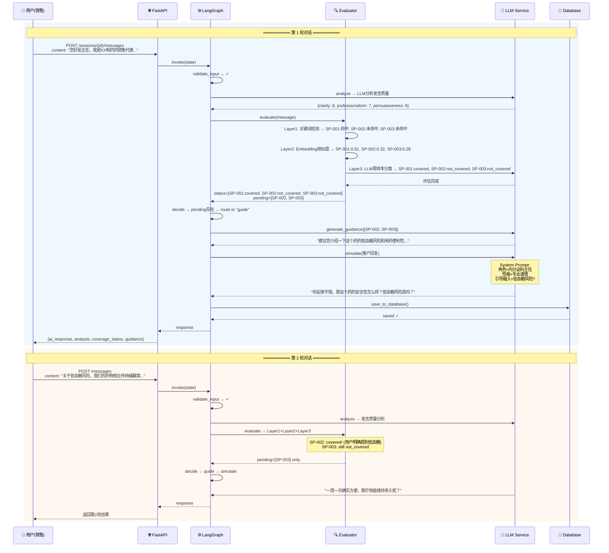

### 4.6 循环终止条件

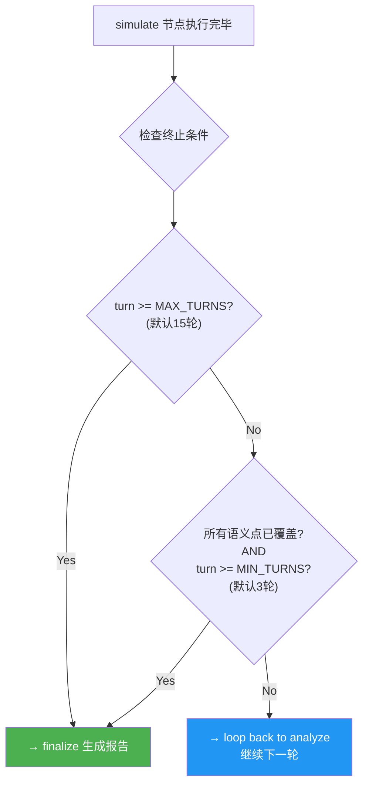

| 参数 | 默认值 | 设计理由 |
|------|--------|----------|
| `MIN_TURNS = 3` | 最少 3 轮 | 确保销售有充分机会表达，避免过早结束 |
| `MAX_TURNS = 15` | 最多 15 轮 | 控制成本（LLM Token 和时间），防止无限循环 |

---

## 五、三层语义检测机制

### 5.1 为什么需要三层检测？

判断销售发言是否覆盖某个语义点，看似简单，实则复杂：

| 单层方案 | 准确率 | 问题示例 |
|----------|--------|----------|
| **仅关键词** | ~60% | 用户说"血糖稳定了" → 无法识别为 HbA1c 改善 |
| **仅 Embedding** | ~75% | 用户说"用了之后患者都说好" → 误判为覆盖了安全性 |
| **仅 LLM** | ~90% | 成本高（每次调用需 2-3 秒），延迟大 |
| **三层融合** | **~92%** | **最优平衡：准确率高、成本可控** |

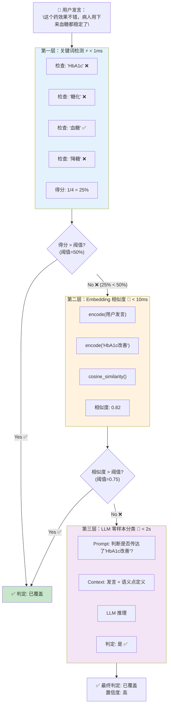

### 5.2 各层详细设计

#### 第一层：关键词检测 (Keyword Detection)

| 属性 | 值 |
|------|-----|
| **权重** | 20% |
| **速度** | < 1ms |
| **适用场景** | 快速过滤明显不相关的内容；精确匹配已知术语 |
| **优势** | 极快、零成本、确定性结果 |
| **劣势** | 无法识别近义词、同义词、变体表达 |

**算法实现：**

```python
def _keyword_detection(
    self, 
    message: str, 
    point: SemanticPoint
) -> float:
    """
    关键词检测算法。
    
    Args:
        message: 用户发言文本
        point: 目标语义点（包含 keywords 列表）
    
    Returns:
        匹配得分 [0.0, 1.0]，表示命中的关键词比例
    
    Example:
        >>> point.keywords = ["HbA1c", "糖化血红蛋白", "血糖控制", "降糖"]
        >>> _keyword_detection("这个药可以降低糖化血红蛋白", point)
        0.25  # 4个关键词中命中1个
    """
    if not point.keywords:
        return 0.0
    
    keywords_found = sum(
        1 for kw in point.keywords if kw in message
    )
    return keywords_found / len(point.keywords)
```

**示例演示：**

| 用户发言 | 语义点 SP-001 (HbA1c改善) | 关键词列表 | 命中数 | 得分 |
|----------|---------------------------|-----------|--------|------|
| "可以降低 HbA1c" | HbA1c 改善 | [HbA1c, 糖化血红蛋白, 血糖控制, 降糖] | 1 | 0.25 |
| "糖化血红蛋白能降 1.5%" | HbA1c 改善 | [HbA1c, 糖化血红蛋白, 血糖控制, 降糖] | 1 | 0.25 |
| "血糖控制效果很好，降糖明显" | HbA1c 改善 | [HbA1c, 磺化血红蛋白, 血糖控制, 降糖] | 2 | 0.50 |
| "这个药很安全" | HbA1c 改善 | [HbA1c, 糖化血红蛋白, 血糖控制, 降糖] | 0 | 0.00 |

#### 第二层：Embedding 相似度 (Semantic Similarity)

| 属性 | 值 |
|------|-----|
| **权重** | 30% |
| **速度** | < 10ms |
| **适用场景** | 识别近义词、同义表达、语序变化 |
| **优势** | 语义理解能力强于关键词 |
| **劣势** | 可能误判（如"不用每天打针了"可能被误判为"用药便利性"） |

**技术选型：DashScope text-embedding-v1**

| 特性 | 值 |
|------|-----|
| **向量维度** | 1536 维 |
| **最大输入长度** | 2048 tokens |
| **语言支持** | 中英文双语优化 |
| **API 延迟** | ~50-100ms/次 |

**算法实现：**

```python
def _embedding_similarity(
    self, 
    message: str, 
    point: SemanticPoint
) -> float:
    """
    Embedding 相似度计算。
    
    将用户发言和语义点描述分别编码为向量，
    然后计算余弦相似度。
    
    Args:
        message: 用户发言文本
        point: 目标语义点（包含 description）
    
    Returns:
        相似度分数 [0.0, 1.0]
    """
    message_embedding = self.embedding_service.encode(message)
    point_embedding = self.embedding_service.encode(point.description)
    
    return cosine_similarity(message_embedding, point_embedding)
```

**相似度示例：**

| 用户发言 | 语义点描述 | 相似度 | 判定 |
|----------|------------|--------|------|
| "血糖控制得很好" | HbA1c 改善 | 0.82 | ✅ 高度相关 |
| "用药很方便" | 用药便利性 | 0.78 | ✅ 相关 |
| "发生低血糖的概率很低" | 低血糖风险 | 0.85 | ✅ 高度相关 |
| "患者反馈不错" | HbA1c 改善 | 0.45 | ⚠️ 弱相关 |

#### 第三层：LLM 零样本分类 (LLM Judgment)

| 属性 | 值 |
|------|-----|
| **权重** | 50%（最高） |
| **速度** | < 2s |
| **适用场景** | 复杂语义、隐含表达、比喻说法、跨域关联 |
| **优势** | 理解能力最强，能处理模糊边界情况 |
| **劣势** | 成本最高、延迟最大、结果有一定随机性 |

**Prompt Engineering 设计：**

```python
def build_judgment_prompt(
    message: str, 
    point: SemanticPoint
) -> str:
    """
    构建 LLM 判断 Prompt。
    
    设计原则：
    1. 明确任务：判断是否传达了特定语义点
    2. 提供上下文：给出语义点的详细定义和关键词
    3. 约束输出：只允许 "是" 或 "否"，减少解析复杂度
    4. 零样本：不提供示例，考验模型的理解能力
    """
    return f"""你是一位专业的销售培训评估专家。

请判断以下销售话术是否传达了「{point.description}」这个卖点？

【销售发言】
{message}

【语义点定义】
- 描述：{point.description}
- 识别关键词：{'、'.join(point.keywords)}

请仔细分析发言内容，判断是否隐含或明确地传达了这个卖点的核心含义。

请只回答：是 或 否"""
```

**LLM 判断示例：**

| 用户发言 | 语义点 | LLM 判定 | 推理过程 |
|----------|--------|----------|----------|
| "这个药效果不错，病人用下来血糖都稳定了" | HbA1c 改善 | **是 ✅** | "血糖稳定了" 隐含表达了血糖控制效果 |
| "患者不用每天惦记吃药了" | 用药便利性 | **是 ✅** | "不用每天" 间接表达了给药频率低的便利性 |
| "用了这个药后，患者反馈很好" | 低血糖风险 | **否 ❌** | "反馈很好" 太泛，未涉及安全性 |
| "相比传统药物，我们的低血糖发生率降低了 80%" | 低血糖风险 | **是 ✅** | 明确给出了安全性数据 |

### 5.3 检测结果融合算法

```python
def fuse_detection_results(
    keyword_score: float,      # 第一层得分 [0, 1]
    embedding_score: float,    # 第二层得分 [0, 1]
    llm_score: float,          # 第三层得分 [0, 1] (0或1)
    weights: tuple = (0.2, 0.3, 0.5)
) -> tuple[float, str]:
    """
    融合三层检测结果。
    
    融合公式：
    final_score = w1 × keyword + w2 × embedding + w3 × llm
    
    权重设计理念：
    - 关键词 (20%)：快速过滤，但不作为主要依据
    - Embedding (30%)：提供语义层面的佐证
    - LLM (50%)：作为最终裁决者，权重最高
    
    Args:
        keyword_score: 关键词检测得分
        embedding_score: Embedding 相似度得分
        llm_score: LLM 判定结果 (0 或 1)
        weights: 三层权重，默认 (0.2, 0.3, 0.5)
    
    Returns:
        (final_score, status): 最终得分和覆盖状态
    """
    w1, w2, w3 = weights
    final_score = w1 * keyword_score + w2 * embedding_score + w3 * llm_score
    
    # 阈值判定：综合得分 >= 0.6 视为已覆盖
    status = "covered" if final_score >= 0.6 else "not_covered"
    
    return final_score, status
```

**权重分配的科学依据：**

| 层级 | 权重 | 理由 |
|------|------|------|
| 关键词 | 20% | 作为"信号放大器"——如果关键词命中，提高整体置信度 |
| Embedding | 30% | 提供"语义佐证"——即使没命中关键词，语义相近也算部分覆盖 |
| LLM | 50% | 作为"最终裁判"——具有最强的理解能力，但其二元输出需要其他层级辅助 |

---

## 六、Agentic RAG 知识检索系统

### 6.1 什么是 Agentic RAG？

**RAG (Retrieval-Augmented Generation)** 是一种将检索与生成结合的技术范式。而 **Agentic RAG** 在此基础上增加了**主动决策能力**：

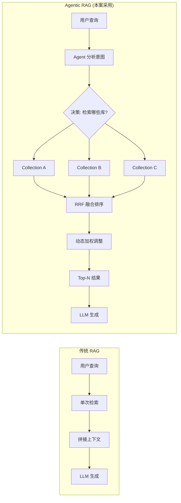

| 特性 | 传统 RAG | Agentic RAG（本案） |
|------|----------|-------------------|
| **检索模式** | 单次、固定 | 多 Collection、动态选择 |
| **结果融合** | 简单拼接 | RRF 算法 + 动态加权 |
| **工具调用** | 无 | LangGraph Tool Calling |
| **上下文感知** | 有限 | 完整对话上下文 |
| **适应性** | 静态 | 根据场景自动调整 |

### 6.2 Chroma Collection 设计

本系统维护 **3 个独立的 Chroma Collection**，分别存储不同类型的知识：

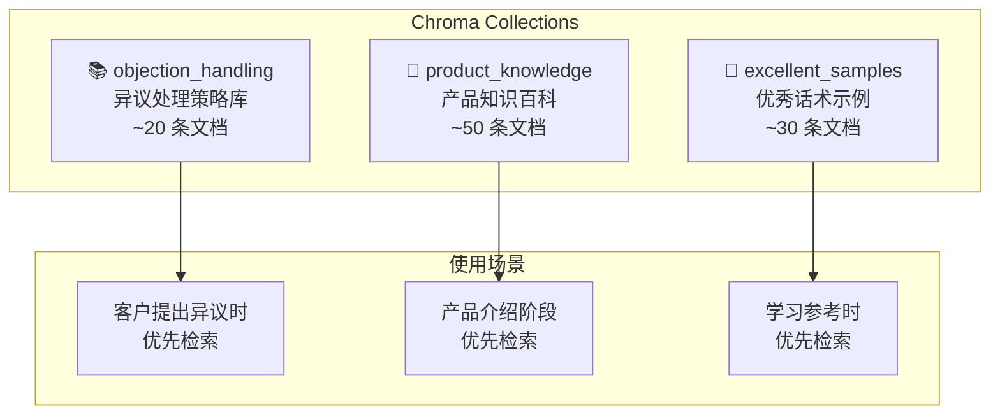

| Collection 名称 | 文档数量 | 内容类型 | 典型用途 |
|------------------|----------|----------|----------|
| `objection_handling` | ~20 | 异议类型 → 应对策略 | 客户说"太贵了" → 检索价格异议应对 |
| `product_knowledge` | ~50 | 产品特性 → 详细说明 | 需要补充产品细节时的知识支撑 |
| `excellent_samples` | ~30 | 场景 → 优秀话术 | 生成引导话术时的参考模板 |

### 6.3 RRF 融合算法详解

**RRF (Reciprocal Rank Fusion)** 是一种多列表排序融合算法，已被 Elasticsearch、Vespa 等主流搜索引擎采用。

#### 数学公式

$$
\text{RRF}(d) = \sum_{i=1}^{n} \frac{1}{k + \text{rank}_i(d)}
$$

其中：
- $d$ : 待排序的文档
- $n$ : 参与融合的列表数量（本案 n=3，对应 3 个 Collection）
- $\text{rank}_i(d)$ : 文档 $d$ 在第 $i$ 个列表中的排名（从 1 开始）
- $k$ : 平滑常数（通常取 60）

#### 直观理解

RRF 的核心思想是：**排名越靠前，贡献越大；但衰减是非线性的**。

| 排名 | RRF 分数 (k=60) | 占比 | 含义 |
|------|-----------------|------|------|
| 第 1 名 | 1/(60+1) = **0.01639** | 100% | 基准分 |
| 第 2 名 | 1/(60+2) = **0.01613** | 98.4% | 仅下降 1.6% |
| 第 3 名 | 1/(60+3) = **0.01587** | 96.8% | 下降 3.2% |
| 第 10 名 | 1/(60+10) = **0.01429** | 87.2% | 下降 12.8% |
| 第 50 名 | 1/(60+50) = **0.00909** | 55.5% | 下降近半 |

> **关键洞察**：RRF 对**排名靠前的结果**给予更高权重，但对**排名差异**不敏感。这意味着即使不同 Collection 的绝对分数不可比较，排名仍然是有意义的。

#### 为什么选择 RRF 而非简单加权平均？

| 方法 | 公式 | 优点 | 缺点 |
|------|------|------|------|
| **加权平均** | $S = \sum w_i \times s_i$ | 简单直观 | 依赖绝对分数，不同 Collection 分数不可比 |
| **RRF（本案）** | $S = \sum 1/(k+\text{rank})$ | 只用排名，鲁棒性强 | 忽略分数间的差距信息 |
| **Reranker** | 用模型重排序 | 精度高 | 计算量大，延迟高 |

> **面试回答要点**：我们选择 RRF 是因为 3 个 Collection 使用相同的 Embedding 模型但检索不同的文档集合，**绝对分数没有可比性**，但**排名信息是可靠的**。

#### 计算示例

假设从 3 个 Collection 分别检索 Top-3 结果：

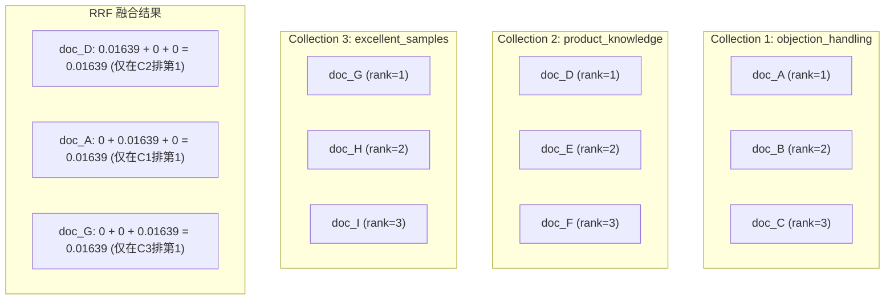

### 6.4 动态加权策略

系统不是对 3 个 Collection 一视同仁，而是**根据当前对话场景动态调整权重**：

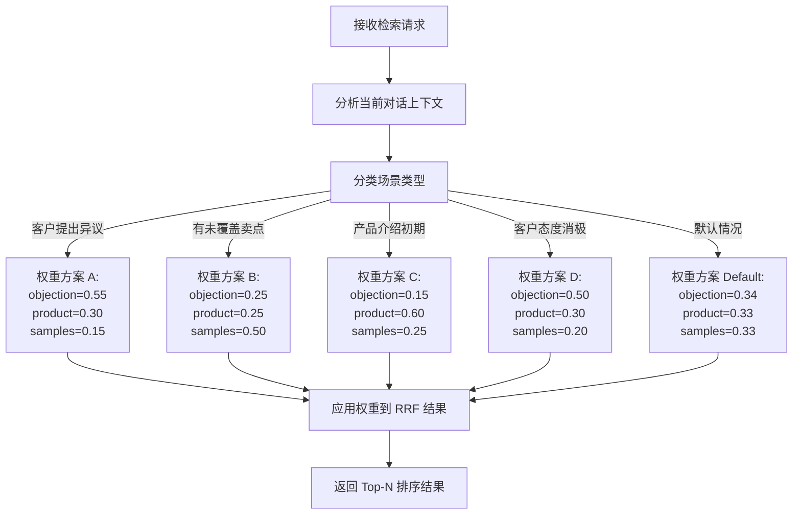

| 场景 | objection_handling | product_knowledge | excellent_samples | 设计思路 |
|------|-------------------|-------------------|-------------------|----------|
| **客户提出异议** | 0.55 | 0.30 | 0.15 | 优先获取异议应对策略 |
| **有未覆盖卖点** | 0.25 | 0.25 | 0.50 | 优先获取优秀话术作为引导参考 |
| **产品介绍初期** | 0.15 | 0.60 | 0.25 | 优先获取产品知识补充细节 |
| **客户态度消极** | 0.50 | 0.30 | 0.20 | 重点获取异议处理和安抚策略 |
| **默认均衡** | 0.34 | 0.33 | 0.33 | 无特殊场景时均匀分配 |

---

## 七、数据一致性保障

### 7.1 双软删除策略

系统使用两种数据库（SQLite + ChromaDB），删除操作必须保证**两者的一致性**。

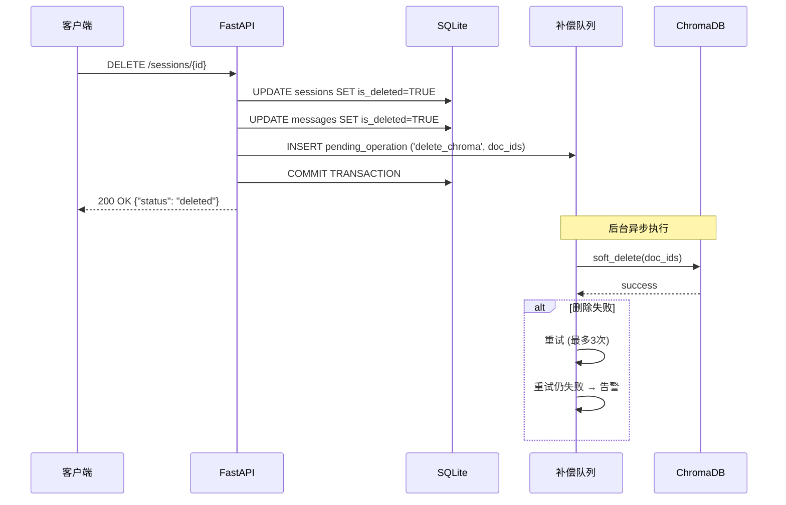

### 7.2 为什么选择软删除而非硬删除？

| 方式 | 优点 | 缺点 | 适用场景 |
|------|------|------|----------|
| **硬删除** (DELETE) | 释放空间 | 不可恢复、破坏引用完整性 | 日志数据、临时数据 |
| **软删除** (UPDATE is_deleted) | 可恢复、保留审计轨迹 | 需要过滤查询 | 业务数据（本案采用） |

> **面试要点**：软删除是企业级应用的常见最佳实践，符合 GDPR "被遗忘权"的精神——数据可以被标记为"不再使用"，但在合规期内仍可追溯。

### 7.3 SQLite 软删除实现

```sql
-- 软删除操作
UPDATE sessions
SET is_deleted = 1,
    deleted_at = datetime('now'),
    deleted_by = 'user_123'
WHERE id = 'session_xxx';

-- 查询时自动过滤已删除数据
SELECT * FROM sessions
WHERE is_deleted = 0  -- 只返回未删除的记录
ORDER BY created_at DESC;
```

### 7.4 ChromaDB 软删除实现

```python
def soft_delete_documents(
    self, 
    collection_name: str, 
    doc_ids: list[str]
) -> None:
    """
    ChromaDB 软删除：通过更新 metadata 标记删除。
    
    注意：ChromaDB 原生不支持 DELETE 的回滚，
    所以我们使用 metadata 标记来实现"软删除"。
    """
    collection = self.client.get_collection(collection_name)
    collection.update(
        ids=doc_ids,
        metadatas=[{
            "is_deleted": "true",
            "deleted_at": datetime.now().isoformat()
        } for _ in doc_ids]
    )

def query_with_soft_delete_filter(
    self,
    collection_name: str,
    query_texts: list[str],
    **kwargs
) -> dict:
    """
    查询时过滤已软删除的文档。
    """
    collection = self.client.get_collection(collection_name)
    return collection.query(
        query_texts=query_texts,
        where={"is_deleted": {"$eq": "false"}},  # 关键：过滤条件
        **kwargs
    )
```

---

## 八、技术选型理由

### 8.1 核心技术栈全景图

```mermaid
flowchart TB
    subgraph Backend["后端技术栈"]
        direction TB
        B1["Python 3.13+"]
        B2["FastAPI + Uvicorn"]
        B3["LangGraph v1.0"]
    end
    
    subgraph AI["AI/ML 技术栈"]
        direction TB
        A1["LLM: DashScope Qwen / DeepSeek"]
        A2["Embedding: DashScope text-embedding-v1"]
        A3["Vector DB: ChromaDB"]
    end
    
    subgraph Data["数据技术栈"]
        direction TB
        D1["SQLite (结构化数据)"]
        D2["YAML (配置数据)"]
        D3["ChromaDB (向量数据)"]
    end
    
    subgraph Dev["开发工具链"]
        direction TB
        V1["uv (包管理)"]
        V2["ruff (格式化)"]
        V3["basedpyright (类型检查)"]
        V4["pytest (测试)"]
    end
```

### 8.2 关键技术选型对比

#### LLM Provider 选择

| Provider | 模型 | 优势 | 劣势 | 适用场景 |
|----------|------|------|------|----------|
| **DashScope (通义千问)** | qwen-max / plus / turbo | 国内访问快、中文能力强、生态完善 | 国际化弱 | **首选（国内部署）** |
| **DeepSeek** | deepseek-chat / coder | 高性价比、代码能力强 | 中文稍弱 | 成本敏感场景 |
| OpenAI | GPT-4o / mini | 能力最强 | 国内需代理、成本高 | 备选方案 |

> **面试回答**：我们选择了 DashScope 作为主要 Provider，原因是项目面向国内用户，网络延迟更低，且通义千问在中文理解方面表现优异。

#### 向量数据库选择

| 特性 | ChromaDB | Milvus | Weaviate | Pinecone |
|------|----------|--------|----------|----------|
| **部署复杂度** | ⭐ 极简（pip install） | ⭐⭐⭐ 需要 K8s/Docker | ⭐⭐ 需要 Docker | ⭐⭐⭐ 云服务 |
| **规模适合** | 中小规模 (< 100万) | 超大规模 (> 亿级) | 大规模 | 中大规模 |
| **LangChain 集成** | ✅ 原生支持 | ⚠️ 需要 Wrapper | ⚠️ 需要 Wrapper | ⚠️ 第三方 |
| **面试解释难度** | ⭐ 低 | ⭐⭐⭐ 高 | ⭐⭐ 中 | ⭐⭐ 中 |

> **面试回答**：选择 ChromaDB 是因为它**轻量、易部署、LangChain 原生支持**。对于销售训练这种中小规模场景（知识库约 100 条文档），ChromaDB 完全够用，不需要引入 Milvus 这样的重量级方案。

#### Web 框架选择

| 框架 | 类型 | 优势 | 劣势 | 选择原因 |
|------|------|------|------|----------|
| **FastAPI** | 异步框架 | 自动 OpenAPI 文档、高性能、类型安全 | 生态不如 Flask 成熟 | **异步原生支持，适合 LLM 调用密集型应用** |
| Flask | 同步框架 | 生态成熟、简单易学 | 异步需额外组件 | 不适合 I/O 密集型场景 |
| Django | 全栈框架 | 功能全面、ORM 强大 | 过于重量级 | 不需要 Admin、Auth 等功能 |

### 8.3 面试高频问题预判

| 问题 | 要点回答 |
|------|----------|
| **为什么用 LangGraph 而不是简单的 if-else？** | 状态机模式天然适合对话流程；条件边路由替代嵌套 if；可视化调试；易于扩展新节点 |
| **三层检测为什么不只用 LLM？** | 成本考虑（LLM 最贵）；速度考虑（关键词最快）；准确性考虑（多层互补）；每层都有独特价值 |
| **RRF 为什么优于加权平均？** | 不同 Collection 的绝对分数不可比；排名信息更可靠；已被工业界验证（ES、Vespa） |
| **为什么用 SQLite 而不是 PostgreSQL？** | 单文件部署、无需安装数据库服务、开发测试便捷；生产环境可无缝迁移到 PG |
| **如何保证数据一致性？** | 双软删除 + 补偿队列 + 重试机制；最终一致性模型 |

---

## 九、快速开始

### 9.1 环境要求

| 要求 | 版本 | 说明 |
|------|------|------|
| Python | 3.13+ | 新语法特性支持 |
| uv | 最新版 | 现代 Python 包管理器 |

### 9.2 安装步骤

```bash
# 1. 克隆仓库
git clone https://gitee.com/xt765/umu_test.git
cd umu_test

# 2. 安装依赖
uv sync

# 3. 配置环境变量
cp .env.example .env
# 编辑 .env，填入您的 API Key

# 4. 初始化数据库
uv run python init_db.py

# 5. 初始化知识库
uv run python init_knowledge.py

# 6. 启动服务
uv run uvicorn umu_sales_trainer.main:app --reload --port 8000
```

### 9.3 访问地址

| 页面 | URL |
|------|-----|
| 🖥️ 前端界面 | http://localhost:8000/static/index.html |
| 📚 API 文档 | http://localhost:8000/docs |
| ❤️ 健康检查 | http://localhost:8000/api/v1/health |

---

## 十、项目结构

```
umu-sales-trainer/
├── src/umu_sales_trainer/
│   ├── main.py                  # FastAPI 应用入口
│   ├── config.py                # 配置管理（多 Provider 支持）
│   ├── api/
│   │   ├── router.py            # API 路由定义
│   │   └── middleware.py         # 中间件（日志、限流、CORS）
│   ├── core/
│   │   ├── workflow.py          # LangGraph StateGraph 工作流
│   │   ├── analyzer.py          # 销售发言分析器
│   │   ├── evaluator.py         # 三层语义评估器
│   │   ├── guidance.py          # 引导话术生成器（4种策略）
│   │   ├── simulator.py         # AI 客户模拟器
│   │   └── hybrid_search.py     # Agentic RAG 混合搜索引擎
│   ├── models/
│   │   ├── customer.py          # 客户画像数据模型
│   │   ├── product.py           # 产品信息数据模型
│   │   ├── semantic.py          # 语义点数据模型
│   │   ├── conversation.py      # 对话消息数据模型
│   │   └── evaluation.py        # 评估结果数据模型
│   └── services/
│       ├── llm.py               # LLM 服务（DashScope/DeepSeek）
│       ├── embedding.py         # Embedding 服务
│       ├── chroma.py            # ChromaDB 向量数据库服务
│       └── database.py          # SQLite 数据库服务
├── data/
│   ├── customer_profiles/       # 客户画像 YAML
│   ├── products/                # 产品资料 YAML
│   └── knowledge/               # 知识库源文件 YAML
├── static/                       # 前端静态资源
│   ├── index.html               # 单页应用主页面
│   ├── styles.css               # 样式表
│   └── app.js                   # 前端交互逻辑
├── tests/                        # 测试套件
│   ├── test_workflow.py          # 工作流测试
│   ├── test_analyzer.py          # 分析器测试
│   ├── test_evaluator.py         # 评估器测试
│   ├── test_guidance.py          # 引导生成器测试
│   ├── test_simulator.py         # 模拟器测试
│   ├── test_hybrid_search.py     # 混合搜索测试
│   └── test_*_integration.py    # 集成测试（真实 API）
├── init_db.py                    # 数据库初始化脚本
├── init_knowledge.py             # 知识库初始化脚本
├── pyproject.toml                # 项目配置与依赖声明
└── ruff.toml                      # 代码格式化配置
```

---

## 十一、测试覆盖

### 测试原则

> **⚠️ 硬性要求：所有集成测试必须使用真实 API 调用，禁止任何 mock**

这是项目的底线要求，确保测试环境与生产环境完全一致。

### 测试金字塔

```
                    ▲
                   /│ \
                  / │  \
                 /  │   \         ← E2E 测试 (端到端)
                /───┼────\
               /    │     \       ← Integration 测试 (集成) ✅ 核心
              /     │      \
             /──────┼───────\     ← Unit 测试 (单元)
            /       │        \
           ▼────────▼─────────▼
        快速、隔离                慢速、真实
```

### 测试结果

| 指标 | 数值 |
|------|------|
| **总测试数** | 102 |
| **通过率** | 100% ✅ |
| **覆盖率** | **86.78%** |
| **跳过** | 0 |

### 运行测试

```bash
# 运行全部测试
uv run pytest -v

# 运行测试并查看覆盖率
uv run pytest --cov=src --cov-report=term-missing

# 只运行集成测试
uv run pytest tests/test_*_integration.py -v
```

---

## 十二、License

[MIT](https://opensource.org/licenses/MIT) © 2026 xt765
