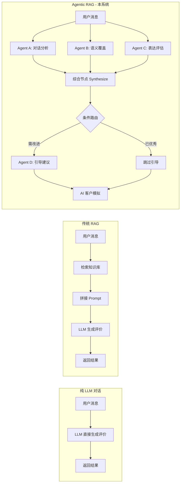
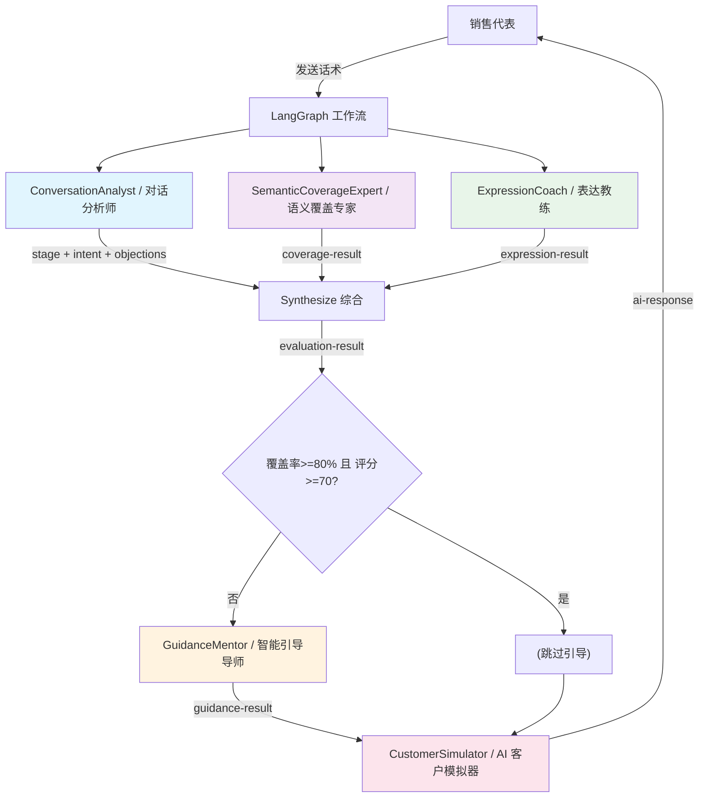
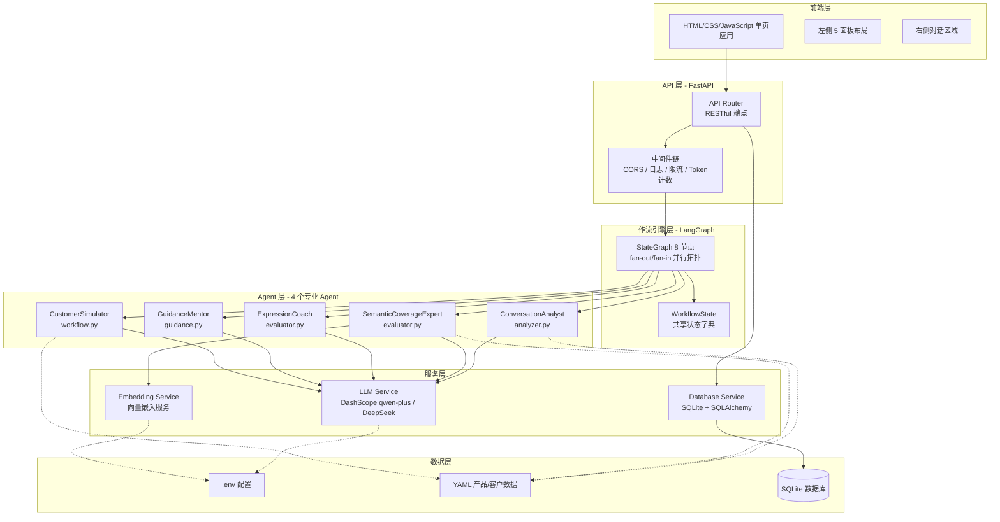
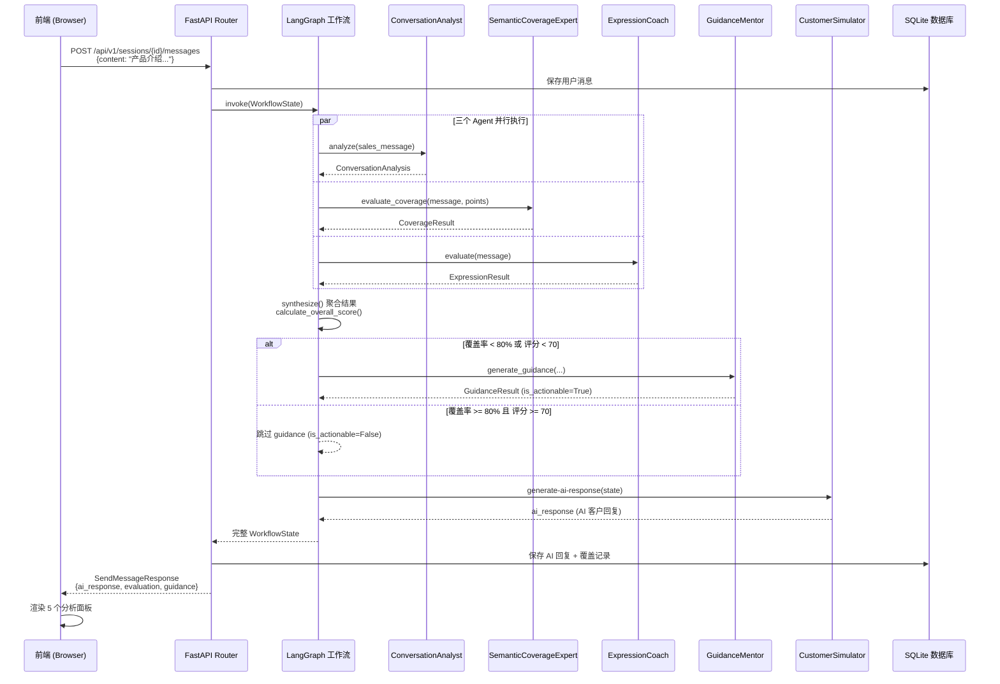
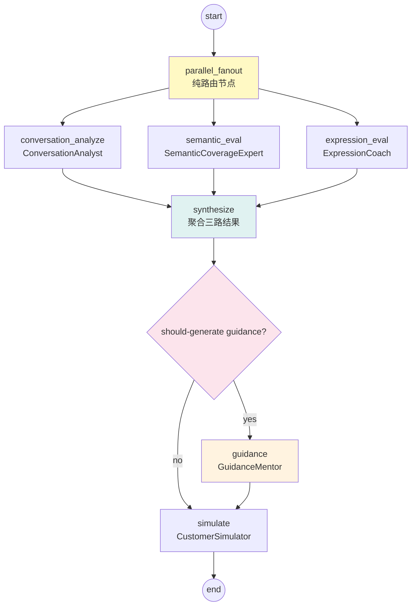
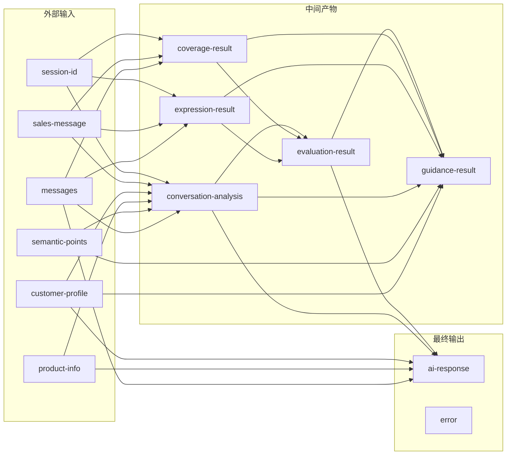
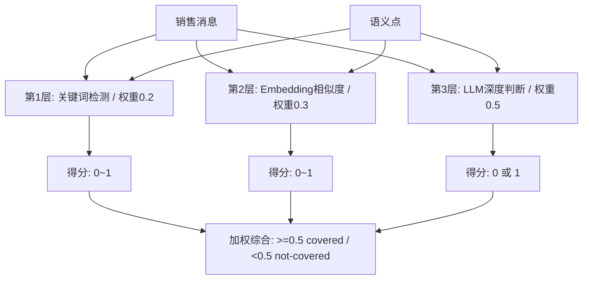
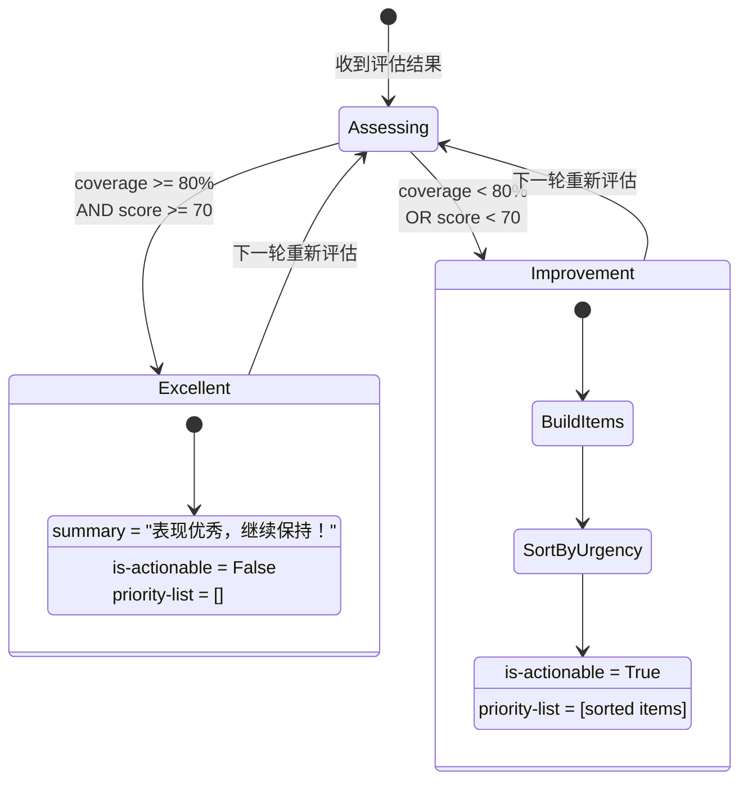
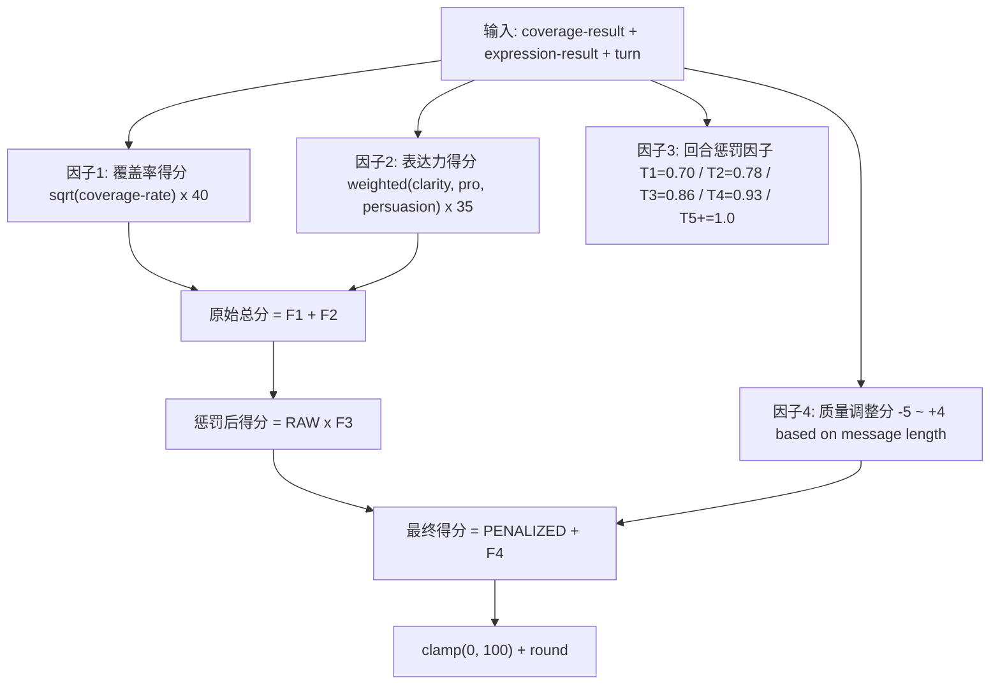
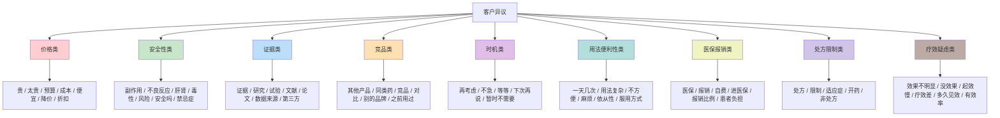

# AI Sales Trainer Chatbot

基于 Agentic RAG（Agentic Retrieval-Augmented Generation）的医药销售智能陪练系统。

本系统为医药销售代表提供 AI 驱动的场景化话术训练环境：销售人员输入话术后，系统通过 4 个专业 Agent 并行分析其发言质量，同时由 AI 模拟客户角色进行回应，最终返回结构化的评分、改进建议和智能引导。

## 目录

- [1. 项目概述](#1-项目概述)
- [2. 为什么选择 Agentic RAG](#2-为什么选择-agentic-rag)
- [3. 系统架构](#3-系统架构)
- [4. 工作流设计](#4-工作流设计)
- [5. Agent 详细设计](#5-agent-详细设计)
- [6. 评分算法](#6-评分算法)
- [7. 异议识别体系](#7-异议识别体系)
- [8. 前端交互设计](#8-前端交互设计)
- [9. 快速开始](#9-快速开始)
- [10. API 速查](#10-api-速查)
- [11. 项目结构](#11-项目结构)
- [12. 技术栈与依赖](#12-技术栈与依赖)
- [13. 测试](#13-测试)

---

## 1. 项目概述

### 1.1 背景：医药销售话术训练的痛点

医药销售代表在推广产品时需要面对医生、采购方等不同角色的客户，每个客户关注点各异（疗效、安全性、价格、医保报销等）。传统的销售培训方式存在以下局限：

| 痛点 | 具体表现 |
|------|---------|
| 训练场景单一 | 角色扮演练习依赖同事配合，难以模拟真实客户的多样性和专业性 |
| 反馈滞后 | 培训师无法对每句话实时给出多维度评估，反馈周期长且主观性强 |
| 缺乏量化标准 | "说得不错"这类模糊评价无法指导具体改进方向 |
| 异议应对不足 | 客户提出的反对意见种类繁多（9 大类），新人难以全面准备 |
| 覆盖度不可控 | 销售要点是否被完整提及缺乏系统性检查机制 |

### 1.2 本系统的定位与目标用户

**定位**：面向医药行业的 AI 销售陪练平台，以 Agentic RAG 架构为核心，提供多维度实时分析能力。

**目标用户**：

- 医药销售代表：日常话术练习和技能提升
- 销售培训师：标准化培训流程和评估基准
- 销售管理者：团队技能水平量化和追踪

### 1.3 核心价值主张

1. **多 Agent 协作分析** -- 4 个专业 Agent 各司其职，从对话阶段、语义覆盖、表达质量、引导建议四个维度并行评估
2. **严格评分模型** -- 4 因子非线性评分算法，分数具有高区分度，避免"人人高分"的虚胖现象
3. **AI 客户模拟** -- 基于客户画像生成符合角色设定的回应，支持异议抛出和追问
4. **结构化引导** -- 按紧急度排序的改进建议，每条包含问题描述、具体做法和参考话术范例
5. **双态反馈面板** -- 绿色优秀态 / 黄色改进态自动切换，一目了然地展示当前表现状态

---

## 2. 为什么选择 Agentic RAG

### 2.1 三种方案对比

构建一个销售话术分析系统，存在三种主流技术路线。下面对比各自在本场景下的适用性：



**各方案特性对比**：

| 特性 | 方案 A: 纯 LLM | 方案 B: 传统 RAG | 方案 C: Agentic RAG（本系统） |
|------|---------------|-----------------|------------------------------|
| 分析维度 | 单一 Prompt 输出 | 检索片段 + LLM 总结 | 多 Agent 分工，各维度独立深度分析 |
| 可解释性 | 黑盒，难以追溯 | 可追溯检索来源 | 每个 Agent 有明确的输入/输出/逻辑 |
| 扩展性 | 改 Prompt 即可 | 需维护知识库 | 新增 Agent 节点即可扩展新维度 |
| 执行效率 | 单次 LLM 调用 | 检索 + 单次 LLM | 多 Agent **并行执行**，总耗时约等于最慢的单个 Agent |
| 评分一致性 | 受 LLM 温度影响大 | 相对稳定 | 结构化公式 + LLM 校验，双重保障 |
| 条件计算 | 无法按需跳过步骤 | 固定流水线 | 条件路由节点，优秀时跳过引导节省资源 |
| 适用场景 | 简单问答 | 文档问答 | 复杂多步推理、多维度评估 |

### 2.2 Agentic RAG 在销售训练场景的具体优势

本系统采用 Agentic RAG 架构并非为了追求技术新颖性，而是基于以下实际考量：

**优势一：多 Agent 分工实现多维度专业分析**

销售话术的质量评估天然涉及多个独立维度：
- 这句话处于销售的哪个阶段？（对话分析师）
- 销售要点覆盖了哪些？（语义覆盖专家）
- 表达是否清晰、专业、有说服力？（表达教练）
- 综合以上信息，应该优先改进什么？（引导导师）

如果将这些任务塞入单个 LLM Prompt，会导致 Prompt 过长、注意力分散、各维度评分互相干扰。Agentic RAG 通过将每个维度分配给独立的 Agent，确保每个 Agent 的 Prompt 高度聚焦，分析质量更高。

**优势二：并行执行缩短响应时间**

本系统的 LangGraph 工作流采用 fan-out/fan-in 并行模式：三个分析 Agent（对话分析、语义覆盖、表达评估）同时启动，而非串行等待。在典型场景下，响应时间从串行的约 15 秒降低至并行的约 8 秒（受限于最慢的单个 Agent）。

**优势三：条件路由实现按需计算**

当销售代表的表现已经达到优秀标准时（覆盖率 >= 80% 且综合评分 >= 70），系统会跳过 GuidanceMentor 节点，直接进入客户模拟环节。这种按需计算策略既减少了不必要的 LLM 调用开销，也避免了在表现良好时仍显示冗余的改进建议。

**优势四：销售要点作为结构化检索源**

本系统中，产品的核心卖点（core_benefits）作为"检索源"嵌入工作流。与传统 RAG 从非结构化文档中检索片段不同，这里的"检索"是结构化的语义点匹配：每个卖点有明确的 ID、描述和关键词列表，Agent 可以精确判断该卖点是否被覆盖、覆盖到什么程度。

### 2.3 本系统的 Agent 职责划分



---

## 3. 系统架构

### 3.1 整体架构图



### 3.2 前端层：HTML/CSS/JavaScript 单页应用

前端采用纯静态文件方案（无构建工具），位于 `static/` 目录：

| 文件 | 职责 |
|------|------|
| `index.html` | 页面骨架，定义左侧面板和右侧聊天区域的 DOM 结构 |
| `styles.css` | 全部样式，包括 5 面板布局、双态引导面板（绿色优秀 / 黄色改进）、响应式适配 |
| `app.js` | 核心交互逻辑，包括消息收发、SSE 解析、面板渲染、引导双态切换 |

前端通过 RESTful API 与后端通信，使用 `fetch()` 发送请求并解析 JSON 响应，无需 WebSocket 或其他实时协议。

### 3.3 API 层：FastAPI + 中间件链

API 层基于 FastAPI 构建，注册了三层中间件：

| 中间件 | 位置 | 功能 |
|--------|------|------|
| CORSMiddleware | 最外层 | 跨域资源共享控制，允许本地开发端口访问 |
| LoggingMiddleware | 中间层 | 请求/响应日志记录，便于调试追踪 |
| RateLimitMiddleware | 中间层 | API 调用频率限制，防止滥用 |
| TokenCountMiddleware | 内层 | LLM Token 用量统计，用于成本监控 |

API 路由前缀为 `/api/v1`，核心端点包括会话管理（CRUD）、消息收发、评估查询和健康检查。

### 3.4 工作流引擎：LangGraph 编排层

工作流引擎是整个系统的核心调度中心，基于 LangGraph 的 `StateGraph` 实现。它负责：

- 编排 8 个节点的执行顺序
- 管理 `WorkflowState` 在节点间的传递
- 实现 fan-out/fan-in 并行分发模式
- 执行条件路由判断（是否需要引导）
- 将多个 Agent 的输出聚合为统一的评估结果

### 3.5 Agent 层：4 个专业分析 Agent + 1 个模拟器

| Agent | 源文件 | 核心职责 |
|-------|--------|---------|
| ConversationAnalyst | `analyzer.py` | 识别销售阶段、意图分类、9 类异议关键词检测 |
| SemanticCoverageExpert | `evaluator.py` | 3 层语义检测（关键词 / Embedding / LLM），判断卖点覆盖情况 |
| ExpressionCoach | `evaluator.py` | 三维表达评分（清晰度 / 专业性 / 说服力）+ 改进建议生成 |
| GuidanceMentor | `guidance.py` | 综合三方结果，按紧急度排序引导项，双态输出 |
| CustomerSimulator | `workflow.py` | 基于客户画像生成 AI 客户角色扮演回复 |

### 3.6 LLM 层：大语言模型调用

LLM 服务模块 (`services/llm.py`) 封装了对两个 Provider 的调用：

| Provider | 模型名称 | 用途 |
|----------|---------|------|
| DashScope（阿里云） | qwen-plus | 主要模型，用于全部 Agent 的分析和生成任务 |
| DeepSeek | deepseek-chat | 备选模型，可通过配置切换 |

接口统一为 OpenAI 兼容格式（`ChatOpenAI`），通过 `langchain-openai` 库调用。

### 3.7 数据流向总览

以下是单次对话（销售代表发送一条消息）的完整数据流：



---

## 4. 工作流设计

### 4.1 8 节点并行工作流拓扑

本系统的 LangGraph 工作流包含 8 个节点，采用 fan-out/fan-in 并行拓扑：



**节点说明**：

| 节点 | 类型 | 功能 | 返回值 |
|------|------|------|--------|
| `start` | 初始化 | 验证输入字段完整性 | 空字典或错误信息 |
| `parallel_fanout` | 路由 | 纯分发节点，不执行计算 | 空字典 |
| `conversation_analyze` | Agent | 调用 ConversationAnalyst 分析对话 | `{conversation_analysis}` |
| `semantic_eval` | Agent | 调用 SemanticCoverageExpert 检测覆盖 | `{coverage_result}` |
| `expression_eval` | Agent | 调用 ExpressionCoach 评估表达 | `{expression_result}` |
| `synthesize` | 聚合 | 合并三路结果，计算综合评分 | `{evaluation_result}` |
| `guidance` | Agent（条件） | 调用 GuidanceMentor 生成引导 | `{guidance_result}` |
| `simulate` | 模拟 | 生成 AI 客户回复 | `{ai_response}` |
| `end` | 结束 | 日志记录 | 空字典 |

### 4.2 并行 fan-out/fan-in 机制详解

**Fan-out（分发）**：

`parallel_fanout` 节点是本系统并行设计的核心。它是一个"纯路由节点"（pure routing node），自身不执行任何计算逻辑，仅返回空字典：

```python
def _node_parallel_fanout(state: WorkflowState) -> dict[str, Any]:
    logger.info("[parallel_fanout] Dispatching to 3 parallel analysis agents")
    return {}  # 空状态更新
```

LangGraph 检测到从一个节点出发有多条出边（`parallel_fanout` -> conversation_analyze / semantic_eval / expression_eval）时，会将这三个后续节点标记为可并行执行。在实际运行中，这三个 Agent 会**并发调用各自的 LLM**，总耗时取决于最慢的那个 Agent，而非三者之和。

**Fan-in（汇聚）**：

`synthesize` 节点有三个入边（分别来自三个分析 Agent）。LangGraph 会自动等待所有三个前驱节点完成后才执行 synthesize。这保证了聚合操作一定在所有分析结果就绪后才进行。

### 4.3 条件路由：何时生成引导建议

`synthesize` 节点之后存在一条条件边（conditional edge），由 `_should_generate_guidance()` 函数决定走向：

```python
def _should_generate_guidance(state: WorkflowState) -> str:
    coverage = state.get("coverage_result")
    eval_result = state.get("evaluation_result")
    overall_score = eval_result.overall_score if eval_result else 0.0

    if coverage and coverage.coverage_rate < 0.8:
        return "yes"
    if overall_score < 70:
        return "yes"
    return "no"
```

**判定逻辑（双条件 AND 关系的否定形式）**：

| 覆盖率 | 综合评分 | 是否生成引导 | 前端显示状态 |
|--------|---------|-------------|-------------|
| < 80% | 任意 | 是 | 黄色改进面板 |
| >= 80% | < 70 | 是 | 黄色改进面板 |
| >= 80% | >= 70 | **否** | 绿色优秀面板 |

只有当**覆盖率充足且评分达标**两个条件同时满足时，才认为表现真正优秀并跳过引导节点。任一条件不满足都会触发 GuidanceMentor 生成改进建议。

### 4.4 WorkflowState 数据模型

`WorkflowState` 是贯穿所有节点的共享状态字典（继承自 Python `dict`），定义如下：

| 字段名 | 类型 | 写入节点 | 读出节点 | 说明 |
|--------|------|---------|---------|------|
| `session_id` | `str` | 外部传入 | 全部节点 | 会话唯一标识 |
| `sales_message` | `str` | 外部传入 | analyze / semantic / expr | 销售人员发言内容（累积式） |
| `current_message` | `str` | 外部传入 | 仅参考 | 当前轮次单条消息 |
| `customer_profile` | `CustomerProfile` | 外部传入 | analyze / guidance / simulate | 客户画像 |
| `product_info` | `ProductInfo` | 外部传入 | simulate | 产品信息 |
| `semantic_points` | `list[SemanticPoint]` | 外部传入 | semantic / guidance | 待检测的语义点列表 |
| `messages` | `list[Message]` | 外部传入 | analyze / simulate | 对话历史消息 |
| `coverage_result` | `CoverageResult` | semantic_eval | synthesize / guidance | 语义覆盖检测结果 |
| `expression_result` | `ExpressionResult` | expression_eval | synthesize / guidance | 表达能力评估结果 |
| `conversation_analysis` | `ConversationAnalysis` | conversation_analyze | synthesize / guidance | 对话分析结果 |
| `evaluation_result` | `EvaluationResult` | synthesize | guidance / simulate / router | 最终聚合评估结果 |
| `guidance_result` | `GuidanceResult` | guidance | router | 引导建议结果 |
| `ai_response` | `str` | simulate | router / end | AI 生成的客户回复 |
| `error` | `str` | 任意节点 | end | 错误信息 |

### 4.5 各节点输入输出说明



---

## 5. Agent 详细设计

### 5.1 ConversationAnalyst（对话分析师）

**源文件**: [analyzer.py](src/umu_sales_trainer/core/analyzer.py)

**职责**：分析销售发言所处的对话阶段、识别意图方向、检测潜在异议信号。

**输入**：
- `sales_message`: 销售人员最新发言文本
- `customer_profile`: 客户画像（姓名、职位、关注点、性格倾向）
- `conversation_history`: 近期对话历史（最近 4 条消息）

**输出**：`ConversationAnalysis` 数据对象

| 字段 | 类型 | 说明 |
|------|------|------|
| `stage` | `str` | 当前销售阶段标识（5 种之一） |
| `intent` | `str` | 一句话描述销售意图 |
| `objections` | `list[str]` | 检测到的异议类型列表 |
| `sentiment` | `str` | 情感倾向（positive / neutral / cautious） |
| `confidence` | `float` | 分析置信度（0-1） |

**核心方法**：

- `analyze()` -- 主入口，先尝试 LLM 分析，失败时降级为规则匹配
- `_detect_objections_by_keywords()` -- 基于 9 类预定义关键词库进行异议信号扫描

**支持的 5 个销售阶段**：

| 阶段标识 | 中文名称 | 典型行为 |
|---------|---------|---------|
| `opening` | 开场破冰 | 问候、自我介绍、建立联系 |
| `needs_discovery` | 需求探查 | 询问痛点、了解现状、挖掘深层需求 |
| `presentation` | 产品呈现 | 介绍特点、展示疗效数据、说明安全性 |
| `objection_handling` | 异议处理 | 回应反对意见、化解疑虑、提供证据 |
| `closing` | 缔结成交 | 推动下一步行动、确认意向、安排跟进 |

**降级策略**：当 LLM 服务不可用时，`_rule_based_analysis()` 方法通过关键词匹配做基础判断（如检测到"您好""很高兴"等词汇判定为 opening 阶段），确保系统在任何情况下都能产出有效分析结果。

---

### 5.2 SemanticCoverageExpert（语义覆盖专家）

**源文件**: [evaluator.py](src/umu_sales_trainer/core/evaluator.py) （`SemanticCoverageExpert` 类）

**职责**：检测销售话术对产品语义点（卖点）的覆盖情况，采用 3 层递进式检测机制。

**3 层检测流水线**：



**各层详细说明**：

| 层级 | 方法 | 权重 | 优点 | 局限 |
|------|------|------|------|------|
| 第 1 层：关键词检测 | `_keyword_detection()` | 0.2 | 速度快、零成本、确定性强 | 只能检测显式提及，遗漏同义表述 |
| 第 2 层：Embedding 相似度 | `_embedding_similarity()` | 0.3 | 能捕获语义相近但用词不同的表述 | 依赖向量质量，可能误判 |
| 第 3 层：LLM 判断 | `_llm_judgment()` | 0.5 | 理解力最强，能处理复杂语境 | 调用成本最高、延迟最大 |

**综合判定公式**：

```
final_score = keyword_score * 0.2 + embedding_score * 0.3 + llm_score * 0.5
final_verdict = "covered" if final_score >= 0.5 else "not_covered"
```

LLM 层权重最高（0.5），因为它是唯一具备深度语义理解能力的层级。关键词层和 Embedding 层作为前置过滤器，可以在一定程度上减少不必要的 LLM 调用（虽然当前实现中三层始终全量执行）。

**输出**：`CoverageResult` 数据对象

| 字段 | 类型 | 说明 |
|------|------|------|
| `coverage_status` | `dict[str, str]` | 每个语义点的覆盖状态（point_id -> covered/not_covered） |
| `coverage_rate` | `float` | 总覆盖率（0.0 - 1.0） |
| `uncovered_points` | `list[str]` | 未覆盖的语义点 ID 列表 |

---

### 5.3 ExpressionCoach（表达教练）

**源文件**: [evaluator.py](src/umu_sales_trainer/core/evaluator.py) （`ExpressionCoach` 类）

**职责**：评估销售人员的话术表达能力，从三个维度打分并为低分维度生成具体改进建议。

**三维评分模型**：

| 维度 | 英文标识 | 权重 | 评分标准摘要 |
|------|---------|------|------------|
| 清晰度 | `clarity` | 0.2（在表达总分中） | 语句通顺性、结构合理性、标点规范性 |
| 专业性 | `professionalism` | 0.3 | 术语准确性、数据引用规范度、行业认知深度 |
| 说服力 | `persuasiveness` | 0.5 | 论证逻辑完整性、痛点结合度、行动号召力度 |

**说服力权重最高（0.5）的设计理由**：在医药销售场景中，清晰和专业是基础要求，而能否真正打动客户、推动决策关键在于论证的说服力。因此评分模型给予说服力最高的权重倾斜。

**评分流程**：

1. LLM 根据严格的五级评分标准对三个维度分别打分（1-10 分）
2. 解析 LLM 返回的格式化字符串（如 `清晰度:7, 专业性:5, 说服力:4`）
3. 对低于 7 分的维度生成 `Suggestion` 改进建议

**每条 Suggestion 包含**：

| 字段 | 说明 |
|------|------|
| `dimension` | 维度标识（clarity / professionalism / persuasiveness） |
| `current_score` | 当前分数（1-10） |
| `advice` | 具体改进建议文字 |
| `example` | 参考话术范例 |

**降级策略**：当 LLM 不可用时，`_rule_based_expression_analysis()` 通过规则引擎分析文本特征（句子长度分布、标点使用、专业术语密度、数据百分比出现频率等）给出估算分数。

---

### 5.4 GuidanceMentor（智能引导导师）

**源文件**: [guidance.py](src/umu_sales_trainer/core/guidance.py)

**职责**：综合来自前三个 Agent 的评估结果，生成结构化、可操作的优先级排序引导建议。这是唯一直接面向用户输出的 Agent，其产出渲染为前端「智能引导」面板。

**双态输出机制**：



**优秀态（Excellent State）**：
- 触发条件：`coverage_rate >= 0.8 AND overall_score >= 70`
- 输出：`summary="表现优秀，继续保持！"`, `is_actionable=False`, 空的 `priority_list`
- 前端渲染：绿色渐变背景面板，显示奖杯图标和评分

**改进态（Improvement State）**：
- 触发条件：`coverage_rate < 0.8 OR overall_score < 70`
- 输出：包含按紧急度排序的引导项列表
- 前端渲染：黄色背景面板，显示灯泡图标和改进项详情

**引导项来源与紧急度分配**：

| 来源 | 判定标准 | 紧急度 | 理由 |
|------|---------|--------|------|
| 未覆盖的语义点 | `uncovered_points` 非空 | **high** | 核心卖点缺失是最严重的问题 |
| 表达维度分数 < 6 | 明显短板 | **high** | 严重影响整体表达效果 |
| 表达维度分数 6-7 | 有提升空间 | medium | 不影响基本沟通但可以更好 |
| 检测到异议信号 | `objections` 非空 | medium | 提前预警，避免被动 |

**每条 GuidanceItem 包含**：

| 字段 | 说明 |
|------|------|
| `gap` | 缺失或不足方面的描述 |
| `urgency` | 紧急程度（high / medium / low） |
| `suggestion` | 具体改进建议 |
| `talking_point` | 参考话术范例 |
| `expected_effect` | 预期效果说明 |

---

## 6. 评分算法

### 6.1 设计理念：为什么需要严格评分

早期版本的评分算法采用线性公式 `coverage_rate * 50 + expression_avg / 30 * 50`，导致以下问题：

1. **首轮虚高**：第 1 轮简单问候即可获得 70-80 分，无法反映真实水平
2. **区分度不足**：大多数情况下分数集中在 65-85 区间，拉不开差距
3. **关键词堆砌漏洞**：仅靠罗列产品关键词就能获得高覆盖率分
4. **无轮次概念**：不考虑对话进展程度，开场和缔结阶段同等对待

当前的 4 因子严格评分模型针对上述问题逐一优化。

### 6.2 4 因子公式详解



#### 因子 1：覆盖率得分（满分 40 分）

采用**平方根非线性压缩**，防止仅靠罗列关键词就获得高分：

$$
\text{CoverageScore} = \sqrt{\text{CoverageRate}} \times 40
$$

| 覆盖率 | 线性模型得分（旧） | 非线性压缩得分（新） | 压缩效果 |
|--------|-------------------|---------------------|---------|
| 100% | 50.0 | **40.0** | -10.0 |
| 67% | 33.5 | **32.7** | -0.8 |
| 33% | 16.5 | **23.0** | +6.5 |
| 0% | 0.0 | **0.0** | 0.0 |

平方根函数的特性是：低覆盖率时收益递减较慢（鼓励基础覆盖），高覆盖率时边际收益快速下降（抑制关键词堆砌）。满分上限从 50 降至 40，为其他因子预留空间。

#### 因子 2：表达力得分（满分 35 分）

差异化加权组合，说服力权重最高：

$$
\text{ExpressionScore} = \frac{\text{Clarity} \times 0.2 + \text{Professionalism} \times 0.3 + \text{Persuasiveness} \times 0.5}{10} \times 35
$$

假设三维均为满分（10 分）：`(10*0.2 + 10*0.3 + 10*0.5) / 10 * 35 = 35.0`
假设三维均为及格分（6 分）：`(6*0.2 + 6*0.3 + 6*0.5) / 10 * 35 = 21.0`
假设说服力拖后腿（清晰度 8 / 专业性 7 / 说服力 4）：`(8*0.2 + 7*0.3 + 4*0.5) / 10 * 35 = 17.5`

#### 因子 3：回合惩罚因子（系数 0.70 - 1.00）

早期轮次的话术天然较简单（开场寒暄、初步介绍），不应给予高分。随着对话深入，评分标准逐渐放宽：

| 轮次 | 惩罚系数 | 典型场景 |
|------|---------|---------|
| 第 1 轮 | 0.70 | 开场问候、自我介绍 |
| 第 2 轮 | 0.78 | 初步探查需求、引入话题 |
| 第 3 轮 | 0.86 | 产品介绍、呈现卖点 |
| 第 4 轮 | 0.93 | 深入讨论、处理异议 |
| 第 5 轮+ | 1.00 | 缔结成交、完整论证 |

#### 因子 4：消息质量调整分（-5 至 +4 分）

基于消息长度和覆盖率的联动调整：

| 条件 | 调整值 | 设计理由 |
|------|--------|---------|
| 字符数 < 15 | **-5** | 消息过短，缺乏实质内容 |
| 字符数 < 30 | **-2** | 消息偏短，信息量不足 |
| 字符数 > 120 且覆盖率 >= 67% | **+3** | 深度论述且有实质覆盖，奖励 |
| 字符数 > 80 且覆盖率 = 100% | **+2** | 完整覆盖且论述充分，小幅奖励 |
| 其他 | 0 | 正常范围，不做调整 |

### 6.3 典型场景分数推演

以下表格展示了一个完整对话过程中分数的自然演进轨迹（假设销售代表逐步提升表现）：

| 轮次 | 场景描述 | 覆盖率 | 清晰度/专业/说服力 | 覆盖分 | 表达分 | 原始总 | 惩罚系数 | 质量调整 | **最终得分** |
|------|---------|--------|-------------------|--------|--------|--------|---------|---------|-------------|
| 1 | "您好，我是XX制药的销售代表小李" | 0% | 6/4/2 | 0.0 | 14.0 | 14.0 | x0.70 | -2.0 | **8** |
| 2 | "我们这款产品主要针对2型糖尿病患者" | 33% | 7/5/4 | 23.0 | 16.5 | 39.5 | x0.78 | 0.0 | **31** |
| 3 | "临床数据显示HbA1c平均降低1.2%，安全性优于对照组" | 67% | 7/6/5 | 32.7 | 19.3 | 52.0 | x0.86 | 0.0 | **45** |
| 4 | "关于您担心的副作用问题，研究证明发生率低于2%，且多数为轻度..." | 100% | 8/7/6 | 40.0 | 22.8 | 62.8 | x0.93 | +2.0 | **60** |
| 5 | "综合来看，这款产品能有效帮助您的患者控制血糖，建议可以先试用观察效果" | 100% | 8/8/7 | 40.0 | 25.6 | 65.6 | x1.0 | +3.0 | **69** |

**关键观察**：
- 第 1 轮得分仅为 8 分（旧算法可能给到 40+），真实反映了开场问候的信息量有限
- 分数随轮次自然递增（8 -> 31 -> 45 -> 60 -> 69），体现了学习曲线
- 第 5 轮接近优秀门槛（70 分），激励销售代表继续完善话术

### 6.4 与旧算法对比

| 维度 | 旧算法 | 新算法（当前） |
|------|--------|--------------|
| 公式 | `coverage * 50 + expr_avg/30 * 50` | `(sqrt(cov)*40 + weighted_expr*35) * turn_penalty + quality_adj` |
| 因子数量 | 2（覆盖率 + 表达均值） | 4（覆盖率 + 表达力 + 回合惩罚 + 质量调整） |
| 第 1 轮典型分 | 60-80 | 8-25 |
| 区分度 | 低（大部分 65-85） | 高（跨度 8-80） |
| 抗关键词堆砌 | 弱 | 强（sqrt 压缩） |
| 轮次感知 | 无 | 有（渐进式惩罚） |

---

## 7. 异议识别体系

### 7.1 9 类异议分类

医药销售场景中的客户异议可归纳为 9 大类别，每类对应一组关键词：



### 7.2 关键词匹配策略

异议检测采用双层机制：

1. **LLM 层检测**：ConversationAnalyst 的 `analyze()` 方法通过 Prompt 让 LLM 识别发言中隐含的异议信号，返回 JSON 格式的异议类型数组
2. **规则层补充**：`_detect_objections_by_keywords()` 方法对发言文本做关键词扫描，匹配预定义的 9 类关键词库

两层结果取并集，确保 LLM 遗漏的显式关键词匹配能被规则层补获。

### 7.3 边界情况处理

| 情况 | 处理方式 |
|------|---------|
| 同一句话包含多类异议 | 全部检出，如"太贵了而且副作用怎么样"同时触发价格+安全性 |
| 异议关键词出现在引用语境中 | 当前版本不做上下文消歧，如实报告检测到的关键词类型 |
| 无任何异议信号 | 返回空列表 `[]` |
| LLM 不可用 | 仅依赖规则层的 keyword matching 结果 |

---

## 8. 前端交互设计

### 8.1 左侧 5 面板布局

前端页面采用左右分栏布局，左侧为  个分析面板，右侧为对话区域：

| 面板 | 内容 | 数据来源 |
|------|------|---------|
| AI 客户回复面板 | 显示 CustomerSimulator 生成的 AI 客户回应 | `ai_response` |
| 语义覆盖面板 | 显示各语义点的覆盖状态（已覆盖/未覆盖）+ 覆盖率进度条 | `coverage_result` |
| 表达评分面板 | 显示清晰度/专业性/说服力三分项分数 + 改进建议列表 | `expression_result` |
| 会话洞察面板 | 显示当前销售阶段、意图、检测到的异议信号 | `conversation_analysis` |
| 智能引导面板 | 双态显示：优秀态（绿色）/ 改进态（黄色） | `guidance_result` |

### 8.2 双态引导面板实现

引导面板根据 `guidance.is_actionable` 字段切换两种视觉状态：

**优秀态（`is_actionable = False`）**：
- CSS 类名：`guidance-panel guidance-panel--excellent`
- 背景色：绿色渐变（`linear-gradient(135deg, #e8f5e9, #c8e6c9)`）
- 图标：奖杯图标（Lucide `award`）
- 内容：显示 `summary` 文本和 `overall_score` 分数
- 行为：点击可展开/折叠（默认折叠，仅显示标题栏）

**改进态（`is_actionable = True`）**：
- CSS 类名：`guidance-panel`
- 背景色：黄色（`#fff8e1`）
- 图标：灯泡图标（Lucide `lightbulb`）
- 内容：显示 `summary` + 按紧急度排序的 `priority_list`（标红 high urgency 项）
- 行为：展开显示所有引导项详情

### 8.3 SSE 实时数据渲染

当前版本使用标准的 HTTP POST 请求/响应模式（非 SSE）。前端通过 `fetch()` 发送消息到 `/api/v1/sessions/{id}/messages`，在后端完成全部工作流执行后一次性接收完整的 `SendMessageResponse`，然后同步更新所有 5 个面板的内容。

---

## 9. 快速开始

### 9.1 环境要求

| 依赖 | 版本要求 | 说明 |
|------|---------|------|
| Python | >= 3.13 | 使用 uv 管理虚拟环境 |
| uv | 最新版 | Python 包管理工具 |
| 操作系统 | Windows 10+ / Linux / macOS | 开发和运行环境 |
| API 密钥 | DashScope 或 DeepSeek | 用于 LLM 调用（至少配置其一） |

### 9.2 安装步骤

**Step 1：克隆项目**

```bash
git clone <repository-url>
cd UMU_Test
```

**Step 2：创建虚拟环境并安装依赖**

```bash
uv venv
uv pip install -e .
```

`-e` 参数以可编辑模式安装，代码修改后无需重新安装即可生效。

**Step 3：配置环境变量**

```bash
cp .env.example .env
```

编辑 `.env` 文件，填入 API 密钥：

```bash
# 必填：至少配置其中一个 Provider
DASHSCOPE_API_KEY="your-dashscope-api-key-here"
DS_API_KEY="your-deepseek-api-key-here"
```

**Step 4：初始化数据库**

```bash
uv run python init_db.py
```

**Step 5：启动服务**

```bash
uv run uvicorn umu_sales_trainer.main:app --reload --port 8000
```

`--reload` 参数启用热重载，代码修改后自动重启服务。

### 9.3 启动验证

1. 打开浏览器访问 http://localhost:8000 ，应自动重定向到前端页面
2. 健康检查：访问 http://localhost:8000/api/v1/health 应返回 `{"status": "healthy"}`
3. 在前端页面创建会话并发送测试消息，确认 5 个面板正常渲染

### 9.4 常见问题

| 问题 | 可能原因 | 解决方案 |
|------|---------|---------|
| 启动报错 `DASHSCOPE_API_KEY not set` | .env 文件未正确配置 | 确保 `.env` 文件存在于项目根目录且密钥已填写 |
| 端口 8000 被占用 | 上次进程未退出 | Windows: `taskkill /F /IM python.exe`；Linux: `killall python` |
| 前端页面空白 | 静态文件挂载失败 | 检查 `static/` 目录是否存在且包含 index.html |
| AI 回复为兜底文本 | LLM 调用失败 | 检查网络连接和 API 密钥有效性 |

---

## 10. API 速查

### 10.1 核心端点列表

| 方法 | 端点 | 功能 |
|------|------|------|
| POST | `/api/v1/sessions` | 创建训练会话 |
| POST | `/api/v1/sessions/{id}/messages` | 发送消息，获取 AI 回复和评估 |
| GET | `/api/v1/sessions/{id}/evaluation` | 获取会话评估结果 |
| DELETE | `/api/v1/sessions/{id}` | 删除指定会话 |
| DELETE | `/api/v1/sessions` | 清空所有会话 |
| GET | `/api/v1/sessions/{id}/status` | 获取会话状态 |
| GET | `/api/v1/sessions` | 获取所有会话列表 |
| GET | `/api/v1/sessions/{id}/messages` | 获取会话消息历史 |
| GET | `/api/v1/health` | 健康检查 |

### 10.2 核心端点请求/响应示例

**POST /api/v1/sessions/{id}/messages** -- 发送消息（最核心端点）

请求体：

```json
{
  "content": "张主任您好，我这边有一款新型降糖药想跟您介绍一下，它在HbA1c控制方面有显著优势。"
}
```

响应体（`SendMessageResponse`）：

```json
{
  "session_id": "uuid-string",
  "turn": 1,
  "ai_response": "你好小李，请简要说说这个产品的具体优势？我最近确实在关注一些新的降糖方案。",
  "evaluation": {
    "coverage_status": { "SP-001": "covered", "SP-002": "not_covered", "SP-003": "not_covered" },
    "coverage_labels": { "SP-001": "产品介绍", "SP-002": "疗效效果", "SP-003": "安全性" },
    "coverage_rate": 0.33,
    "overall_score": 31,
    "expression_analysis": { "clarity": 7, "professionalism": 5, "persuasiveness": 4 },
    "suggestions": [
      { "dimension": "professionalism", "current_score": 5, "advice": "...", "example": "..." },
      { "dimension": "persuasiveness", "current_score": 4, "advice": "...", "example": "..." }
    ],
    "conversation_analysis": {
      "stage": "opening",
      "intent": "开场破冰并建立联系",
      "objections": [],
      "sentiment": "positive",
      "confidence": 0.8
    }
  },
  "guidance": {
    "summary": "有2项急需改进（共3项），建议优先处理标红项目。",
    "is_actionable": true,
    "overall_score": 31,
    "priority_list": [
      {
        "gap": "未充分覆盖：疗效效果",
        "urgency": "high",
        "suggestion": "在下次发言中主动提及疗效效果相关的内容",
        "talking_point": "关于疗效效果，我想特别强调的是...",
        "expected_effect": "提升语义点覆盖率，当前 33% → 目标 100%"
      },
      {
        "gap": "未充分覆盖：安全性",
        "urgency": "high",
        "suggestion": "在下次发言中主动提及安全性相关的内容",
        "talking_point": "关于安全性...",
        "expected_effect": "提升语义点覆盖率，当前 33% → 目标 100%"
      },
      {
        "gap": "说服力偏低（4/10分）",
        "urgency": "high",
        "suggestion": "采用'痛点-方案-证据-行动'四步法构建论证逻辑链",
        "talking_point": "您提到的XX问题确实存在（痛点），我们的方案是XX（方案）...",
        "expected_effect": "提升说服力至7分以上"
      }
    ]
  }
}
```

---

## 11. 项目结构

```
UMU_Test/
├── data/                          # YAML 数据文件
│   ├── customer_profiles/          # 客户画像模板
│   │   └── endocrinologist.yaml   # 内分泌科医生画像
│   ├── knowledge/                  # 知识库
│   │   ├── excellent_samples.yaml # 优秀话术范例
│   │   ├── objection_handling.yaml # 异议处理技巧
│   │   └── product_knowledge.yaml # 产品知识
│   └── products/                   # 产品数据
│       └── hypoglycemic_drug.yaml # 降糖药产品定义
├── docs/                          # 项目文档
│   ├── architecture.md            # 技术架构深度文档
│   ├── api.md                     # API 参考文档
│   ├── getting-started.md         # 快速上手指南
│   └── testing.md                 # 测试策略文档
├── src/umu_sales_trainer/         # 主包
│   ├── api/                       # API 层
│   │   ├── middleware.py           # 中间件（日志/限流/Token统计）
│   │   └── router.py              # 路由定义 + Pydantic 模型
│   ├── core/                      # 核心业务逻辑（Agent 所在地）
│   │   ├── analyzer.py            # ConversationAnalyst 对话分析师
│   │   ├── evaluator.py           # SemanticCoverageExpert + ExpressionCoach
│   │   ├── guidance.py            # GuidanceMentor 智能引导导师
│   │   ├── hybrid_search.py       # 混合搜索（备用）
│   │   ├── simulator.py           # 客户模拟器辅助模块
│   │   └── workflow.py            # LangGraph 8 节点工作流
│   ├── models/                    # Pydantic 数据模型
│   │   ├── conversation.py        # 会话/消息模型
│   │   ├── customer.py            # 客户画像模型
│   │   ├── evaluation.py          # 评估结果模型
│   │   ├── product.py             # 产品信息模型
│   │   └── semantic.py            # 语义点模型
│   ├── repositories/              # 数据仓库
│   │   └── config_repo.py         # 配置仓库
│   ├── services/                  # 基础服务
│   │   ├── chroma.py              # ChromaDB 向量数据库
│   │   ├── database.py            # SQLite 数据库服务
│   │   ├── embedding.py           # 向量嵌入服务
│   │   └── llm.py                 # LLM 调用服务（DashScope/DeepSeek）
│   ├── config.py                  # 应用配置
│   ├── main.py                    # FastAPI 入口 + lifespan
│   └── __init__.py                # 包初始化
├── static/                        # 前端静态文件
│   ├── index.html                 # 页面骨架
│   ├── app.js                     # 交互逻辑
│   └── styles.css                 # 样式表
├── tests/                         # 测试套件
│   ├── conftest.py                # 共享 fixtures
│   ├── test_analyzer.py           # 对话分析测试
│   ├── test_evaluator.py          # 语义评估 + 表达评估测试
│   ├── test_guidance.py           # 引导建议测试
│   ├── test_workflow.py           # 工作流集成测试
│   └── ...                        # 其他测试文件
├── .env.example                   # 环境变量模板
├── pyproject.toml                 # 项目元数据和依赖声明
├── init_db.py                     # 数据库初始化脚本
├── init_knowledge.py              # 知识库初始化脚本
└── ruff.toml                      # Ruff 格式化配置
```

---

## 12. 技术栈与依赖

### 12.1 核心依赖

| 依赖 | 版本 | 用途 |
|------|------|------|
| `langgraph` | >= 1.0.0 | 工作流编排引擎（StateGraph / 并行执行 / 条件路由） |
| `langchain-core` | >= 0.3.0 | LangChain 核心抽象（Message 类型 / Runnable 接口） |
| `langchain-openai` | >= 0.2.0 | OpenAI 兼容接口（用于 DashScope 和 DeepSeek） |
| `openai` | >= 1.50.0 | OpenAI SDK |
| `dashscope` | >= 1.20.0 | 阿里云 DashScope SDK |
| `fastapi` | >= 0.115.0 | Web 框架（API 路由 / Pydantic 集成） |
| `uvicorn` | >= 0.30.0 | ASGI 服务器 |
| `pydantic` | >= 2.0.0 | 数据验证和序列化 |
| `pyyaml` | >= 6.0.0 | YAML 配置/数据文件解析 |
| `chromadb` | >= 0.4.0 | 向量数据库（Embedding 存储） |
| `langchain-chroma` | >= 0.1.0 | ChromaDB LangChain 集成 |
| `sqlalchemy` | >= 2.0.49 | ORM（SQLite 操作） |
| `aiosqlite` | >= 0.20.0 | 异步 SQLite 驱动 |
| `httpx` | >= 0.27.0 | HTTP 客户端 |
| `python-dotenv` | >= 1.2.2 | .env 文件加载 |

### 12.2 开发依赖

| 依赖 | 用途 |
|------|------|
| `pytest` | 测试框架 |
| `pytest-asyncio` | 异步测试支持 |
| `pytest-cov` | 覆盖率报告 |
| `ruff` | 代码格式化和 lint |
| `basedpyright` | 静态类型检查 |

### 12.3 LLM Provider 支持

| Provider | 模型 | 配置变量 |
|----------|------|---------|
| DashScope（阿里云） | qwen-plus | `DASHSCOPE_API_KEY`, `DASHSCOPE_BASE_URL` |
| DeepSeek | deepseek-chat | `DS_API_KEY`, `DS_BASE_URL` |

---

## 13. 测试

本项目使用 pytest 作为测试框架，配合 pytest-asyncio 支持异步测试。

### 运行全部测试

```bash
uv run pytest tests/ -v --cov=src
```

### 运行单个测试文件

```bash
uv run pytest tests/test_evaluator.py -v
```

### 运行特定测试用例

```bash
uv run pytest tests/test_evaluator.py::test_overall_score_progression -v
```

详细的测试策略和覆盖场景参见 [docs/testing.md](docs/testing.md)。

---

## License

MIT License
