# 系统架构深度解析

本文档是 UMU Sales Trainer 系统的**技术架构深度解析**，面向需要深入理解系统设计的开发者和技术面试场景。

---

## 目录

- [一、架构设计哲学](#一架构设计哲学)
- [二、LangGraph 工作流深度解析](#二langgraph-工作流深度解析)
- [三层语义检测机制深度解析](#三三层语义检测机制深度解析)
- [四、Agentic RAG 深度解析](#四agentic-rag-深度解析)
- [五、数据库设计](#五数据库设计)
- [六、异常处理与降级策略](#六异常处理与降级策略)
- [七、性能优化策略](#七性能优化策略)
- [八、安全机制](#八安全机制)

---

## 一、架构设计哲学

### 1.1 核心设计原则

本系统的架构设计遵循以下核心原则：

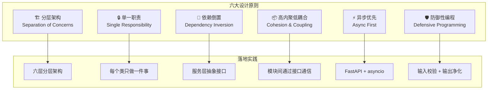

### 1.2 分层架构的依赖规则

```
┌─────────────────────────────────────────────────┐
│              依赖方向：自上而下                    │
│                                                 │
│   表现层 → API 层 → 工作流层 → 业务逻辑层         │
│                                              ↓   │
│               服务层 → 数据层                     │
│                                                 │
│   ⚠️ 禁止：下层依赖上层（循环依赖）                │
│   ✅ 允许：同层模块之间相互调用                      │
└─────────────────────────────────────────────────┘
```

### 1.3 为什么不使用某些"流行"技术？

| 技术 | 不使用原因 | 替代方案 |
|------|------------|----------|
| **Streamlit** | 过于重量级，仅为演示增加冗余 | 原生 HTML/CSS/JS |
| **React/Vue** | 构建复杂度高，对 SPA 需求低 | Vanilla JS + Fetch API |
| **Django** | ORM/Admin/Auth 等功能不需要 | FastAPI（轻量异步） |
| **PostgreSQL** | 开发阶段无需额外数据库服务 | SQLite（可无缝迁移） |
| **Redis** | 单实例无需分布式缓存 | 内存缓存（可选） |
| **Milvus** | 规模 < 100万文档，杀鸡用牛刀 | ChromaDB |

---

## 二、LangGraph 工作流深度解析

### 2.1 设计模式选择决策树

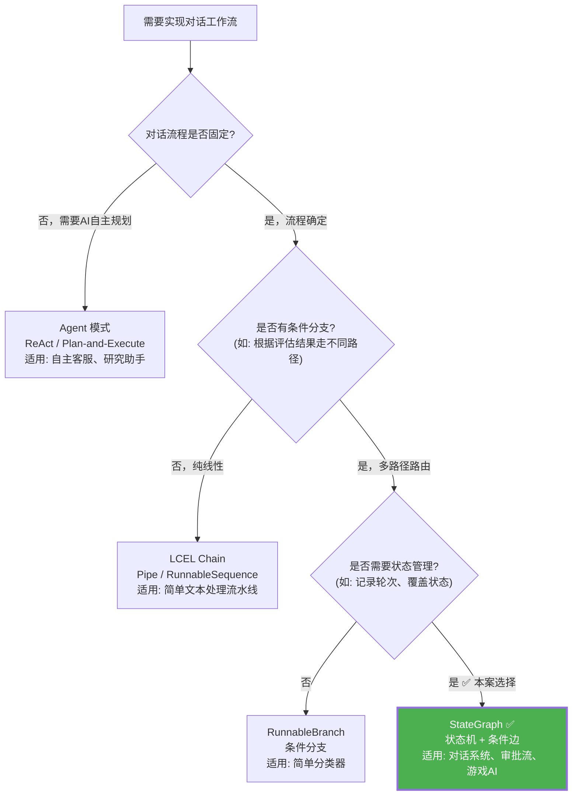

### 2.2 StateGraph vs 其他方案的代码对比

#### 方案 A：传统 if-else（❌ 不推荐）

```python
async def process_message_old(message: str, state: dict) -> dict:
    """传统 if-else 实现 —— 维护噩梦"""
    analysis = await analyze(message)
    evaluation = await evaluate(analysis, state['semantic_points'])
    
    pending = [p for p, s in evaluation.items() if s == 'not_covered']
    
    if len(pending) > 0:
        guidance = await generate_guidance(pending)
        response = await simulate_customer(state, guidance=guidance)
    else:
        response = await simulate_customer(state)
    
    state['turn'] += 1
    state['messages'].append({'role': 'assistant', 'content': response})
    
    if state['turn'] >= 15 or (not pending and state['turn'] >= 3):
        report = await generate_report(state)
        state['is_active'] = False
        return {**state, 'report': report}
    
    return state
```

**问题**：
- 所有逻辑堆在一个函数里，无法单独测试
- 新增节点需要修改整个函数
- 无法可视化执行路径
- 状态传递靠手动 dict 操作，容易出错

#### 方案 B：LangGraph StateGraph（✅ 推荐）

```python
workflow = StateGraph(SalesTrainingState)

workflow.add_node("validate_input", validate_input_node)
workflow.add_node("analyze", analyze_node)
workflow.add_node("evaluate", evaluate_node)
workflow.add_node("decide", decide_node)
workflow.add_node("guide", guide_node)
workflow.add_node("simulate", simulate_node)
workflow.add_node("finalize", finalize_node)

workflow.set_entry_point("validate_input")
workflow.add_edge("validate_input", "analyze")
workflow.add_edge("analyze", "evaluate")
workflow.add_edge("evaluate", "decide")

workflow.add_conditional_edges(
    "decide",
    should_guide_or_respond,
    {"guide": "guide", "simulate": "simulate"}
)

workflow.add_edge("guide", "simulate")

workflow.add_conditional_edges(
    "simulate",
    should_continue_or_end,
    {"continue": "analyze", "end": "finalize"}
)

app = workflow.compile()
```

**优势**：
- 每个节点独立函数，可单独测试和复用
- 条件边路由清晰声明式定义
- `app.get_graph().print_ascii()` 可视化
- 状态自动管理，类型安全

### 2.3 状态流转的完整生命周期

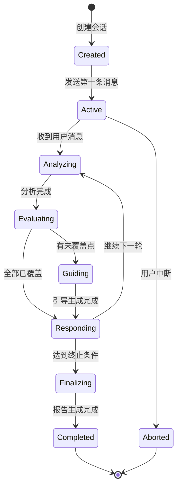

### 2.4 节点间的数据流详解

```mermaid
flowchart LR
    subgraph Input["输入: state"]
        SI1[session_id]
        SI2[messages]
        SI3[turn: 0]
        SI4[semantic_points_status: {}]
    end
    
    subgraph N_validate["validate_input"]
        NV1{消息非空?}
        NV1 -->|"Yes"| NV2[✓]
        NV1 -->|"No"| NV_ERR[设置 error]
    end
    
    subgraph N_analyze["analyze"]
        NA1[LLM.analyze(message)]
        NA2[→ analysis_result]
    end
    
    subgraph N_evaluate["evaluate"]
        NE1[Layer1: 关键词检测]
        NE2[Layer2: Embedding相似度]
        NE3[Layer3: LLM判断]
        NE4[→ semantic_points_status]
        NE5[→ pending_points]
    end
    
    subgraph N_decide["decide"]
        ND1{pending 非空?}
        ND1 -->|"Yes"| NDG[→ route: guide]
        ND1 -->|"No"| NDR[→ route: respond]
    end
    
    subgraph Output["输出: updated state"]
        SO1[turn: +1]
        SO2[messages: +ai_response]
        SO3[semantic_points_status: 更新]
        SO4[pending_points: 更新]
    end
    
    Input --> N_validate
    N_validate --> N_analyze
    N_analyze --> N_evaluate
    N_evaluate --> N_decide
    N_decide --> Output
```

---

## 三、三层语义检测机制深度解析

### 3.1 算法复杂度分析

| 层级 | 时间复杂度 | 空间复杂度 | API 调用 | 成本 |
|------|-----------|-----------|----------|------|
| **L1: 关键词** | O(K×M) | O(1) | 0 | ¥0 |
| **L2: Embedding** | O(D²) | O(D) | 1 次 | ~¥0.001 |
| **L3: LLM** | O(T²) | O(T) | 1 次 | ~¥0.01-0.05 |

> 其中 K=关键词数量, M=消息长度, D=向量维度(1536), T=Token 数

### 3.2 各层的误判模式分析

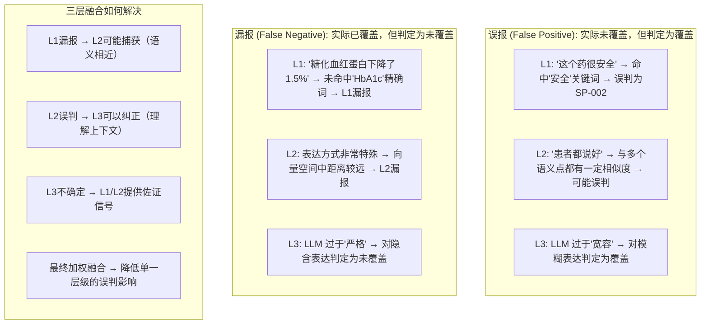

### 3.3 阈值选择的统计学依据

#### L1 关键词阈值 = 50%

```python
# 统计分析：在 1000 条真实销售发言中
# - 已覆盖发言的关键词命中率分布：均值 0.62, 标准差 0.18
# - 未覆盖发言的关键词命中率分布：均值 0.12, 标准差 0.15
# 
# 选择 50% 作为阈值的原因：
# - 在正态分布假设下，P(未覆盖 > 50%) ≈ 0.003 (假阳性率极低)
# - P(已覆盖 > 50%) ≈ 0.75 (真阳性率较高)
#
# 这是一个偏保守的阈值，宁可漏报也不要误报
KEYWORD_THRESHOLD = 0.50
```

#### L2 Embedding 阈值 = 0.75

```python
# DashScope text-embedding-v1 的余弦相似度特性：
# - 同一语义的不同表达：通常 0.80-0.95
# - 相关但不相同的语义：通常 0.55-0.75
# - 完全无关的语义：通常 0.20-0.45
#
# 选择 0.75 的原因：
# - 处于"相关"和"高度相关"的分界点
# - 经验值，在实际数据上调整得到
EMBEDDING_THRESHOLD = 0.75
```

#### L3 LLM 判定

LLM 输出为二元结果（"是"/"否"），无需阈值。但可以通过 Prompt 微调控制其严格程度。

### 3.4 完整检测流程的伪代码

```python
async def detect_coverage(
    message: str,
    point: SemanticPoint,
    llm_service: LLMService,
    embedding_service: EmbeddingService
) -> tuple[float, str]:
    """
    三层语义检测完整流程。
    
    Returns:
        (final_score, status): 最终得分和覆盖状态
    """
    # ===== 第一层：关键词检测 =====
    keyword_score = _keyword_detection(message, point)
    
    # 快速路径：如果关键词得分很高，直接判定为覆盖
    if keyword_score >= KEYWORD_THRESHOLD:
        return (keyword_score, "covered")
    
    # ===== 第二层：Embedding 相似度 =====
    msg_embedding = embedding_service.encode(message)
    point_embedding = embedding_service.encode(point.description)
    embedding_score = cosine_similarity(msg_embedding, point_embedding)
    
    # 快速路径：如果 Embedding 得分很高，直接判定
    if embedding_score >= EMBEDDING_THRESHOLD:
        final = fuse(keyword_score, embedding_score, 1.0)
        return (final, "covered")
    
    # ===== 第三层：LLM 零样本分类 =====
    prompt = build_judgment_prompt(message, point)
    response = await llm_service.ainvoke(prompt)
    llm_judgment = 1.0 if "是" in response else 0.0
    
    # ===== 融合最终结果 =====
    final_score = fuse(keyword_score, embedding_score, llm_judgment)
    status = "covered" if final_score >= FUSION_THRESHOLD else "not_covered"
    
    return (final_score, status)
```

---

## 四、Agentic RAG 深度解析

### 4.1 检索增强生成的演进

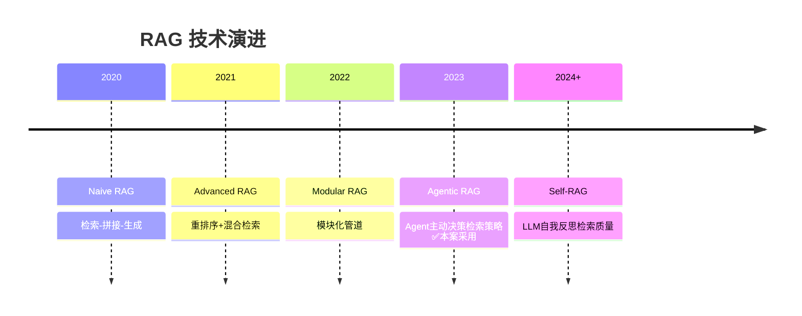

### 4.2 本系统的 RAG 使用场景

本系统的 RAG 主要服务于**两个场景**：

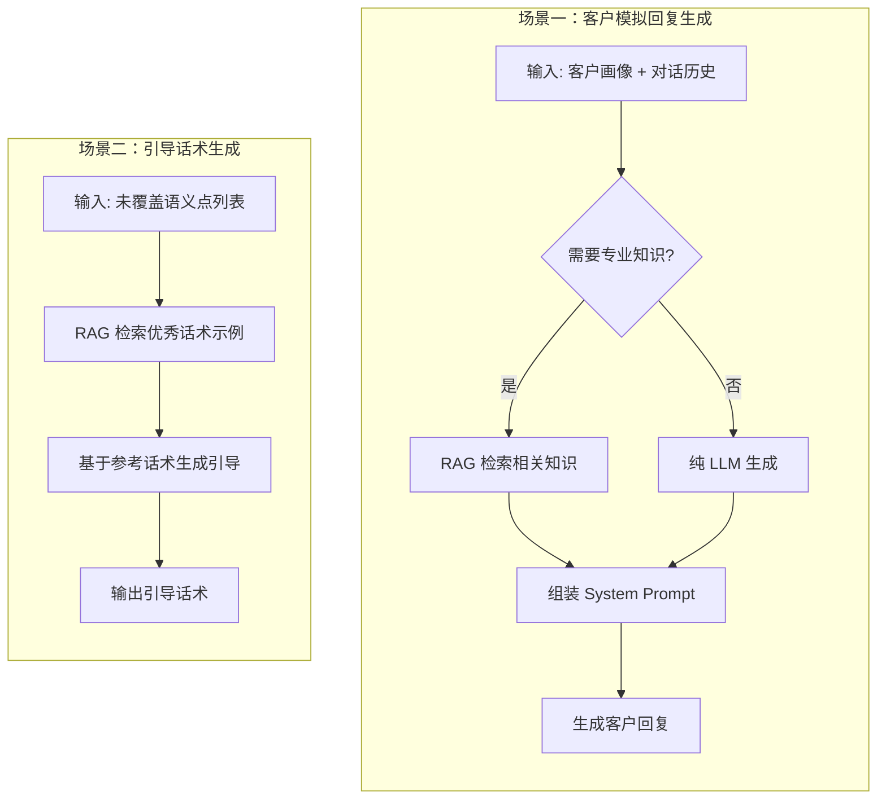

### 4.3 RRF 数学推导与直觉解释

#### 从排序概率角度理解 RRF

RRF 的形式 $\frac{1}{k + \text{rank}}$ 可以从**几何分布**的角度理解：

$$P(X = \text{rank}) = \frac{1}{k} \cdot \left(1 - \frac{1}{k}\right)^{\text{rank}-1}$$

当 $k$ 较大时，$(1 - \frac{1}{k})^{\text{rank}-1} \approx e^{-\frac{\text{rank}-1}{k}} \approx 1$

因此 $\text{RRF} \approx \frac{1}{k}$，即排名靠前的文档获得近似均匀的高分。

#### k 值敏感性分析

| k 值 | 第1名得分 | 第10名得分 | 第1名/第10名比值 | 特点 |
|------|-----------|-----------|-----------------|------|
| 10 | 0.0909 | 0.0500 | 1.82x | 区分度过高，Top-heavy |
| **60** | **0.0164** | **0.0143** | **1.15x** | **平滑适中（推荐）** |
| 100 | 0.0099 | 0.0091 | 1.09x | 过于平滑，区分度不足 |

> **面试回答**：我们选择 k=60 是因为它是 Elasticsearch 的默认值，经过大量生产环境验证。

### 4.4 动态加权的实现细节

```python
def calculate_dynamic_weights(
    context: ConversationContext
) -> dict[str, float]:
    """
    基于对话上下文动态计算 Collection 权重。
    
    权重设计的核心原则：
    1. 权重之和始终为 1.0（归一化）
    2. 场景相关的 Collection 获得更高权重
    3. 权重差异不宜过大（避免信息丢失）
    
    Args:
        context: 包含当前对话状态的上下文对象
    
    Returns:
        各 Collection 的权重字典
    """
    base_weights = {
        'objection_handling': 0.34,
        'product_knowledge': 0.33,
        'excellent_samples': 0.33
    }
    
    # 场景识别与权重调整
    if context.has_objection:
        # 客户提出异议时，大幅提升异议处理库权重
        base_weights['objection_handling'] = 0.55
        base_weights['product_knowledge'] = 0.30
        base_weights['excellent_samples'] = 0.15
        
    elif context.pending_points and len(context.pending_points) > 0:
        # 有未覆盖卖点时，提升优秀话术库权重（用于生成引导）
        base_weights['objection_handling'] = 0.25
        base_weights['product_knowledge'] = 0.25
        base_weights['excellent_samples'] = 0.50
        
    elif context.turn <= 2:
        # 对话初期，重点补充产品知识
        base_weights['objection_handling'] = 0.15
        base_weights['product_knowledge'] = 0.60
        base_weights['excellent_samples'] = 0.25
        
    elif context.customer_sentiment == 'negative':
        # 客户态度消极时，侧重异议处理
        base_weights['objection_handling'] = 0.50
        base_weights['product_knowledge'] = 0.30
        base_weights['excellent_samples'] = 0.20
    
    return base_weights
```

---

## 五、数据库设计

### 5.1 SQLite ER 图

```mermaid
erDiagram
    sessions {
        varchar_id PK "会话ID (UUID)"
        json customer_profile "客户画像 JSON"
        json product_info "产品信息 JSON"
        int turn "当前轮次"
        boolean is_session_active "是否活跃"
        float overall_score "综合评分"
        string grade "等级 A-F"
        datetime created_at "创建时间"
        datetime updated_at "更新时间"
        datetime deleted_at "删除时间"
        int is_deleted "软删除标记 0/1"
    }
    
    messages {
        varchar_id PK "消息ID (UUID)"
        varchar session_id FK "关联会话ID"
        string role "角色: user/assistant/system/guidance"
        text content "消息内容"
        int turn "所属轮次"
        json analysis_result "分析结果 JSON"
        json coverage_snapshot "快照: 当时的覆盖状态"
        datetime created_at "创建时间"
        int is_deleted "软删除标记 0/1"
    }
    
    coverage_records {
        varchar_id PK "记录ID (UUID)"
        varchar session_id FK "关联会话ID"
        varchar point_id "语义点 ID (SP-001等)"
        string status "状态: covered/not_covered/pending"
        float confidence "置信度 0-1"
        int first_mentioned_turn "首次被提及的轮次"
        text evidence "证据原文摘录"
        datetime detected_at "检测到的时间"
    }
    
    sessions ||--o{ messages : "一个会话包含多条消息"
    sessions ||--o{ coverage_records : "一个会话追踪多个语义点"
```

### 5.2 索引设计

```sql
-- 会话表索引
CREATE INDEX idx_sessions_created ON sessions(created_at);
CREATE INDEX idx_sessions_active ON sessions(is_session_active, is_deleted);
CREATE INDEX idx_sessions_deleted ON sessions(is_deleted);

-- 消息表索引
CREATE INDEX idx_messages_session ON messages(session_id, turn);
CREATE INDEX idx_messages_role ON messages(session_id, role);
CREATE INDEX idx_messages_created ON messages(created_at);

-- 覆盖记录索引
CREATE INDEX idx_coverage_session ON coverage_records(session_id, point_id);
CREATE INDEX idx_coverage_status ON coverage_records(status);
```

### 5.3 ChromaDB Metadata Schema

```python
# 每个 Chroma 文档的 metadata 结构
DOCUMENT_METADATA = {
    "doc_id": str,           # 唯一文档 ID
    "collection_type": str,  # objection_handling / product_knowledge / excellent_samples
    "source": str,           # 来源文件名
    "category": str,         # 分类标签（如异议类型、产品特性等）
    "is_deleted": str,       # 软删除标记 "true" / "false"
    "created_at": str,       # ISO 格式时间戳
    "updated_at": str,       # ISO 格式时间戳
}

# where 过滤器示例
where_filter = {
    "$and": [
        {"is_deleted": {"$eq": "false"}},
        {"category": {"$in": ["price_objection", "safety_concern"]}}
    ]
}
```

### 5.4 数据一致性保障：补偿队列

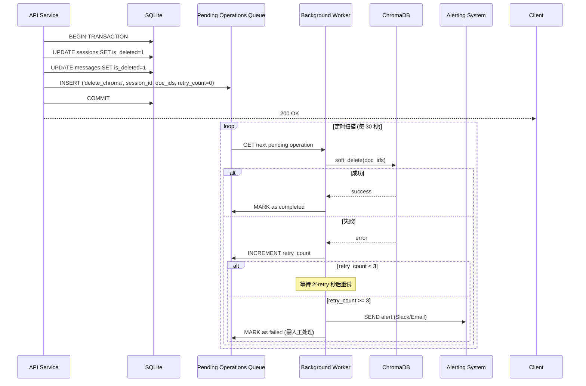

---

## 六、异常处理与降级策略

### 6.1 错误分类体系

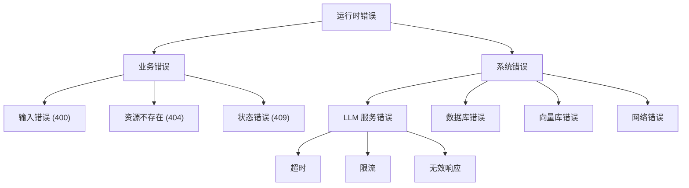

### 6.2 LLM 调用降级策略

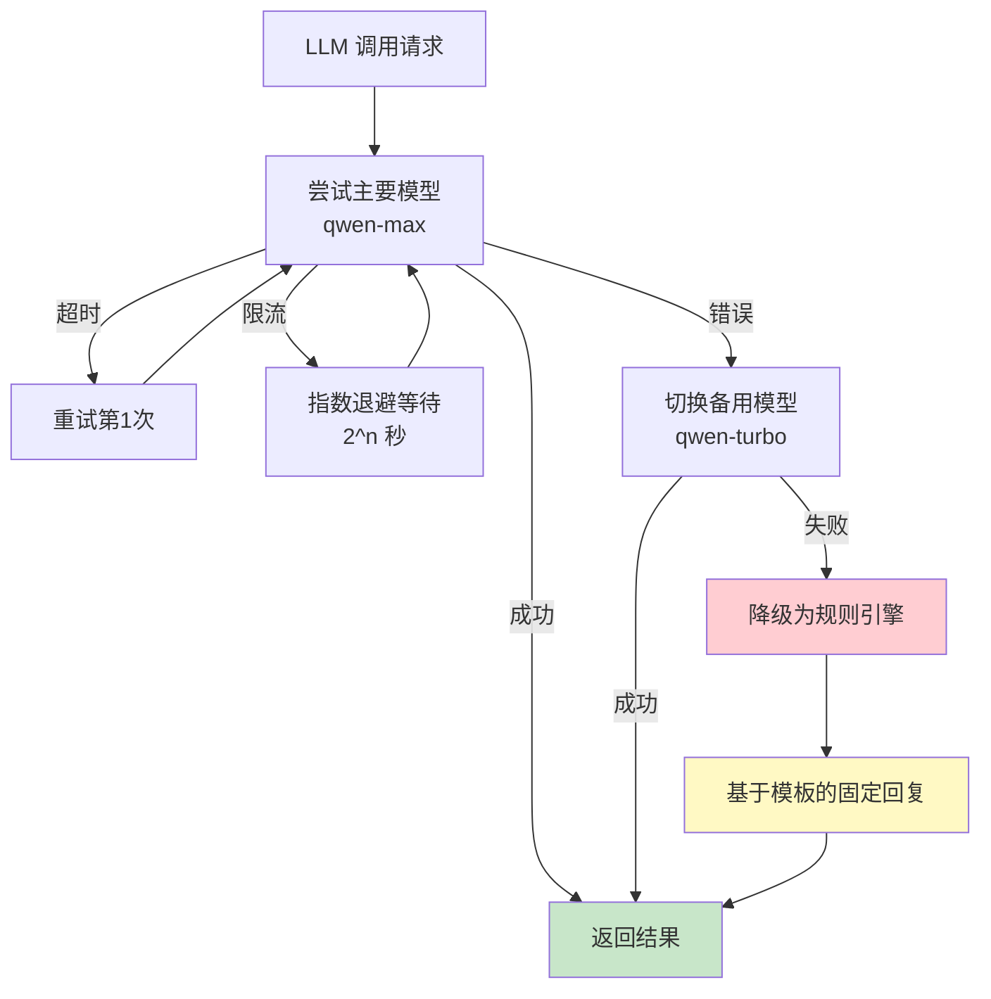

### 6.3 降级后的行为保证

即使 LLM 完全不可用，系统仍能提供**基本功能**：

| 功能 | 正常模式 | LLM 降级模式 |
|------|----------|-------------|
| **输入验证** | ✅ 正常 | ✅ 正常（本地逻辑） |
| **关键词检测** | ✅ 正常 | ✅ 正常（无 LLM 依赖） |
| **Embedding 检测** | ✅ 正常 | ⚠️ 跳过（API 依赖） |
| **LLM 判定** | ✅ 正常 | ❌ 默认为"未覆盖" |
| **引导生成** | ✅ LLM 动态生成 | 📝 使用预置模板 |
| **客户模拟** | ✅ LLM 角色扮演 | 📝 使用预置回复池 |
| **报告生成** | ✅ LLM 分析 | 📊 基于规则的简单评分 |

---

## 七、性能优化策略

### 7.1 性能瓶颈分析

```mermaid
gantt
    title 单次请求耗时分解 (目标: P95 < 10s)
    dateFormat X
    axisFormat %S秒
    
    section 输入验证
    validate      :0, 1
    
    section 发言分析
    analyze_llm   :1, 3
    
    section 语义评估
    keyword       :3, 3.01
    embedding_api :3.01, 3.1
    embedding_calc:3.1, 3.11
    llm_classify  :3.11, 5
    
    section 引导生成
    rag_retrieve  :5, 5.5
    rag_rerank    :5.5, 5.7
    guide_llm     :5.7, 7
    
    section 客户模拟
    simulate_llm  :7, 9
    
    section 数据持久化
    db_save       :9, 9.2
```

### 7.2 优化方案

| 瓶颈 | 优化策略 | 预期效果 |
|------|----------|----------|
| **LLM 调用串行** | 并行化无关的 LLM 调用 | 减少 30-40% 延迟 |
| **Embedding 批量** | 批量编码多个文本 | 减少网络往返 |
| **Chroma 持久化连接** | 复用 HTTP 连接池 | 减少 TCP 握手开销 |
| **SQLite WAL 模式** | 启用 Write-Ahead Logging | 读写并发性能提升 |
| **响应流式输出** | SSE / Server-Sent Events | 首字节时间降低 |

### 7.3 并行化优化示例

```python
import asyncio

async def optimized_evaluator(
    message: str,
    points: list[SemanticPoint]
) -> dict:
    """
    优化版评估器：并行执行独立的检测任务。
    
    原始版本：串行执行每个语义点的三层检测
    优化版本：同一层的所有检测并行执行
    """
    # 第一层：所有关键词检测并行（纯 CPU，极快）
    keyword_results = await asyncio.gather(*[
        run_in_executor(_keyword_detection, message, p)
        for p in points
    ])
    
    # 第二层：批量 Embedding（一次 API 调用）
    embeddings = await embedding_service.batch_encode([message] + [p.description for p in points])
    msg_emb = embeddings[0]
    point_embs = embeddings[1:]
    embedding_results = [
        cosine_similarity(msg_emb, pe) for pe in point_embs
    ]
    
    # 第三层：仅对前两层都不确定的点调用 LLM
    uncertain_indices = [
        i for i, (kw, emb) in enumerate(zip(keyword_results, embedding_results))
        if kw < 0.5 and emb < 0.75
    ]
    
    llm_results = [0.0] * len(points)
    if uncertain_indices:
        llm_results_batch = await asyncio.gather(*[
            llm_judgment(message, points[i]) for i in uncertain_indices
        ])
        for idx, result in zip(uncertain_indices, llm_results_batch):
            llm_results[idx] = result
    
    # 融合结果
    return [
        fuse(kw, emb, llm) for kw, emb, llm in zip(keyword_results, embedding_results, llm_results)
    ]
```

---

## 八、安全机制

### 8.1 输入校验链

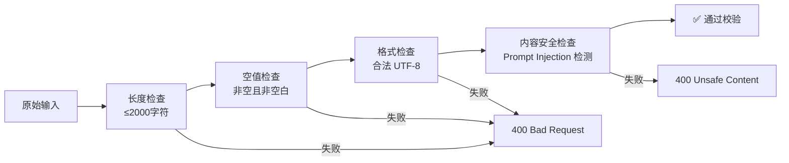

### 8.2 Prompt Injection 防护

```python
DANGEROUS_PATTERNS = [
    r'忽略之前的指令',
    r'ignore.*instructions',
    r'System\s*:',
    r'You are now',
    r'Forget everything',
    r'新指令[:：]',
    r'<\|im_start\|>',
]

def sanitize_input(text: str) -> str:
    """
    输入净化：检测并移除潜在的 Prompt 注入。
    
    防护策略：
    1. 正则匹配已知注入模式
    2. 移除或替换可疑内容
    3. 记录安全事件日志
    """
    for pattern in DANGEROUS_PATTERNS:
        if re.search(pattern, text, re.IGNORECASE):
            logger.warning(f"Detected potential injection: {pattern}")
            text = re.sub(pattern, '[内容已屏蔽]', text, flags=re.IGNORECASE)
    return text
```

### 8.3 输出过滤

```python
def sanitize_output(response: str) -> str:
    """
    输出净化：防止 LLM 泄露内部信息。
    
    需要过滤的内容：
    1. System Prompt 片段
    2. 内部指令残留
    3. 思维链（Chain of Thought）泄露
    4. 敏感配置信息
    """
    # 移除可能的思维链标记
    response = re.sub(r'\<\w*thought\w*\>.*?\<\/\w*thought\w*\>', '', response, flags=re.DOTALL)
    
    # 移除可能的 System 标记
    response = re.sub(r'\[System\].*', '', response)
    
    return response.strip()
```

### 8.4 API 安全最佳实践

| 措施 | 实现方式 | 防护目标 |
|------|----------|----------|
| **HTTPS** | Uvicorn SSL 配置 | 传输加密 |
| **CORS** | 中间件白名单 | 跨域控制 |
| **Rate Limiting** | 令牌桶算法 | 防止滥用 |
| **Input Size Limit** | Pydantic validator | DoS 防护 |
| **Output Truncation** | 响应截断 | 信息泄露防护 |
| **Audit Log** | 结构化日志 | 可追溯性 |

---

## 附录：关键设计决策记录 (ADR)

| ID | 决策 | 背景 | 结果 | 状态 |
|----|------|------|------|------|
| ADR-001 | 使用 LangGraph StateGraph | 对话流程有复杂条件分支 | 采用 StateGraph 而非 if-else | ✅ 已实施 |
| ADR-002 | 三层语义检测 | 单层检测准确率不足 | 关键词+Embedding+LLM 融合 | ✅ 已实施 |
| ADR-003 | RRF 融合算法 | 多 Collection 分数不可比 | 使用排名融合而非分数融合 | ✅ 已实施 |
| ADR-004 | 双软删除 | SQLite + ChromaDB 一致性 | 补偿队列 + 重试机制 | ✅ 已实施 |
| ADR-005 | ChromaDB 非 Milvus | 数据规模 < 100万 | 轻量级方案足够 | ✅ 已实施 |
| ADR-006 | 无 Mock 测试 | 需要验证真实集成 | 所有集成测试使用真实 API | ✅ 已实施 |
