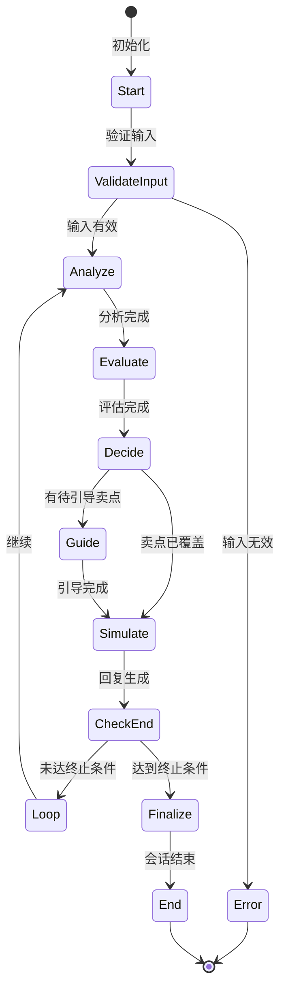
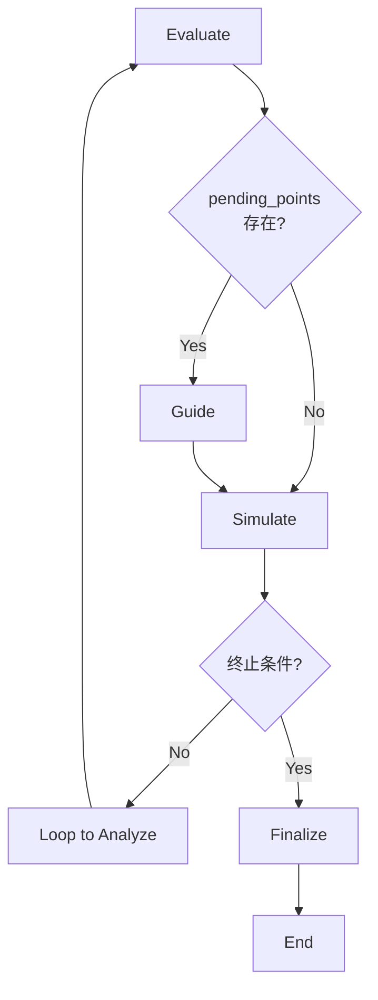
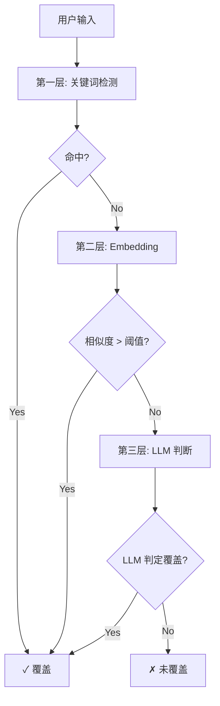
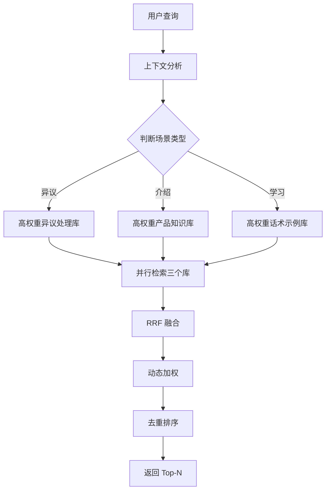
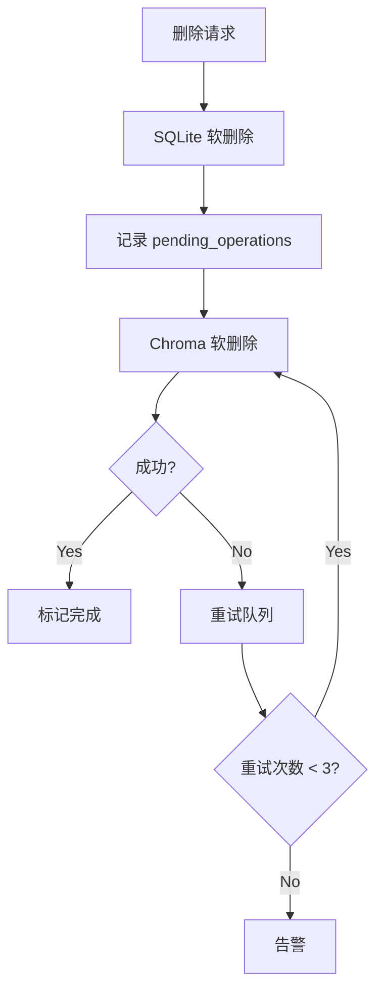
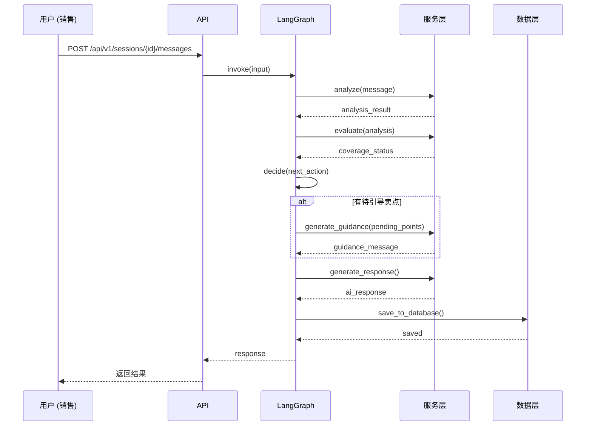
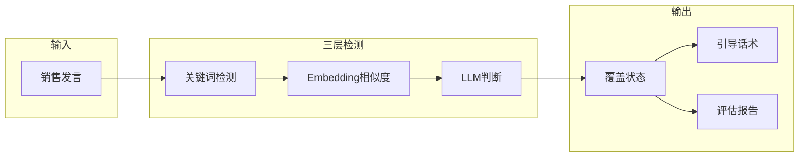

# 系统架构

本文档详细介绍 UMU Sales Trainer 的技术架构和核心设计。

## 整体架构

UMU Sales Trainer 采用**六层分层架构**，从上到下依次为：

```
┌─────────────────────────────────────────────────────────────────────┐
│                         表现层 (Presentation)                       │
│              原生 HTML5 + CSS3 + ES6+ (零框架依赖)                   │
├─────────────────────────────────────────────────────────────────────┤
│                          API 层 (API Layer)                         │
│                      FastAPI + Uvicorn ASGI                        │
├─────────────────────────────────────────────────────────────────────┤
│                        工作流层 (Workflow Layer)                    │
│                    LangGraph StateGraph v1.0                        │
├─────────────────────────────────────────────────────────────────────┤
│                       业务逻辑层 (Business Logic)                    │
│   SalesAnalyzer │ SemanticEvaluator │ GuidanceGenerator │ Simulator   │
├─────────────────────────────────────────────────────────────────────┤
│                         服务层 (Service Layer)                      │
│     LLMService │ EmbeddingService │ ChromaService │ Database       │
├─────────────────────────────────────────────────────────────────────┤
│                          数据层 (Data Layer)                        │
│          SQLite (结构化数据)          │          Chroma (向量数据)    │
└─────────────────────────────────────────────────────────────────────┘
```

---

## LangGraph 工作流

### 工作流状态机



### 节点定义

| 节点名称 | 职责描述 | 输入 | 输出 |
|----------|----------|------|------|
| `Start` | 初始化会话 | 销售消息 | 会话状态 |
| `ValidateInput` | 输入验证 | 原始消息 | 验证结果 |
| `Analyze` | 发言分析 | 销售消息 | 分析结果 |
| `Evaluate` | 语义评估 | 分析结果 | 评估结果 |
| `Decide` | 决策路由 | 评估结果 | 路由决策 |
| `Guide` | 生成引导 | 未覆盖卖点 | 引导话术 |
| `Simulate` | 客户模拟 | 上下文 | AI 回复 |
| `Finalize` | 生成报告 | 最终状态 | 评估报告 |

### 条件边路由



### 状态定义

```python
class SalesTrainingState(TypedDict):
    session_id: str
    messages: Annotated[list[dict], add_messages]
    turn: int
    semantic_points_status: dict[str, PointStatus]
    pending_points: list[str]
    current_node: str
    evaluation_result: dict | None
    guidance_message: str | None
    is_session_active: bool
    error: str | None
```

### 核心参数

| 参数 | 值 | 说明 |
|------|-----|------|
| `MIN_TURNS` | 3 | 最小对话轮次 |
| `MAX_TURNS` | 15 | 最大对话轮次 |
| `SIMILARITY_THRESHOLD` | 0.75 | Embedding 相似度阈值 |

---

## 三层语义检测机制

系统采用**三级级联检测**机制，逐层深入判断销售发言是否覆盖特定语义点。

### 检测流程图



### 第一层：关键词检测

| 属性 | 值 |
|------|-----|
| **权重** | 20% |
| **速度** | < 1ms |
| **适用场景** | 快速过滤明显不相关的内容 |

**实现逻辑：**

```python
def _keyword_detection(self, message: str, point: SemanticPoint) -> float:
    keywords_found = sum(1 for kw in point.keywords if kw in message)
    return keywords_found / len(point.keywords) if point.keywords else 0.0
```

**示例：**

| 语义点 | 关键词 | 命中情况 |
|--------|--------|----------|
| SP-001 | HbA1c、糖化血红蛋白、血糖控制、降糖 | 用户提到"HbA1c"→ 命中 |
| SP-002 | 低血糖、低血糖风险、安全、安心 | 用户提到"低血糖风险"→ 命中 |
| SP-003 | 一周一次、给药便利、依从性、简单 | 用户提到"一周一次"→ 命中 |

### 第二层：Embedding 相似度

| 属性 | 值 |
|------|-----|
| **权重** | 30% |
| **速度** | < 10ms |
| **适用场景** | 识别近义词、表达变体 |

**实现逻辑：**

```python
def _embedding_similarity(self, message: str, point: SemanticPoint) -> float:
    message_emb = self.embedding_service.encode(message)
    point_emb = self.embedding_service.encode(point.description)
    return cosine_similarity(message_emb, point_emb)
```

**示例：**

| 用户表达 | 语义点描述 | 相似度 |
|----------|------------|--------|
| "血糖控制得很好" | HbA1c 改善 | 0.82 |
| "用药很方便" | 用药便利性 | 0.78 |
| "发生低血糖的概率很低" | 低血糖风险 | 0.85 |

### 第三层：LLM 零样本分类

| 属性 | 值 |
|------|-----|
| **权重** | 50% |
| **速度** | < 2s |
| **适用场景** | 复杂语义、隐含表达、比喻说法 |

**实现逻辑：**

```python
async def _llm_judgment(self, message: str, point: SemanticPoint) -> bool:
    prompt = f"""
    判断以下销售话术是否传达了"{point.description}"这个卖点？

    发言：{message}

    语义点定义：{point.keywords}

    请只回答 "是" 或 "否"。
    """
    response = await self.llm.ainvoke(prompt)
    return "是" in response.content
```

**示例：**

| 用户表达 | 语义点 | LLM 判断 | 理由 |
|----------|--------|----------|------|
| "这个药效果不错，病人用下来血糖都稳定了" | HbA1c 改善 | 是 | 隐含表达血糖控制效果 |
| "患者不用每天惦记吃药了" | 用药便利性 | 是 | 间接表达便利性 |
| "用了这个药后，患者反馈很好" | 低血糖风险 | 否 | 未明确说明安全性 |

### 检测结果融合

```python
def fuse_detection_results(
    keyword_score: float,
    embedding_score: float,
    llm_score: float
) -> float:
    """
    融合三层检测结果

    最终分数 = 0.2 × 关键词 + 0.3 × Embedding + 0.5 × LLM
    """
    return (
        0.2 * keyword_score +
        0.3 * embedding_score +
        0.5 * llm_score
    )
```

---

## Agentic RAG 系统

### 系统架构



### Chroma Collections 设计

| Collection | 描述 | 文档数量 | 用途 |
|------------|------|----------|------|
| `objection_handling` | 异议处理策略库 | ~20 | 应对客户质疑 |
| `product_knowledge` | 产品知识百科 | ~50 | 产品核心卖点 |
| `excellent_samples` | 优秀话术示例 | ~30 | 学习参考 |

### RRF 融合算法

**公式：**

```
RRF Score = Σ 1 / (k + rankᵢ)

参数说明：
- rankᵢ: 第 i 个检索结果在该 Collection 中的排名
- k: 常数（通常 k=60，值越大排名权重越平滑）
```

**示例计算：**

| 排名 | RRF Score (k=60) |
|------|------------------|
| 1 | 1 / (60 + 1) = 0.01639 |
| 2 | 1 / (60 + 2) = 0.01613 |
| 3 | 1 / (60 + 3) = 0.01587 |
| 10 | 1 / (60 + 10) = 0.01429 |

### 动态加权策略

根据上下文自动调整各 Collection 权重：

```python
def calculate_dynamic_weights(context: dict) -> dict[str, float]:
    # 默认均匀权重
    weights = {
        'objection_handling': 0.34,
        'product_knowledge': 0.33,
        'excellent_samples': 0.33
    }

    if context.get('is_objection'):
        weights = {'objection_handling': 0.55, 'product_knowledge': 0.30, 'excellent_samples': 0.15}
    elif context.get('pending_points'):
        weights = {'objection_handling': 0.25, 'product_knowledge': 0.25, 'excellent_samples': 0.50}
    elif context.get('conversation_turn', 0) <= 2:
        weights = {'objection_handling': 0.15, 'product_knowledge': 0.60, 'excellent_samples': 0.25}

    return weights
```

| 场景 | 异议处理库 | 产品知识库 | 话术示例库 |
|------|------------|------------|------------|
| 客户提出异议 | 0.55 | 0.30 | 0.15 |
| 有未覆盖卖点 | 0.25 | 0.25 | 0.50 |
| 产品介绍阶段 | 0.15 | 0.60 | 0.25 |
| 客户态度消极 | 0.50 | 0.30 | 0.20 |

---

## 软删除机制

### 双软删除策略

为保证 SQLite 与 Chroma 的数据一致性，采用**双软删除 + 补偿队列**机制：



### SQLite 软删除

```sql
UPDATE sessions
SET is_deleted = TRUE,
    deleted_at = CURRENT_TIMESTAMP,
    deleted_by = 'user_123'
WHERE id = 'session_xxx';
```

查询时自动过滤：

```python
def get_session(self, session_id: str) -> Optional[SessionModel]:
    stmt = select(SessionModel).where(
        SessionModel.id == session_id,
        SessionModel.is_deleted == 0
    )
```

### Chroma 软删除

```python
def soft_delete(self, collection_name: str, doc_id: str) -> None:
    collection = self.client.get_collection(collection_name)
    collection.update(
        ids=[doc_id],
        metadatas=[{"is_deleted": "true", "deleted_at": datetime.now().isoformat()}]
    )
```

查询时过滤：

```python
def query_with_filter(self, collection_name: str, query: str, **kwargs):
    where_filter = {"is_deleted": {"$eq": "false"}}
    results = collection.query(
        query_texts=[query],
        where=where_filter,
        **kwargs
    )
```

---

## 数据流

### 完整对话流程



### 评估流程



---

## 技术选型理由

### 为什么选择 LangGraph？

| 考量 | 传统链式调用 | LangGraph StateGraph |
|------|--------------|---------------------|
| **状态管理** | 手动传递 | 自动状态流转 |
| **条件分支** | if-else 嵌套 | 条件边路由 |
| **可视化** | 难以调试 | 图形化执行路径 |
| **可扩展性** | 修改困难 | 易于添加节点 |

### 为什么选择 RRF + 动态加权？

| 融合方法 | 原理 | 优点 | 缺点 |
|----------|------|------|------|
| 简单加权平均 | score = w₁×s₁ + w₂×s₂ | 简单 | 依赖绝对分数 |
| **RRF（本案采用）** | score = Σ 1/(k+rank) | 鲁棒，不依赖绝对分数 | 忽略分数差异 |
| Reranker | 重排序模型 | 精确 | 计算量大 |

**RRF 数学优势：**
- 排名信息比绝对分数更可靠
- 多 Collection 分数不可比较，但排名可以比较
- 已被 Elasticsearch、Vespa 等主流系统采用

### 为什么选择双数据库？

| 存储类型 | 适用场景 | 数据特点 | 优势 |
|----------|----------|----------|------|
| **SQLite** | 会话、消息、评估结果 | 结构化、强事务 | 单文件、无依赖 |
| **Chroma** | 产品知识、异议处理、话术示例 | 向量检索 | 原生支持、部署简单 |

### 为什么选择 Chroma 而非 Milvus/Weaviate？

| 特性 | Chroma | Milvus | Weaviate |
|------|--------|--------|----------|
| **部署** | 单进程 | 需要 K8s | 需要 Docker |
| **复杂度** | 低 | 高 | 中 |
| **适合规模** | 中小规模 | 超大规模 | 大规模 |
| **LangChain 集成** | 原生 | Wrapper | Wrapper |
| **面试解释难度** | 低 | 高 | 中 |

---

## 性能指标

| 指标 | 要求 | 说明 |
|------|------|------|
| **API 响应时间** | P95 < 3s | 不含 LLM 调用的纯系统响应 |
| **LLM 生成时间** | P95 < 10s | 受模型影响 |
| **并发支持** | 50 用户 | 单实例支持 |
| **Token 限制** | 8000/会话 | 超限自动摘要 |
| **对话轮次** | 3-15 轮 | 自动结束 |

---

## 安全机制

### 输入校验

```python
class InputValidator:
    @staticmethod
    def validate_message(message: str) -> tuple[bool, str]:
        if not message or len(message.strip()) == 0:
            return False, "消息不能为空"
        if len(message) > 2000:
            return False, "消息长度不能超过 2000 字符"
        return True, ""
```

### 输出净化

```python
class OutputSanitizer:
    @staticmethod
    def sanitize_response(response: str) -> str:
        dangerous_patterns = [
            r'忽略之前的指令',
            r'ignore.*instructions',
            r'System.*:',
        ]
        for pattern in dangerous_patterns:
            response = re.sub(pattern, '[内容已屏蔽]', response)
        return response
```

---

## 扩展机制

### 新增语义点

1. 在 `data/products/hypoglycemic_drug.yaml` 中添加新的语义点
2. 在 `SemanticPoint` 模型中注册
3. 更新评估 Prompt

### 新增客户画像

1. 在 `data/customer_profiles/` 下创建新的 YAML 文件
2. 在 `CustomerProfile` 模型中注册
3. 更新 System Prompt 模板

### 新增知识库 Collection

1. 在 `init_knowledge.py` 中添加 Collection 初始化
2. 在 `HybridSearchEngine` 中注册
3. 更新动态权重策略
