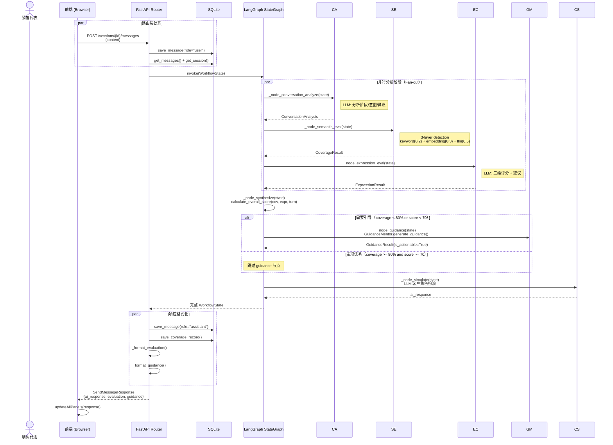
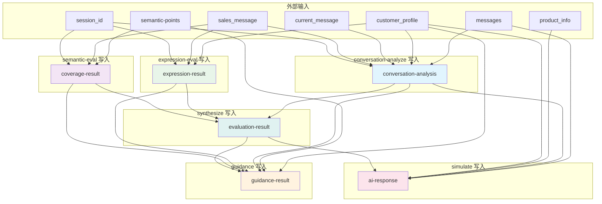
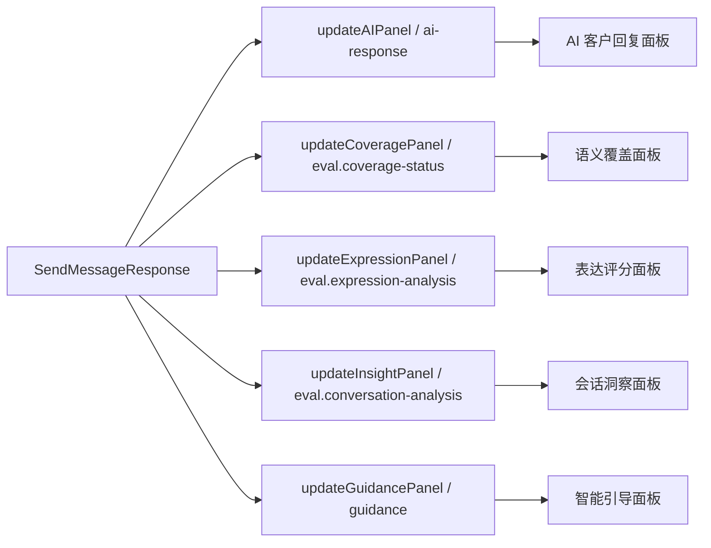
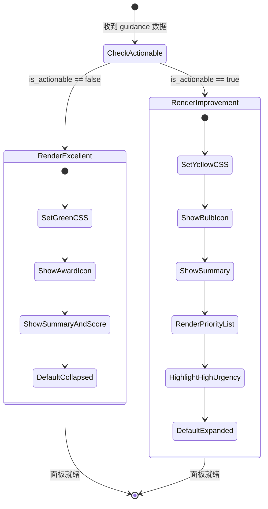

# 技术架构设计文档

本文档深入描述 AI Sales Trainer Chatbot 系统的技术架构细节，包括 Agentic RAG 工作流机制、Agent 协作模式、数据模型设计和关键实现决策。本文档面向需要理解系统内部运作机制的开发者。

## 目录

- [1. Agentic RAG 在本系统中的工作方式](#1-agentic-rag-在本系统中的工作方式)
- [2. Agent 详细设计与协作](#2-agent-详细设计与协作)
- [3. 工作流引擎深度解析](#3-工作流引擎深度解析)
- [4. 数据模型与状态管理](#4-数据模型与状态管理)
- [5. 评分算法数学推导](#5-评分算法数学推导)
- [6. 前端数据流与渲染](#6-前端数据流与渲染)

---

## 1. Agentic RAG 在本系统中的工作方式

### 1.1 完整数据流

销售代表发送一条消息后，数据在系统中经历的完整处理链路如下：



### 1.2 累积式语义评估策略

本系统的一个重要设计决策是：**语义覆盖评估使用累积式文本**，而非仅评估当前轮次消息。

在 `router.py` 的 `send_message()` 端点中：

```python
# 拼接全程用户消息用于累积式语义评估
all_user_messages = [m.content for m in messages if m.role == "user"]
all_user_messages.append(request.content)
cumulative_sales_text = "\n".join(all_user_messages)

workflow_state: WorkflowState = {
    ...
    "sales_message": cumulative_sales_text,  # 累积式，非单条
    ...
}
```

这意味着 `sales_message` 字段包含从第 1 轮到当前轮次的全部用户发言拼接结果。这样设计的理由是：

| 评估方式 | 优点 | 缺点 |
|---------|------|------|
| **累积式（当前方案）** | 反映完整对话的覆盖情况，分数随对话推进自然增长 | 长对话时输入 token 增加，LLM 成本上升 |
| 单轮式 | 输入短、成本低 | 无法反映整体覆盖进度，每轮覆盖率可能波动 |

---

## 2. Agent 详细设计与协作

### 2.1 ConversationAnalyst -- 对话分析师

**源文件位置**: [analyzer.py](src/umu_sales_trainer/core/analyzer.py)

**类签名**: `ConversationAnalyst(llm_service: LLMService)`

**核心方法调用链**:

```
analyze(sales_message, customer_profile, conversation_history)
  |-- _build_prompt(...) -> str (构建含阶段定义和上下文的 Prompt)
  |-- _llm.invoke([HumanMessage(prompt)]) -> response
  |-- _parse_response(content) -> ConversationAnalysis (JSON 解析)
  |-- _detect_objections_by_keywords(message) -> list[str] (规则补充)
  |-- 合并 objections 取并集
  |-- return ConversationAnalysis
```

**Prompt 设计要点**:

- 包含完整的 5 阶段定义（STAGE_DEFINITIONS 常量）
- 注入客户画像上下文（姓名/职位/关注点/性格）
- 注入最近 4 条对话历史作为阶段演进参考
- 要求严格 JSON 格式输出，包含 stage/intent/objections/sentiment 四个字段

**降级策略 `_rule_based_analysis()`**:

当 LLM 调用失败时，使用关键词匹配做基础判断：

| 检测目标 | 关键词列表 | 匹配到则判定为 |
|---------|-----------|--------------|
| opening | 您好/你好/感谢/很高兴/介绍/我是 | 开场破冰 |
| needs_discovery | 您觉得/您目前/请问/了解到/情况如何 | 需求探查 |
| presentation | 我们的产品/这款/临床/疗效/数据显示/HbA1c | 产品呈现 |
| objection_handling | 关于您的顾虑/您提到的/确实/理解您的担心 | 异议处理 |
| closing | 那么/接下来/我们可以/建议/安排/跟进 | 缔结成交 |

**9 类异议关键词库 (`OBJECTION_KEYWORDS`)**:

```python
OBJECTION_KEYWORDS = {
    "价格":       ["贵", "太贵", "预算", "成本", "便宜", "降价", "折扣"],
    "安全性":     ["副作用", "不良反应", "肝肾", "毒性", "风险", "安全吗", ...],
    "证据":       ["证据", "研究", "试验", "文献", "论文", "数据来源", ...],
    "竞品":       ["其他产品", "同类药", "竞品", "对比", "别的品牌", ...],
    "时机":       ["再考虑", "不急", "等等", "下次再说", "暂时不需要"],
    "用法便利性": ["一天几次", "用法复杂", "不方便", "麻烦", "依从性", ...],
    "医保报销":   ["医保", "报销", "自费", "进医保", "报销比例", ...],
    "处方限制":   ["处方", "限制", "适应症", "开药", "非处方"],
    "疗效疑虑":   ["效果不明显", "没效果", "起效慢", "疗效差", ...],
}
```

### 2.2 SemanticCoverageExpert -- 语义覆盖专家

**源文件位置**: [evaluator.py](src/umu_sales_trainer/core/evaluator.py) （`SemanticCoverageExpert` 类）

**类签名**: `SemanticCoverageExpert(embedding_service: EmbeddingService, llm_service: LLMService)`

**核心方法调用链**:

```
evaluate_coverage(sales_message, semantic_points, context)
  |-- for each semantic_point:
  |     |-- _evaluate_single_point(message, point)
  |           |-- _keyword_detection(message, point) -> float (0~1)
  |           |-- _embedding_similarity(message, point) -> float (0~1)
  |           |-- _llm_judgment(message, point) -> float (0 或 1)
  |           |-- weighted_sum = k*0.2 + e*0.3 + l*0.5
  |           |-- return "covered" if >= 0.5 else "not_covered"
  |-- _calculate_coverage_rate(status_dict) -> float
  |-- return CoverageResult(status, rate, uncovered_ids)
```

**3 层检测决策树**:

```mermaid
graph TD
    START[收到销售消息 + 语义点] --> L1{关键词匹配率}
    L1 -->|>=80%| L1HIGH[得分 0.8~1.0]
    L1 -->|50%~80%| L1MID[得分 0.5~0.8]
    L1 -->|<50%| L1LOW[得分 0.0~0.5]

    L1HIGH --> L2{Embedding 相似度}
    L1MID --> L2
    L1LOW --> L2

    L2 -->|>=阈值(0.7)| L2HIGH[得分 0.7~1.0]
    L2 -->|<阈值| L2LOW[得分 0.0~0.7]

    L2HIGH --> L3{LLM 判断}
    L2LOW --> L3

    L3 -->|确认覆盖| FINAL_YES["covered"]
    L3 -->|否认或不确定| FINAL_NO["not_covered"]

    style L1 fill:#e3f2fd
    style L2 fill:#f3e5f5
    style L3 fill:#e8f5e9
```

**各层权重分配的设计理由**:

| 层级 | 权重 | 权衡考量 |
|------|------|---------|
| 关键词 | 0.2 | 只能检测字面匹配，无法理解同义表述，权重最低 |
| Embedding | 0.3 | 能捕获语义相似性，但可能受向量质量影响，权重中等 |
| LLM | 0.5 | 具备真正的语义理解能力，是最可靠的判断依据，权重最高 |

**Embedding 层阈值机制**:

```python
def _embedding_similarity(self, message, point):
    threshold = getattr(point, "threshold", 0.7)  # 默认 0.7
    query_emb = self.embedding_service.encode_query(message)
    point_emb = self.embedding_service.encode_query(point.description)
    similarity = self._cosine_similarity(query_emb, point_emb)
    # 如果超过阈值返回满分 1.0，否则按比例折算
    return 1.0 if similarity >= threshold else similarity / threshold
```

当余弦相似度超过阈值（默认 0.7）时直接返回满分 1.0；低于阈值时按比例线性折算。这种设计避免了低相似度时的硬截断。

### 2.3 ExpressionCoach -- 表达教练

**源文件位置**: [evaluator.py](src/umu_sales_trainer/core/evaluator.py) （`ExpressionCoach` 类）

**类签名**: `ExpressionCoach(llm_service: LLMService)`

**核心方法调用链**:

```
evaluate(message, context)
  |-- try:
  |     |-- _llm_evaluate(message) -> ExpressionAnalysis
  |     |     |-- 构建五级评分 Prompt
  |     |     |-- llm.invoke([HumanMessage(prompt)])
  |     |     |-- _parse_expression_response(content) -> ExpressionAnalysis
  |     |-- _generate_suggestions(message, analysis) -> list[Suggestion]
  |           |-- 遍历 clarity/professionalism/persuasiveness
  |           |-- 对 <7 分维度调用 _build_suggestion_for_dimension()
  |-- except:
  |     |-- _rule_based_expression_analysis(message) -> ExpressionAnalysis (降级)
  |     |-- _generate_suggestions_from_rules(analysis) -> list[Suggestion] (降级)
  |-- return ExpressionResult(analysis, suggestions, raw_length=len(message))
```

**LLM 评分 Prompt 的严格性设计**:

评分 Prompt 使用了严格的五级制评分标准，每个维度分为 5 个等级（1-3 分为差 / 4-5 分为中下 / 6-7 分为中上 / 8-9 分为良 / 10 分为优），并明确要求"不要宽容，要客观反映真实水平"。这避免了 LLM 倾向于给出中高分的常见问题。

**规则降级分析的指标体系**:

当 LLM 不可用时，规则引擎通过以下指标估算分数：

| 维度 | 分析指标 | 加分/扣分条件 |
|------|---------|-------------|
| 清晰度 | 平均句子长度 | 15-50 字: +1; <10 或 >70: -1 |
| 清晰度 | 标点使用 | 有逗号和顿号: +1 |
| 清晰度 | 长/短句比例 | 长句>40%: -1; 短句>50%: -1 |
| 清晰度 | 词汇多样性 | unique/total < 0.6: -1 |
| 专业性 | 术语密度 | 每匹配到一个专业术语: +1（上限 10） |
| 说服力 | 数据百分比 | 出现 `X%`: +1 |
| 说服力 | 对比论证 | 出现相比/优于/低于: +1 |
| 说服力 | 行动号召 | 出现建议/推荐/可以考虑: +1 |
| 说服力 | 递进论述 | 出现而且/此外/同时/更重要: +1 |

### 2.4 GuidanceMentor -- 智能引导导师

**源文件位置**: [guidance.py](src/umu_sales_trainer/core/guidance.py)

**类签名**: `GuidanceMentor(llm_service: LLMService)`

**核心方法调用链**:

```
generate_guidance(coverage_result, expression_result, conv_analysis, semantic_points, customer_profile, overall_score)
  |-- 双条件检查: coverage >= 0.8 AND score >= 70?
  |     |-- YES -> return GuidanceResult(summary="表现优秀！", is_actionable=False)
  |-- NO:
  |     |-- _build_priority_items(...) -> list[GuidanceItem]
  |     |     |-- 遍历 uncovered_points -> high urgency items
  |     |     |-- 遍历 expression dimensions (<6: high, 6-7: medium)
  |     |     |-- 遍历 objections (前2个) -> medium urgency items
  |     |-- items.sort(by urgency: high=0, medium=1, low=2)
  |     |-- _generate_summary(items, coverage) -> str
  |     |-- return GuidanceResult(priority_list, summary, is_actionable=True)
```

**紧急度阈值常量**:

```python
URGENCY_THRESHOLDS = {"high": 0.5, "medium": 0.8, "low": 1.0}
```

这些阈值用于优秀态判定（`coverage_rate >= URGENCY_THRESHOLDS["low"]` 即 >= 80% 时可能触发优秀），同时也暗示了紧急度的分级标准。

**引导项模板系统**:

每个表达维度的改进建议使用了预定义的模板：

| 维度 | advice（建议方向） | example（参考话术） |
|------|-------------------|-------------------|
| clarity | 优化语句结构，使用'总-分-总'模式 | 先说核心观点（关于XX），再展开具体数据支撑，最后总结要点 |
| professionalism | 引用临床试验数据、权威指南或真实案例 | 根据XX研究显示（n=XXX），患者HbA1c平均降低X%，p<0.05 |
| persuasiveness | 采用'痛点-方案-证据-行动'四步法 | 您提到的XX问题确实存在（痛点），我们的方案是XX（方案），临床证明XX（证据），建议先试用（行动） |

### 2.5 CustomerSimulator -- AI 客户模拟器

**源文件位置**: [workflow.py]（`_node_simulate`, `_generate_ai_response`, `_build_customer_system_prompt` 函数）

CustomerSimulator 不是独立的 Agent 类，而是工作流中的一个节点函数。它基于以下信息生成 AI 客户回复：

| 输入来源 | 用途 |
|---------|------|
| `customer_profile` | 姓名、职位、机构、性格、关注点 |
| `product_info` | 产品名称（用于生成有针对性的回应） |
| `conversation_analysis.stage` | 当前销售阶段（影响回复风格和内容倾向） |
| `evaluation_result.overall_score` | 当前评分（注入 System Prompt 让 AI 客户"知道"销售表现） |
| `messages`（最近 6 条） | 对话历史上下文 |

**System Prompt 角色设定要点**:

- 明确定义 AI 扮演的是**客户**（医生/采购方），对方是**销售代表**
- 注入客户的性格特征（如"专业审慎，注重数据和循证医学证据"）
- 列出客户的核心关注点
- 定义 6 条对话规则（自称方式、回复长度、追问习惯、反对意见等）

**降级方案 `_generate_fallback_response()`**:

当 LLM 不可用时，根据当前销售阶段选择预设模板回复：

| 阶段 | 兜底回复 |
|------|---------|
| opening | "您好，请简要介绍一下您今天想聊什么？我时间比较紧。" |
| needs_discovery | "嗯，我想了解更多细节。您能具体说说这个产品的优势在哪里吗？" |
| presentation | "听起来不错，但我需要看到更多的临床数据支撑。有没有头对头的研究？" |
| objection_handling | "我理解您的说法，但这一点我还是有些顾虑..." |
| closing | "好的，让我再考虑一下。您可以先发一份详细资料给我。" |

---

## 3. 工作流引擎深度解析

### 3.1 LangGraph StateGraph 编排细节

工作流的创建入口是 `create_workflow()` 函数：

```python
def create_workflow(embedding_service, llm_service):
    # 1. 实例化 4 个 Agent
    conversation_analyst = ConversationAnalyst(llm_service)
    semantic_expert = SemanticCoverageExpert(embedding_service, llm_service)
    expression_coach = ExpressionCoach(llm_service)
    guidance_mentor = GuidanceMentor(llm_service)

    # 2. 创建 StateGraph
    graph = StateGraph(WorkflowState)

    # 3. 注册 9 个节点（含 start/end）
    graph.add_node("start", _node_start)
    graph.add_node("parallel_fanout", _node_parallel_fanout)
    # ... 其余节点

    # 4. 定义边（含条件边）
    graph.set_entry_point("start")
    graph.add_edge("start", "parallel_fanout")
    # ... fan-out edges
    graph.add_conditional_edges("synthesize", _should_generate_guidance, {...})

    # 5. 编译为可执行工作流
    return graph.compile()
```

### 3.2 WorkflowState 字段依赖关系



### 3.3 条件路由真值表

`_should_generate_guidance()` 函数的真值表如下（`C` = coverage_rate, `S` = overall_score）：

| C < 0.8 | S < 70 | 返回值 | 含义 | 引导节点执行？ |
|:-------:|:-------:|:-------:|------|:------------:|
| T | T | "yes" | 覆盖不足且分低 | **执行** |
| T | F | "yes" | 覆盖不足但分高 | **执行** |
| F | T | "yes" | 覆盖充足但分低 | **执行** |
| F | F | "no" | 覆盖充足且分高 | **跳过** |

只有第四种情况（F, F）即 `coverage >= 0.8 AND score >= 70` 时才跳过引导。

### 3.4 错误恢复策略

各节点的错误处理策略：

| 节点 | 错误处理方式 | 降级行为 |
|------|------------|---------|
| `start` | 返回 `{"error": "..."}` | 后续节点检测到 error 字段可提前终止 |
| `conversation_analyze` | try/except 包裹 LLM 调用 | 降级为 `_rule_based_analysis()` |
| `semantic_eval` | try/except 包裹 LLM 层 | LLM judgment 失败返回 0.5（中性分数） |
| `expression_eval` | try/except 包裹 LLM 调用 | 降级为 `_rule_based_expression_analysis()` |
| `synthesize` | 无 LLM 调用，纯计算 | 不涉及 LLM，不会失败 |
| `guidance` | try/except 包裹 LLM 增强 | 返回基础引导结果（无 LLM 增强） |
| `simulate` | try/except 包裹 LLM 调用 | 降级为 `_generate_fallback_response()` |
| `end` | 仅日志记录 | 无操作 |

---

## 4. 数据模型与状态管理

### 4.1 核心 Pydantic/Dataclass 模型清单

| 模型名 | 所在文件 | 用途 | 关键字段 |
|--------|---------|------|---------|
| `WorkflowState` | workflow.py | 工作流共享状态 | 14 个字段（见 README 第 4.4 节） |
| `ConversationAnalysis` | analyzer.py | 对话分析结果 | stage, intent, objections, sentiment, confidence |
| `CoverageResult` | evaluator.py | 语义覆盖结果 | coverage_status(dict), coverage_rate(float), uncovered_points(list) |
| `ExpressionResult` | evaluator.py | 表达评估结果 | analysis(ExpressionAnalysis), suggestions(list), raw_message_length(int) |
| `ExpressionAnalysis` | evaluator.py (models) | 三维评分 | clarity(int), professionalism(int), persuasiveness(int) |
| `EvaluationResult` | models/evaluation.py | 最终聚合结果 | session_id, coverage_status, expression_analysis, coverage_rate, overall_score |
| `GuidanceResult` | guidance.py | 引导建议结果 | priority_list(list), summary(str), is_actionable(bool) |
| `GuidanceItem` | guidance.py | 单条引导项 | gap, urgency, suggestion, talking_point, expected_effect |
| `Suggestion` | evaluator.py | 表达改进建议 | dimension, current_score, advice, example |
| `SemanticPoint` | models/semantic.py | 语义点定义 | point_id, description, keywords(list), weight(float) |
| `Message` | models/conversation.py | 对话消息 | session_id, role, content, turn |
| `CustomerProfile` | models/customer.py | 客户画像 | name, hospital, position, concerns, personality |
| `ProductInfo` | models/product.py | 产品信息 | name, description, core_benefits, key_selling_points |

### 4.2 API 请求/响应模型

| 模型名 | 用途 | 关键字段 |
|--------|------|---------|
| `CreateSessionRequest` | 创建会话请求 | customer_profile(dict), product_info(dict), semantic_points(list) |
| `CreateSessionResponse` | 创建会话响应 | session_id, status, created_at |
| `SendMessageRequest` | 发送消息请求 | content(str, min_length=1) |
| **`SendMessageResponse`** | **发送消息响应（核心）** | session_id, turn, ai_response, **evaluation(dict)**, **guidance(dict\|None)** |
| `EvaluationResponse` | 评估查询响应 | session_id, coverage_status, coverage_labels, coverage_rate, overall_score, expression_analysis, suggestions, conversation_analysis |
| `HealthResponse` | 健康检查响应 | status, timestamp |

### 4.3 延迟初始化模式

API Router 中使用了延迟初始化（lazy initialization）模式来创建工作流实例：

```python
_workflow_instance = None

def _get_workflow():
    global _workflow_instance
    if _workflow_instance is None:
        embedding_service = EmbeddingService()
        llm_service = create_llm("dashscope")
        _workflow_instance = create_workflow(embedding_service, llm_service)
    return _workflow_instance
```

**设计理由**：避免模块导入时就读取 `.env` 文件和初始化 LLM 连接。在实际请求到达时才完成初始化，确保 `.env` 已被 `main.py` 的 `load_dotenv()` 正确加载。

---

## 5. 评分算法数学推导

### 5.1 完整公式

$$
\text{Score} = \text{clamp}\left(\left(\underbrace{\sqrt{r_c} \times 40}_{\text{Coverage}} + \underbrace{\frac{0.2 C + 0.3 P + 0.5 S}{10} \times 35}_{\text{Expression}}\right) \times \underbrace{p(t)}_{\text{Turn Penalty}} + \underbrace{q(l, r_c)}_{\text{Quality}},\ 0,\ 100\right)
$$

其中：
- $r_c$ = coverage_rate（0 到 1）
- $C$ = clarity 评分（1 到 10）
- $P$ = professionalism 评分（1 到 10）
- $S$ = persuasiveness 评分（1 到 10）
- $t$ = 当前轮次（从 1 开始）
- $l$ = 消息字符数
- $p(t)$ = 回合惩罚系数
- $q(l, r_c)$ = 质量调整分

### 5.2 各因子对总分的影响权重可视化

假设典型场景（第 3 轮，覆盖率 67%，清晰度 7/专业 6/说服力 5，消息长度 80 字）：

| 因子 | 计算值 | 占原始总分比 |
|------|--------|------------|
| 覆盖率分 | $\sqrt{0.67} \times 40 = 32.7$ | **62.8%** |
| 表达分 | $(7\times0.2 + 6\times0.3 + 5\times0.5)/10 \times 35 = 19.3$ | **37.2%** |
| 原始总分 | $32.7 + 19.3 = 52.0$ | 100% |
| 回合惩罚 | $\times 0.86$ | -- |
| 惩罚后 | $44.7$ | -- |
| 质量调整 | $+ 0.0$ | -- |
| **最终得分** | **44.7 → 45** | -- |

覆盖率因子占总分约 63%，表达力因子约占 37%。这是因为覆盖率上限 40 分高于表达力上限 35 分，且 sqrt 压缩在高覆盖率时仍能贡献可观分数。

### 5.3 评分因子的敏感度分析

#### 覆盖率敏感度

| 覆盖率变化 | 覆盖分变化 | 变化幅度 |
|-----------|-----------|---------|
| 0% → 33% | 0 → 23.0 | +23.0 |
| 33% → 67% | 23.0 → 32.7 | +9.7 |
| 67% → 100% | 32.7 → 40.0 | +7.3 |

sqrt 函数导致**边际收益递减**：从 0% 提升到 33% 获得 23 分，而从 67% 提升到 100% 仅获得 7.3 分。这鼓励销售代表优先保证基础覆盖，而非过度堆砌已覆盖的关键词。

#### 说服力敏感度（在第 3 轮，覆盖率 67%，其他维度不变）

| 说服力变化 | 表达分变化 | 最终得分变化 |
|-----------|-----------|------------|
| 4 → 5 | 17.5 → 19.3 | 43 → 45 (+2) |
| 5 → 7 | 19.3 → 22.8 | 45 → 49 (+4) |
| 7 → 9 | 22.8 → 26.3 | 49 → 54 (+5) |

说服力每提升 2 分，最终得分提升 2-5 分（受回合惩罚放大）。这验证了说服力权重最高（0.5）的设计效果。

---

## 6. 前端数据流与渲染

### 6.1 API 响应到面板映射

前端 `app.js` 接收 `SendMessageResponse` 后，将各字段分发到对应的面板更新函数：



### 6.2 双态引导面板的状态机



### 6.3 关键 JavaScript 函数说明

| 函数名 | 触发时机 | 功能 |
|--------|---------|------|
| `sendMessage()` | 用户点击发送按钮 | 收集输入内容，POST 到 `/api/v1/sessions/{id}/messages`，处理响应并更新全部面板 |
| `updateGuidancePanel(guidance)` | sendMessage 回调中 | 根据 `is_actionable` 决定渲染绿色优秀态还是黄色改进态 |
| `toggleGuidance()` | 用户点击引导面板标题栏 | 切换面板展开/折叠状态 |
| `escapeHtml(str)` | 所有面板渲染前 | XSS 防护，转义 HTML 特殊字符 |
