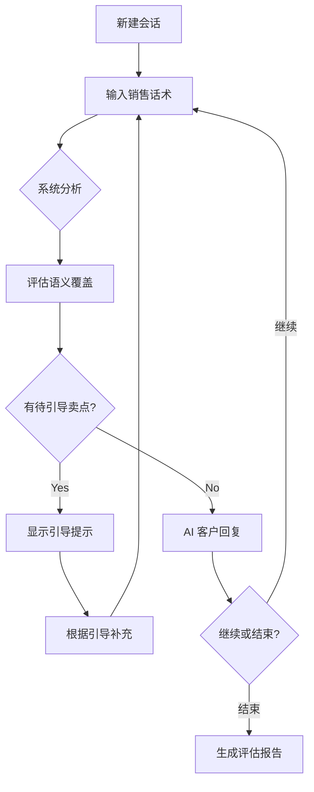

# 快速开始

本指南帮助您在 5 分钟内搭建并运行 UMU Sales Trainer 系统。

## 环境要求

| 要求 | 版本 | 说明 |
|------|------|------|
| **Python** | 3.13+ | 新特性支持 |
| **uv** | 最新版 | 包管理器 |

### 安装 uv

```bash
# Linux / macOS
curl -LsSf https://astral.sh/uv/install.sh | sh

# Windows (PowerShell)
powershell -ExecutionPolicy ByPass -c "irm https://astral.sh/uv/install.ps1 | iex"

# 或使用 pip
pip install uv
```

---

## 安装步骤

### 1. 克隆项目

```bash
git clone https://gitee.com/your-repo/umu-sales-trainer.git
cd umu-sales-trainer
```

### 2. 安装依赖

```bash
uv sync
```

### 3. 配置环境变量

```bash
cp .env.example .env
```

编辑 `.env` 文件，填入您的 API 密钥：

```bash
# 方案一：DashScope（通义千问）- 推荐国内使用
DASHSCOPE_API_KEY=sk-xxxxxxxxxxxxxxxx
DASHSCOPE_BASE_URL=https://dashscope.aliyuncs.com/compatible-mode/v1

# 方案二：DeepSeek（高性价比）
DS_API_KEY=sk-xxxxxxxxxxxxxxxx
DS_BASE_URL=https://api.deepseek.com

# 选择 provider: "dashscope" | "deepseek"
LLM_PROVIDER=dashscope
```

> **获取 API 密钥：**
> - DashScope: https://dashscope.console.aliyun.com/
> - DeepSeek: https://platform.deepseek.com/

### 4. 初始化数据库

```bash
uv run python init_db.py
```

**预期输出：**

```
[INFO] 开始初始化数据库...
[INFO] 数据库路径: ./umu_sales.db
[INFO] 创建表: sessions
[INFO] 创建表: messages
[INFO] 创建表: coverage_records
[INFO] 数据库初始化完成
```

### 5. 初始化知识库

```bash
uv run python init_knowledge.py
```

**预期输出：**

```
[INFO] 开始初始化知识库...
[INFO] 创建 Collection: objection_handling
[INFO] 创建 Collection: product_knowledge
[INFO] 创建 Collection: excellent_samples
[INFO] 加载文档: objection_handling (20 文档)
[INFO] 加载文档: product_knowledge (50 文档)
[INFO] 加载文档: excellent_samples (30 文档)
[INFO] 知识库初始化完成
```

---

## 启动服务

### 开发模式

```bash
uv run uvicorn umu_sales_trainer.main:app --reload --port 8000
```

### 生产模式

```bash
uv run uvicorn umu_sales_trainer.main:app --host 0.0.0.0 --port 8000 --workers 4
```

---

## 访问系统

启动后，打开浏览器访问：

| 页面 | 地址 | 说明 |
|------|------|------|
| **前端界面** | http://localhost:8000/static/index.html | 训练界面 |
| **API 文档** | http://localhost:8000/docs | Swagger UI |
| **健康检查** | http://localhost:8000/api/v1/health | 服务状态 |

---

## 首次使用

### 训练流程



### 操作步骤

1. **新建会话**：点击"新建会话"按钮
2. **输入话术**：在输入框中输入销售话术
3. **发送消息**：点击发送按钮或按 Enter
4. **查看引导**：系统会提示未覆盖的卖点
5. **继续练习**：根据引导补充内容
6. **结束会话**：达到训练目标后点击结束
7. **查看报告**：查看本次训练评估结果

---

## 配置说明

### 环境变量详解

| 变量 | 必填 | 默认值 | 说明 |
|------|------|--------|------|
| `DASHSCOPE_API_KEY` | 是* | - | 通义千问 API 密钥 |
| `DS_API_KEY` | 是* | - | DeepSeek API 密钥 |
| `DASHSCOPE_BASE_URL` | 否 | 见 .env.example | API 地址 |
| `DS_BASE_URL` | 否 | 见 .env.example | API 地址 |
| `LLM_PROVIDER` | 否 | `dashscope` | 当前使用 provider |
| `DATABASE_URL` | 否 | sqlite+aiosqlite | 数据库连接 |
| `CHROMA_PERSIST_DIR` | 否 | `./chroma_db` | 向量库存储路径 |

*二选一，至少填写一个

### 模型选择

| Provider | 模型 | 适用场景 | 成本 |
|----------|------|----------|------|
| **DashScope** | qwen-max | 高质量生成 | 中等 |
| **DashScope** | qwen-plus | 平衡模式 | 较低 |
| **DashScope** | qwen-turbo | 快速响应 | 最低 |
| **DeepSeek** | deepseek-chat | 高性价比 | 低 |

---

## 目录结构

```
umu-sales-trainer/
├── data/                          # 配置数据
│   ├── customer_profiles/        # 客户画像
│   │   └── endocrinologist.yaml  # 内分泌科主任
│   ├── products/                  # 产品资料
│   │   └── hypoglycemic_drug.yaml
│   └── knowledge/                # 知识库
│       ├── objection_handling.yaml
│       ├── product_knowledge.yaml
│       └── excellent_samples.yaml
├── static/                        # 前端资源
│   ├── index.html
│   ├── styles.css
│   └── app.js
├── src/umu_sales_trainer/        # 源代码
├── init_db.py                    # 数据库初始化
├── init_knowledge.py             # 知识库初始化
├── pyproject.toml                # 项目配置
└── .env                          # 环境变量（不提交）
```

---

## 常见问题

### Q: 启动报错 `ModuleNotFoundError`

```bash
# 重新安装依赖
uv sync
```

### Q: API 调用失败

1. 检查 `.env` 中的 API 密钥是否正确
2. 检查网络能否访问 API 服务
3. 查看日志确认具体错误信息

### Q: 向量检索无结果

```bash
# 重新初始化知识库
rm -rf chroma_db/
uv run python init_knowledge.py
```

### Q: 对话一直不结束

系统默认最大轮次为 15 轮，达到后自动结束。您也可以手动点击"结束会话"。

---

## 下一步

- 📖 查看 [API 文档](api.md) 了解接口详情
- 🏗️ 查看 [架构文档](architecture.md) 了解系统设计
- 🧪 查看 [测试文档](testing.md) 了解测试方法
